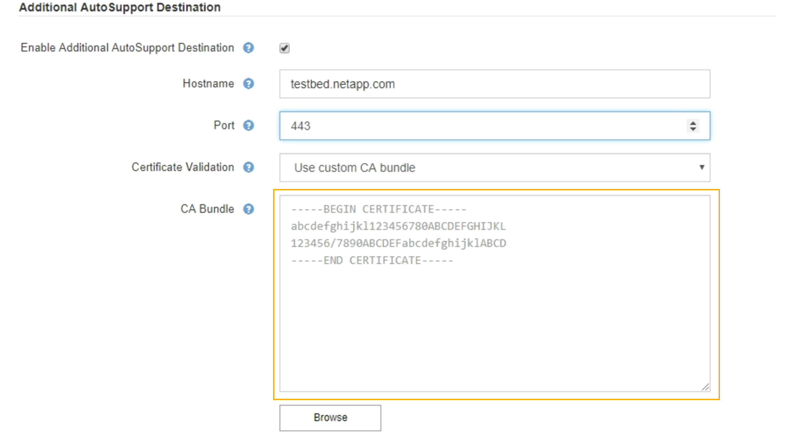

= Adicionar um destino AutoSupport adicional
:allow-uri-read: 
:icons: font
:imagesdir: ../media/

[role="lead"]
Quando você ativa o AutoSupport, as mensagens de estado e de saúde são enviadas para o suporte do NetApp. Você pode especificar um destino adicional para todas as mensagens do AutoSupport.

.O que você vai precisar
* Você deve estar conetado ao Gerenciador de Grade usando um navegador compatível.
* Você deve ter a permissão de Acesso root ou outra Configuração de Grade.

.Sobre esta tarefa
Para verificar ou alterar o protocolo usado para enviar mensagens AutoSupport, consulte as instruções para especificar um protocolo AutoSupport.

NOTE: Não é possível usar o protocolo SMTP para enviar mensagens AutoSupport para um destino adicional.

link:specifying-protocol-for-autosupport-messages.html["Especificando o protocolo para mensagens AutoSupport"]

.Passos
. Selecione *suporte* > *Ferramentas* > *AutoSupport*.
+
A página AutoSupport é exibida com a guia *Configurações* selecionada.

. Selecione *Ativar destino AutoSupport adicional*.
+
São apresentados os campos de destino AutoSupport adicional.

+
image::../media/autosupport_additional_destinations.png[AutoSupport adicionando destinos adicionais]

. Introduza o nome de anfitrião do servidor ou o endereço IP de um servidor de destino AutoSupport adicional.
+

NOTE: Pode introduzir apenas um destino adicional.

. Introduza a porta utilizada para ligar a um servidor de destino AutoSupport adicional (a predefinição é a porta 80 para HTTP ou a porta 443 para HTTPS).
. Para enviar suas mensagens do AutoSupport com validação de certificado, selecione *Use custom CA bundle* no menu suspenso *Validação de certificado*. Em seguida, execute um dos seguintes procedimentos:
+
** Use uma ferramenta de edição para copiar e colar todo o conteúdo de cada um dos arquivos de certificado CA codificados em PEM no campo *CA bundle*, concatenado em ordem de cadeia de certificados. Você deve incluir `----BEGIN CERTIFICATE----` e `----END CERTIFICATE----` em sua seleção.
+

** Selecione *Procurar*, navegue até o arquivo que contém os certificados e selecione *abrir* para carregar o arquivo. A validação do certificado garante que a transmissão de mensagens AutoSupport é segura.

. Para enviar suas mensagens do AutoSupport sem validação de certificado, selecione *não verificar certificado* na lista suspensa *Validação de certificado*.
+
Selecione esta opção apenas quando tiver um bom motivo para não utilizar a validação do certificado, como por exemplo, quando houver um problema temporário com um certificado.

+
Uma mensagem de aviso é exibida: "Você não está usando um certificado TLS para proteger a conexão com o destino AutoSupport adicional."

. Selecione *Guardar*.
+
Todas as futuras mensagens AutoSupport semanais, acionadas por eventos e acionadas pelo usuário serão enviadas para o destino adicional.

