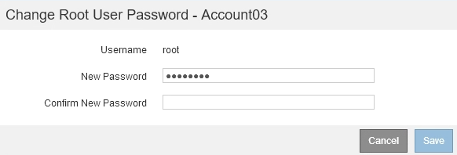

= Alterando a senha do usuário raiz local de um locatário
:allow-uri-read: 
:icons: font
:imagesdir: ../media/

[role="lead"]
Talvez seja necessário alterar a senha do usuário raiz local de um locatário se o usuário raiz estiver bloqueado para fora da conta.

.O que você vai precisar
* Você deve estar conetado ao Gerenciador de Grade usando um navegador compatível.
* Você deve ter permissões de acesso específicas.

.Sobre esta tarefa
Se o logon único (SSO) estiver habilitado para o sistema StorageGRID, o usuário raiz local não poderá entrar na conta de locatário. Para executar tarefas de usuário raiz, os usuários devem pertencer a um grupo federado que tenha a permissão de acesso raiz para o locatário.

.Passos
. Selecione *tenants*.
+
A página Contas do locatário é exibida e lista todas as contas de locatário existentes.

+
image::../media/tenant_accounts_page.png[Página de contas de inquilino]

. Selecione a conta de locatário que você deseja editar.
+
Se o sistema incluir mais de 20 itens, você pode especificar quantas linhas são mostradas em cada página de uma vez. Use a caixa de pesquisa para procurar uma conta de locatário por nome de exibição ou ID de locatário.

+
Os botões Ver Detalhes, Editar e ações ficam ativados.

. Na lista suspensa *ações*, selecione *alterar senha de root*.
+

. Introduza a nova palavra-passe para a conta de locatário.
. Selecione *Guardar*.

.Informações relacionadas
link:controlling-administrator-access-to-storagegrid.html["Controlar o acesso do administrador ao StorageGRID"]
