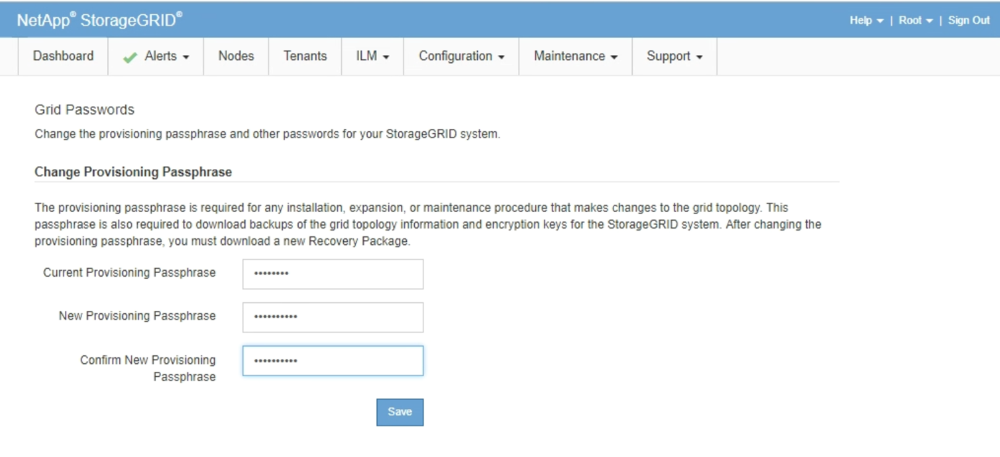

= Alterando a senha de provisionamento
:allow-uri-read: 
:icons: font
:imagesdir: ../media/

[role="lead"]
Use este procedimento para alterar a senha de provisionamento do StorageGRID. A frase-passe é necessária para procedimentos de recuperação, expansão e manutenção. A frase-passe também é necessária para fazer o download dos backups do pacote de recuperação que incluem as informações de topologia de grade e as chaves de criptografia para o sistema StorageGRID.

.O que você vai precisar
* Você deve estar conetado ao Gerenciador de Grade usando um navegador compatível.
* Você deve ter permissões de Manutenção ou Acesso root.
* Você deve ter a senha de provisionamento atual.

.Sobre esta tarefa
A frase-passe de aprovisionamento é necessária para muitos procedimentos de instalação e manutenção e para transferir o pacote de recuperação. A senha de provisionamento não está listada no `Passwords.txt` arquivo. Certifique-se de documentar a senha de provisionamento e mantê-la em um local seguro e seguro.

.Passos
. Selecione *Configuração* > *Controle de Acesso* > *senhas de Grade*.
+

. Introduza a sua frase-passe de aprovisionamento atual.
. Introduza a nova frase-passe.a frase-passe tem de conter, no mínimo, 8 e não mais de 32 carateres. As senhas são sensíveis a maiúsculas e minúsculas.
+

CAUTION: Armazene a nova senha de provisionamento em um local seguro. É necessário para procedimentos de instalação, expansão e manutenção.

. Digite novamente a nova senha e clique em *Salvar*.
+
O sistema exibe um banner verde de sucesso quando a alteração da senha de provisionamento estiver concluída. A mudança deve levar menos de um minuto.

+
image::../media/change_provisioning_passphrase_success.png[Alterar senha de provisionamento - mensagem de sucesso]

. Selecione o link *Pacote de recuperação* dentro do banner de sucesso.
. Faça o download do novo Pacote de recuperação do Gerenciador de Grade. Selecione *Maintenance* > *Recovery Package* e insira a nova senha de provisionamento.
+

CAUTION: Depois de alterar a senha de provisionamento, você deve baixar imediatamente um novo Pacote de recuperação. O arquivo do Pacote de recuperação permite restaurar o sistema se ocorrer uma falha.

