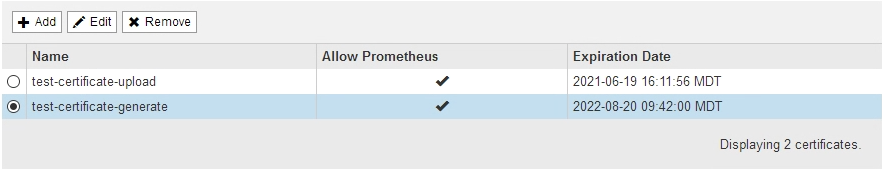

= Configurando certificados de cliente de administrador
:allow-uri-read: 
:icons: font
:imagesdir: ../media/

[role="lead"]
Você pode usar certificados de cliente para permitir que clientes externos autorizados acessem o banco de dados do StorageGRID Prometheus. Os certificados de cliente fornecem uma maneira segura de usar ferramentas externas para monitorar o StorageGRID.

Se você precisar acessar o StorageGRID usando uma ferramenta de monitoramento externa, você deve carregar ou gerar um certificado de cliente usando o Gerenciador de Grade e copiar as informações do certificado para a ferramenta externa.

== Adicionando certificados de cliente administrador

Para adicionar um certificado de cliente, você pode fornecer seu próprio certificado ou gerar um usando o Gerenciador de Grade.

.O que você vai precisar
* Você deve ter a permissão de acesso root.
* Você deve estar conetado ao Gerenciador de Grade usando um navegador compatível.
* Você deve saber o endereço IP ou o nome de domínio do nó Admin.
* Você deve ter configurado o certificado do servidor de interface de gerenciamento do StorageGRID e ter o pacote de CA correspondente
* Se você quiser carregar seu próprio certificado, a chave pública e a chave privada do certificado devem estar disponíveis no computador local.

.Passos
. No Gerenciador de Grade, selecione *Configuração* > *Controle de Acesso* > *certificados de Cliente*.
+
A página certificados de cliente é exibida.

+
image::../media/certificates_page_admin_client.png[Página de certificados - Admin Clients]

. Selecione *Adicionar*.
+
A página carregar certificado é exibida.

+
image::../media/certificate_admin_upload.png[Certificado -Admin - carregar]

. Digite um nome entre 1 e 32 carateres para o certificado.
. Para acessar as métricas do Prometheus usando sua ferramenta de monitoramento externo, marque a caixa de seleção *Allow Prometheus*.
. Carregar ou gerar um certificado:
+
.. Para carregar um certificado, vá <<upload_cert,aqui>>.
.. Para gerar um certificado, vá <<generate_cert,aqui>>.

. [[upload_cert]]para carregar um certificado:
+
.. Selecione *carregar certificado de cliente*.
.. Procure a chave pública do certificado.
+
Depois de carregar a chave pública para o certificado, os campos *metadados do certificado* e *PEM* do certificado são preenchidos.

+
image::../media/certificate_admin_upload_cert_file.png[Certificado - Admin - carregar ficheiro Cert]

.. Selecione *Copiar certificado para a área de transferência* e cole o certificado na ferramenta de monitoramento externa.
.. Use uma ferramenta de edição para copiar e colar a chave privada na sua ferramenta de monitoramento externo.
.. Selecione *Salvar* para salvar o certificado no Gerenciador de Grade.

. [[Generate_cert]]para gerar um certificado:
+
.. Selecione *Generate Client Certificate*.
.. Introduza o nome de domínio ou o endereço IP do nó de administração.
.. Opcionalmente, insira um assunto X,509, também chamado de Nome distinto (DN), para identificar o administrador que possui o certificado.
.. Opcionalmente, selecione o número de dias em que o certificado é válido. O padrão é de 730 dias.
.. Selecione *Generate*.
+
Os campos *metadados do certificado*, *PEM* do certificado e *chave privada do certificado* são preenchidos.

+
image::../media/certificate_admin_upload_generated.png[Certificado - Admin - carregamento gerado]

.. Selecione *Copiar certificado para a área de transferência* e cole o certificado na ferramenta de monitoramento externa.
.. Selecione *Copie a chave privada para a área de transferência* e cole a chave na ferramenta de monitoramento externa.
+

IMPORTANT: Não será possível visualizar a chave privada depois de fechar a caixa de diálogo. Copie a chave para um local seguro.

.. Selecione *Salvar* para salvar o certificado no Gerenciador de Grade.

. Configure as seguintes configurações em sua ferramenta de monitoramento externo, como Grafana.
+
Um exemplo de Grafana é mostrado na seguinte captura de tela:

+
image::../media/grafana_add_url_and_auth.png[Grafana - Adicionar URL e Auth]

+
.. *Nome*: Insira um nome para a conexão.
+
O StorageGRID não requer essas informações, mas você deve fornecer um nome para testar a conexão.

.. *URL*: Insira o nome de domínio ou o endereço IP do nó Admin. Especifique HTTPS e porta 9091.
+
Por exemplo: `+https://admin-node.example.com:9091+`

.. Ative *TLS Client Authorization* e *with CA Cert*.
.. Copie e cole o certificado do servidor de interface de gerenciamento ou o pacote CA para **CA Cert** em Detalhes de autenticação TLS/SSL.
.. *ServerName*: Insira o nome de domínio do nó Admin.
+
O nome do servidor deve corresponder ao nome de domínio como aparece no certificado do servidor de interface de gerenciamento.

.. Salve e teste o certificado e a chave privada que você copiou do StorageGRID ou de um arquivo local.
+
Agora você pode acessar as métricas Prometheus do StorageGRID com sua ferramenta de monitoramento externo.

+
Para obter informações sobre as métricas, consulte as instruções para monitoramento e solução de problemas do StorageGRID.

.Informações relacionadas
link:using-storagegrid-security-certificates.html["Usando certificados de segurança do StorageGRID"]

link:configuring-custom-server-certificate-for-grid-manager-tenant-manager.html["Configurando um certificado de servidor personalizado para o Gerenciador de Grade e o Gerenciador de locatário"]

link:../monitor/index.html["Monitorizar  Resolução de problemas"]

== Editando certificados de cliente do administrador

Você pode editar um certificado para alterar seu nome, ativar ou desativar o acesso Prometheus ou carregar um novo certificado quando o atual expirar.

.O que você vai precisar
* Você deve ter a permissão de acesso root.
* Você deve estar conetado ao Gerenciador de Grade usando um navegador compatível.
* Você deve saber o endereço IP ou o nome de domínio do nó Admin.
* Se você quiser carregar um novo certificado e uma chave privada, eles devem estar disponíveis no computador local.

.Passos
. Selecione *Configuração* > *Controle de Acesso* > *certificados de Cliente*.
+
A página certificados de cliente é exibida. Os certificados existentes são listados.

+
As datas de expiração do certificado são listadas na tabela. Se um certificado expirar em breve ou já estiver expirado, uma mensagem será exibida na tabela e um alerta será acionado.

+

. Selecione o botão de opção à esquerda do certificado que deseja editar.
. Selecione *Editar*.
+
A caixa de diálogo Editar certificado é exibida.

+

. Faça as alterações desejadas no certificado.
. Selecione *Salvar* para salvar o certificado no Gerenciador de Grade.
. Se você carregou um novo certificado:
+
.. Selecione *Copiar certificado para a área de transferência* para colar o certificado em sua ferramenta de monitoramento externa.
.. Use uma ferramenta de edição para copiar e colar a nova chave privada na sua ferramenta de monitoramento externo.
.. Salve e teste o certificado e a chave privada em sua ferramenta de monitoramento externa.

. Se você gerou um novo certificado:
+
.. Selecione *Copiar certificado para a área de transferência* para colar o certificado em sua ferramenta de monitoramento externa.
.. Selecione *Copiar chave privada para a área de transferência* para colar o certificado em sua ferramenta de monitoramento externa.
+

IMPORTANT: Não será possível visualizar ou copiar a chave privada depois de fechar a caixa de diálogo. Copie a chave para um local seguro.

.. Salve e teste o certificado e a chave privada em sua ferramenta de monitoramento externa.

== Removendo certificados de cliente de administrador

Se você não precisar mais de um certificado, você pode removê-lo.

.O que você vai precisar
* Você deve ter a permissão de acesso root.
* Você deve estar conetado ao Gerenciador de Grade usando um navegador compatível.

.Passos
. Selecione *Configuração* > *Controle de Acesso* > *certificados de Cliente*.
+
A página certificados de cliente é exibida. Os certificados existentes são listados.

+

. Selecione o botão de opção à esquerda do certificado que deseja remover.
. Selecione *Remover*.
+
É apresentada uma caixa de diálogo de confirmação.

+
image::../media/certificate_confirm_delete.png[Certificado - confirmar exclusão]

. Selecione *OK*.
+
O certificado é removido.

