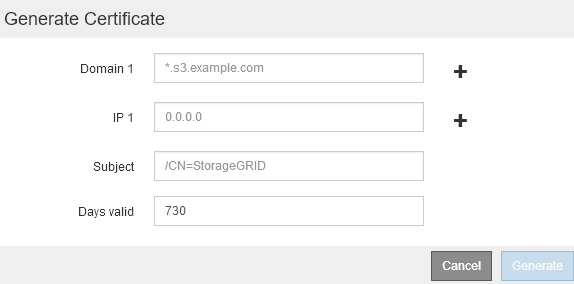

= Configuração dos pontos de extremidade do balanceador de carga
:allow-uri-read: 
:icons: font
:imagesdir: ../media/

[role="lead"]
Você pode criar, editar e remover pontos de extremidade do balanceador de carga.

== Criação de pontos de extremidade do balanceador de carga

Cada ponto de extremidade do balanceador de carga especifica uma porta, um protocolo de rede (HTTP ou HTTPS) e um tipo de serviço (S3 ou Swift). Se criar um endpoint HTTPS, tem de carregar ou gerar um certificado de servidor.

.O que você vai precisar
* Você deve ter a permissão de acesso root.
* Você deve estar conetado ao Gerenciador de Grade usando um navegador compatível.
* Se você tiver anteriormente as portas remapeadas que pretende usar para o serviço Load Balancer, você deve ter removido os remapes.
+

IMPORTANT: Se você tiver remapeado quaisquer portas, não poderá usar as mesmas portas para configurar pontos de extremidade do balanceador de carga. Você pode criar endpoints usando portas remapeadas, mas esses endpoints serão remapeados para as portas e serviços CLB originais, não para o serviço Load Balancer. Siga as etapas nas instruções de recuperação e manutenção para remover os remapas de portas.

+

NOTE: O serviço CLB está obsoleto.

.Passos
. Selecione *Configuration* > *Network Settings* > *Load Balancer Endpoints*.
+
A página Load Balancer Endpoints é exibida.

+
image::../media/load_balancer_endpoints.png[pontos de extremidade do balanceador de carga]

. Selecione *Adicionar endpoint*.
+
A caixa de diálogo criar ponto final é exibida.

+
image::../media/load_balancer_endpoint_create_http.png[Crie um ponto final LB]

. Insira um nome de exibição para o endpoint, que aparecerá na lista na página Load Balancer Endpoints.
. Introduza um número de porta ou deixe o número de porta pré-preenchido como está.
+
Se você inserir o número da porta 80 ou 443, o endpoint será configurado somente nos nós do Gateway, uma vez que essas portas serão reservadas nos nós de administração.

+

NOTE: As portas usadas por outros serviços de grade não são permitidas. Consulte as diretrizes de rede para obter uma lista de portas usadas para comunicações internas e externas.

. Selecione *HTTP* ou *HTTPS* para especificar o protocolo de rede para este endpoint.
. Selecione um modo de encadernação de endpoint.
+
** *Global* (padrão): O endpoint está acessível em todos os nós de Gateway e nós de Admin no número de porta especificado.
+
image::../media/load_balancer_endpoint_global_binding_mode.png[Modo de encadernação global de endpoint]

** *VIPs do grupo HA*: O endpoint só pode ser acessado através dos endereços IP virtuais definidos para os grupos de HA selecionados. Os endpoints definidos neste modo podem reutilizar o mesmo número de porta, desde que os grupos de HA definidos por esses endpoints não se sobreponham entre si.
+
Selecione os grupos de HA com os endereços IP virtuais onde deseja que o endpoint apareça.

+
image::../media/load_balancer_endpoint_ha_group_vips_binding_mode.png[Modo de encadernação VIPs do Grupo de terminais HA]

** * Interfaces de nó*: O ponto de extremidade é acessível apenas nos nós designados e interfaces de rede. Os endpoints definidos neste modo podem reutilizar o mesmo número de porta desde que essas interfaces não se sobreponham umas às outras.
+
Selecione as interfaces de nó em que você deseja que o endpoint apareça.

+
image::../media/load_balancer_endpoint_node_interfaces_binding_mode.png[Modo de encadernação de interfaces de nó de ponto final]

. Selecione *Guardar*.
+
A caixa de diálogo Editar ponto final é exibida.

. Selecione *S3* ou *Swift* para especificar o tipo de tráfego que este endpoint irá servir.
+
image::../media/load_balancer_endpoint_client_options.png[Cliente do Load Balancer]

. Se você selecionou *HTTP*, selecione *Salvar*.
+
O ponto final não protegido é criado. A tabela na página Load Balancer Endpoints lista o nome de exibição, o número da porta, o protocolo e o ID do endpoint.

. Se selecionou *HTTPS* e pretende carregar um certificado, selecione *carregar certificado*.
+
image::../media/load_balancer_endpoint_upload_cert.png[Carregar Cert]

+
.. Procure o certificado do servidor e a chave privada do certificado.
+
Para permitir que os clientes S3 se conetem usando um nome de domínio de endpoint da API S3, use um certificado de domínio multidomínio ou curinga que corresponda a todos os nomes de domínio que o cliente possa usar para se conetar à grade. Por exemplo, o certificado do servidor pode usar o nome de domínio `*._example_.com` .

+
link:configuring-s3-api-endpoint-domain-names.html["Configurando nomes de domínio de endpoint da API S3"]

.. Opcionalmente, procure um pacote de CA.
.. Selecione *Guardar*.
+
Os dados de certificado codificados em PEM para o endpoint são exibidos.

. Se você selecionou *HTTPS* e deseja gerar um certificado, selecione *Generate Certificate*.
+

+
.. Introduza um nome de domínio ou um endereço IP.
+
Você pode usar wildcards para representar os nomes de domínio totalmente qualificados de todos os nós de administrador e nós de gateway que executam o serviço Load Balancer. Por exemplo, `*.sgws.foo.com` usa o caractere curinga * para representar `gn1.sgws.foo.com` e `gn2.sgws.foo.com`.

+
link:configuring-s3-api-endpoint-domain-names.html["Configurando nomes de domínio de endpoint da API S3"]

.. image:../media/icon_plus_sign_black_on_white.gif["Sinal positivo"]Selecione para adicionar outros nomes de domínio ou endereços IP.
+
Se você estiver usando grupos de alta disponibilidade (HA), adicione os nomes de domínio e endereços IP dos IPs virtuais de HA.

.. Opcionalmente, insira um assunto X,509, também chamado de Nome distinto (DN), para identificar quem possui o certificado.
.. Opcionalmente, selecione o número de dias em que o certificado é válido. O padrão é de 730 dias.
.. Selecione *Generate*.
+
Os metadados do certificado e os dados do certificado codificados em PEM para o endpoint são exibidos.

. Clique em *Salvar*.
+
O endpoint é criado. A tabela na página Load Balancer Endpoints lista o nome de exibição, o número da porta, o protocolo e o ID do endpoint.

.Informações relacionadas
link:../maintain/index.html["Manter  recuperar"]

link:../network/index.html["Diretrizes de rede"]

link:managing-high-availability-groups.html["Gerenciamento de grupos de alta disponibilidade"]

link:managing-untrusted-client-networks.html["Gerenciando redes de clientes não confiáveis"]

== Editar pontos de extremidade do balanceador de carga

Para um endpoint não protegido (HTTP), você pode alterar o tipo de serviço de endpoint entre S3 e Swift. Para um endpoint seguro (HTTPS), você pode editar o tipo de serviço de endpoint e exibir ou alterar o certificado de segurança.

.O que você vai precisar
* Você deve ter a permissão de acesso root.
* Você deve estar conetado ao Gerenciador de Grade usando um navegador compatível.

.Passos
. Selecione *Configuration* > *Network Settings* > *Load Balancer Endpoints*.
+
A página Load Balancer Endpoints é exibida. Os endpoints existentes são listados na tabela.

+
Endpoints com certificados que expirarão em breve são identificados na tabela.

+

. Selecione o ponto de extremidade que pretende editar.
. Clique em *Editar endpoint*.
+
A caixa de diálogo Editar ponto final é exibida.

+
Para um ponto de extremidade não protegido (HTTP), apenas a secção Configuração do serviço de extremidade da caixa de diálogo é apresentada. Para um ponto de extremidade seguro (HTTPS), as secções Configuração do serviço de extremidade e certificados da caixa de diálogo são apresentadas, conforme ilustrado no exemplo seguinte.

+
image::../media/load_balancer_endpoint_edit.png[Editar o Load Balancer Endpoint]

. Faça as alterações desejadas no endpoint.
+
Para um endpoint não protegido (HTTP), você pode:

+
** Altere o tipo de serviço de endpoint entre S3 e Swift.
** Altere o modo de encadernação de endpoint. Para um endpoint seguro (HTTPS), você pode:
** Altere o tipo de serviço de endpoint entre S3 e Swift.
** Altere o modo de encadernação de endpoint.
** Exibir o certificado de segurança.
** Carregue ou gere um novo certificado de segurança quando o certificado atual estiver expirado ou prestes a expirar.
+
Selecione uma guia para exibir informações detalhadas sobre o certificado padrão do servidor StorageGRID ou um certificado assinado pela CA que foi carregado.

+

NOTE: Para alterar o protocolo de um endpoint existente, por exemplo, de HTTP para HTTPS, você deve criar um novo endpoint. Siga as instruções para criar pontos de extremidade do balanceador de carga e selecione o protocolo desejado.

. Clique em *Salvar*.

.Informações relacionadas
<<Criação de pontos de extremidade do balanceador de carga>>

== Remoção dos pontos finais do balanceador de carga

Se você não precisar mais de um ponto de extremidade do balanceador de carga, poderá removê-lo.

.O que você vai precisar
* Você deve ter a permissão de acesso root.
* Você deve estar conetado ao Gerenciador de Grade usando um navegador compatível.

.Passos
. Selecione *Configuration* > *Network Settings* > *Load Balancer Endpoints*.
+
A página Load Balancer Endpoints é exibida. Os endpoints existentes são listados na tabela.

+

. Selecione o botão de opção à esquerda do ponto de extremidade que pretende remover.
. Clique em *Remover endpoint*.
+
É apresentada uma caixa de diálogo de confirmação.

+
image::../media/load_balancer_endpoint_confirm_removal.png[Confirme a remoção do endpoint]

. Clique em *OK*.
+
O ponto final é removido.

