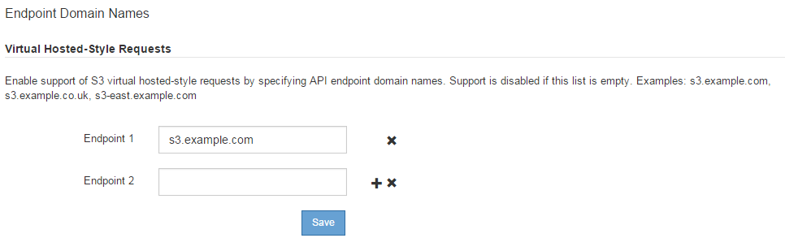

= Configurando nomes de domínio de endpoint da API S3
:allow-uri-read: 
:icons: font
:imagesdir: ../media/

[role="lead"]
Para oferecer suporte a solicitações de estilo hospedado virtual S3, você deve usar o Gerenciador de Grade para configurar a lista de nomes de domínio de endpoint aos quais os clientes S3 se conetam.

.O que você vai precisar
* Você deve estar conetado ao Gerenciador de Grade usando um navegador compatível.
* Você deve ter permissões de acesso específicas.
* Você deve ter confirmado que uma atualização de grade não está em andamento.
+

CAUTION: Não faça alterações na configuração do nome de domínio quando uma atualização de grade estiver em andamento.

.Sobre esta tarefa
Para permitir que os clientes usem nomes de domínio de endpoint S3, você deve executar todas as seguintes tarefas:

* Use o Gerenciador de Grade para adicionar os nomes de domínio de endpoint S3 ao sistema StorageGRID.
* Certifique-se de que o certificado que o cliente usa para conexões HTTPS com o StorageGRID está assinado para todos os nomes de domínio que o cliente requer.
+
Por exemplo, se o endpoint for `s3.company.com`, você deve garantir que o certificado usado para conexões HTTPS inclua o `s3.company.com` endpoint e o nome alternativo do assunto universal (SAN) do endpoint: `*.s3.company.com`.

* Configure o servidor DNS usado pelo cliente. Inclua Registros DNS para os endereços IP que os clientes usam para fazer conexões e verifique se os Registros fazem referência a todos os nomes de domínio de endpoint necessários, incluindo quaisquer nomes de curinga.
+

NOTE: Os clientes podem se conetar ao StorageGRID usando o endereço IP de um nó de gateway, um nó de administrador ou um nó de armazenamento, ou conetando-se ao endereço IP virtual de um grupo de alta disponibilidade. Você deve entender como os aplicativos cliente se conetam à grade para incluir os endereços IP corretos nos Registros DNS.

O certificado que um cliente usa para conexões HTTPS depende de como o cliente se coneta à grade:

* Se um cliente se conetar usando o serviço Load Balancer, ele usará o certificado para um ponto de extremidade específico do balanceador de carga.
+

NOTE: Cada ponto de extremidade do balanceador de carga tem seu próprio certificado e cada ponto de extremidade pode ser configurado para reconhecer nomes de domínio de endpoint diferentes.

* Se o cliente se conetar a um nó de armazenamento ou ao serviço CLB em um nó de gateway, o cliente usará um certificado de servidor personalizado de grade que foi atualizado para incluir todos os nomes de domínio de endpoint necessários.
+

NOTE: O serviço CLB está obsoleto.

.Passos
. Selecione *Configuração* > *Configurações de rede* > *nomes de domínio*.
+
A página nomes de domínio do endpoint é exibida.

+

. Para adicionar campos adicionais, insira a lista de nomes de domínio de endpoint da API S3 nos campos *Endpoint*.
+
Se esta lista estiver vazia, o suporte para solicitações de estilo hospedado virtual S3 será desativado.

. Clique em *Salvar*.
. Certifique-se de que os certificados de servidor que os clientes utilizam correspondem aos nomes de domínio de endpoint necessários.
+
** Para clientes que usam o serviço Load Balancer, atualize o certificado associado ao ponto de extremidade do balanceador de carga ao qual o cliente se coneta.
** Para clientes que se conetam diretamente aos nós de storage ou que usam o serviço CLB nos nós de Gateway, atualize o certificado de servidor personalizado para a grade.

. Adicione os Registros DNS necessários para garantir que as solicitações de nome de domínio de endpoint possam ser resolvidas.

.Resultado
Agora, quando os clientes usam o endpoint `bucket.s3.company.com`, o servidor DNS resolve para o endpoint correto e o certificado autentica o endpoint como esperado.

.Informações relacionadas
link:../s3/index.html["Use S3"]

link:viewing-ip-addresses.html["Visualização de endereços IP"]

link:creating-high-availability-group.html["Criando um grupo de alta disponibilidade"]

link:configuring-custom-server-certificate-for-storage-node-or-clb.html["Configurando um certificado de servidor personalizado para conexões ao nó de armazenamento ou ao serviço CLB"]

link:configuring-load-balancer-endpoints.html["Configuração dos pontos de extremidade do balanceador de carga"]
