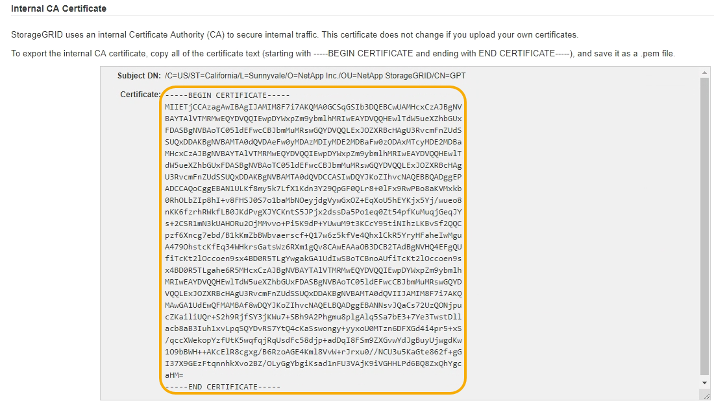

= Copiar o certificado CA do sistema StorageGRID
:allow-uri-read: 
:icons: font
:imagesdir: ../media/

[role="lead"]
O StorageGRID usa uma autoridade de certificação (CA) interna para proteger o tráfego interno. Este certificado não muda se você carregar seus próprios certificados.

.O que você vai precisar
* Você deve estar conetado ao Gerenciador de Grade usando um navegador compatível.
* Você deve ter permissões de acesso específicas.

.Sobre esta tarefa
Se um certificado de servidor personalizado tiver sido configurado, os aplicativos cliente devem verificar o servidor usando o certificado de servidor personalizado. Eles não devem copiar o certificado da CA do sistema StorageGRID.

.Passos
. Selecione *Configuração* > *Configurações de rede* > *certificados de servidor*.
. Na seção *certificado de CA interno*, selecione todo o texto do certificado.
+
Você deve incluir `-----BEGIN CERTIFICATE-----` e `-----END CERTIFICATE-----` em sua seleção.

+

. Clique com o botão direito do rato no texto selecionado e selecione *Copiar*.
. Cole o certificado copiado em um editor de texto.
. Salve o arquivo com a extensão `.pem`.
+
Por exemplo: `storagegrid_certificate.pem`

