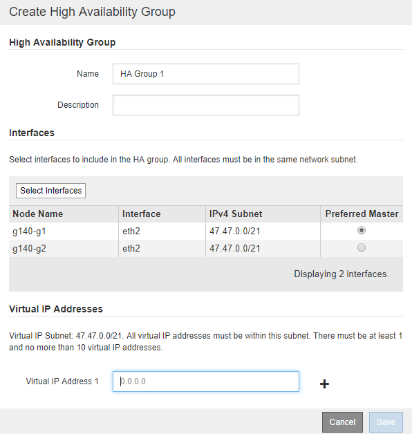

= Criando um grupo de alta disponibilidade
:allow-uri-read: 
:icons: font
:imagesdir: ../media/

[role="lead"]
Você pode criar um ou mais grupos de alta disponibilidade (HA) para fornecer acesso altamente disponível aos serviços em nós de administração ou nós de gateway.

.O que você vai precisar
* Você deve estar conetado ao Gerenciador de Grade usando um navegador compatível.
* Você deve ter a permissão de acesso root.

.Sobre esta tarefa
Uma interface deve atender às seguintes condições para ser incluída em um grupo HA:

* A interface deve ser para um nó de gateway ou um nó de administrador.
* A interface deve pertencer à rede de Grade (eth0) ou à rede de Cliente (eth2).
* A interface deve ser configurada com endereçamento IP fixo ou estático, não com DHCP.

.Passos
. Selecione *Configuração* > *Configurações de rede* > *grupos de alta disponibilidade*.
+
A página grupos de alta disponibilidade é exibida.

+
image::../media/ha_groups_page_with_no_groups.png[Página de grupos HA sem grupos]

. Clique em *criar*.
+
A caixa de diálogo criar Grupo de alta disponibilidade é exibida.

. Digite um nome e, se desejado, uma descrição para o grupo HA.
. Clique em *Select interfaces*.
+
A caixa de diálogo Adicionar interfaces ao Grupo de alta disponibilidade é exibida. A tabela lista nós, interfaces e sub-redes IPv4 elegíveis.

+
image::../media/ha_group_add_interfaces.png[Adicione interfaces]

+
Uma interface não aparece na lista se o seu endereço IP for atribuído pelo DHCP.

. Na coluna *Adicionar ao grupo HA*, marque a caixa de seleção da interface que deseja adicionar ao grupo HA.
+
Observe as seguintes diretrizes para selecionar interfaces:

+
** Você deve selecionar pelo menos uma interface.
** Se você selecionar mais de uma interface, todas as interfaces devem estar na rede de Grade (eth0) ou na rede de Cliente (eth2).
** Todas as interfaces devem estar na mesma sub-rede ou em sub-redes com um prefixo comum.
+
Os endereços IP serão restritos à sub-rede menor (aquela com o maior prefixo).

** Se você selecionar interfaces em diferentes tipos de nós e ocorrer um failover, apenas os serviços comuns aos nós selecionados estarão disponíveis nos IPs virtuais.
+
*** Selecione dois ou mais nós de administração para proteção de HA do Grid Manager ou do Tenant Manager.
*** Selecione dois ou mais nós de administração, nós de gateway ou ambos para proteção de HA do serviço Load Balancer.
*** Selecione dois ou mais nós de Gateway para proteção de HA do serviço CLB.
+

NOTE: O serviço CLB está obsoleto.

+
image::../media/ha_groups_different_node_types.png[HA agrupa diferentes tipos de nó]

. Clique em *aplicar*.
+
As interfaces selecionadas são listadas na seção interfaces da página criar Grupo de alta disponibilidade. Por padrão, a primeira interface na lista é selecionada como o mestre preferido.

+

. Se você quiser que uma interface diferente seja o mestre preferido, selecione essa interface na coluna *Preferred Master*.
+
O Master preferencial é a interface ativa, a menos que ocorra uma falha que faça com que os endereços VIP sejam reatribuídos a uma interface de backup.

+

NOTE: Se o grupo HA fornecer acesso ao Gerenciador de Grade, você deve selecionar uma interface no nó Admin principal para ser o mestre preferido. Alguns procedimentos de manutenção só podem ser executados a partir do nó de administração principal.

. Na seção endereços IP virtuais da página, insira um a 10 endereços IP virtuais para o grupo HA. Clique no sinal de mais (image:../media/icon_plus_sign_black_on_white_old.png["Sinal positivo"]) para adicionar vários endereços IP.
+
Você deve fornecer pelo menos um endereço IPv4. Opcionalmente, você pode especificar endereços IPv4 e IPv6 adicionais.

+
Os endereços IPv4 devem estar dentro da sub-rede IPv4 compartilhada por todas as interfaces membros.

. Clique em *Salvar*.
+
O Grupo HA é criado e agora você pode usar os endereços IP virtuais configurados.

.Informações relacionadas
link:../rhel/index.html["Instale o Red Hat Enterprise Linux ou CentOS"]

link:../vmware/index.html["Instale o VMware"]

link:../ubuntu/index.html["Instale Ubuntu ou Debian"]

link:managing-load-balancing.html["Gerenciamento do balanceamento de carga"]
