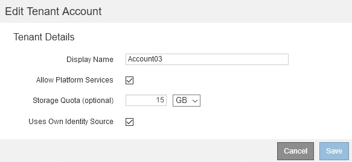

= Editando uma conta de locatário
:allow-uri-read: 
:icons: font
:imagesdir: ../media/

[role="lead"]
Você pode editar uma conta de locatário para alterar o nome de exibição, alterar a configuração de origem de identidade, permitir ou desativar serviços de plataforma ou inserir uma cota de armazenamento.

.O que você vai precisar
* Você deve estar conetado ao Gerenciador de Grade usando um navegador compatível.
* Você deve ter permissões de acesso específicas.

.Passos
. Selecione *tenants*.
+
A página Contas do locatário é exibida e lista todas as contas de locatário existentes.

+
image::../media/tenant_accounts_page.png[Página de contas de inquilino]

. Selecione a conta de locatário que você deseja editar.
+
Se o sistema incluir mais de 20 itens, você pode especificar quantas linhas são mostradas em cada página de uma vez. Use a caixa de pesquisa para procurar uma conta de locatário por nome de exibição ou ID de locatário.

. Selecione *Editar*.
+
A página Editar conta do locatário é exibida. Este exemplo é para uma grade que não usa logon único (SSO). Essa conta de locatário não configurou sua própria origem de identidade.

+

. Altere os valores dos campos conforme necessário.
+
.. Altere o nome de exibição dessa conta de locatário.
.. Altere a configuração da caixa de seleção *permitir Serviços de Plataforma* para determinar se a conta de locatário pode usar serviços de plataforma para seus buckets do S3.
+

IMPORTANT: Se você desabilitar os serviços de plataforma para um locatário que já os esteja usando, os serviços que eles configuraram para seus buckets do S3 deixarão de funcionar. Nenhuma mensagem de erro é enviada ao locatário. Por exemplo, se o locatário tiver configurado a replicação do CloudMirror para um bucket do S3, ele ainda poderá armazenar objetos no bucket, mas as cópias desses objetos não serão mais feitas no bucket externo do S3 configurado como um endpoint.

.. Para *cota de armazenamento*, altere o número máximo de gigabytes, terabytes ou petabytes disponíveis para os objetos desse locatário ou deixe o campo em branco se desejar que esse locatário tenha uma cota ilimitada.
+
A cota de armazenamento de um locatário representa uma quantidade lógica (tamanho do objeto), e não uma quantidade física (tamanho no disco). As cópias ILM e a codificação de apagamento não contribuem para a quantidade de cota usada.

+

NOTE: Para monitorar o uso de armazenamento de cada conta de locatário, selecione *uso*. As contas de inquilino também podem monitorar seu próprio uso no Dashboard no Gerenciador do locatário ou com a API de gerenciamento do locatário. Observe que os valores de uso de storage de um locatário podem ficar desatualizados se os nós forem isolados de outros nós na grade. Os totais serão atualizados quando a conetividade de rede for restaurada.

.. Altere a configuração da caixa de seleção *usa a própria origem de identidade* para determinar se a conta de locatário usará sua própria origem de identidade ou a origem de identidade que foi configurada para o Gerenciador de Grade.
+

NOTE: Se a caixa de verificação *usa a própria fonte de identidade* for:

+
*** Desativado e verificado, o locatário já habilitou sua própria fonte de identidade. Um locatário deve desativar sua origem de identidade antes de poder usar a fonte de identidade que foi configurada para o Gerenciador de Grade.
*** Desativado e desmarcado, SSO está ativado para o sistema StorageGRID. O locatário deve usar a fonte de identidade que foi configurada para o Gerenciador de Grade.

. Selecione *Guardar*.

.Informações relacionadas
link:managing-platform-services-for-s3-tenant-accounts.html["Gerenciamento de serviços de plataforma para contas de locatários do S3"]

link:../tenant/index.html["Use uma conta de locatário"]
