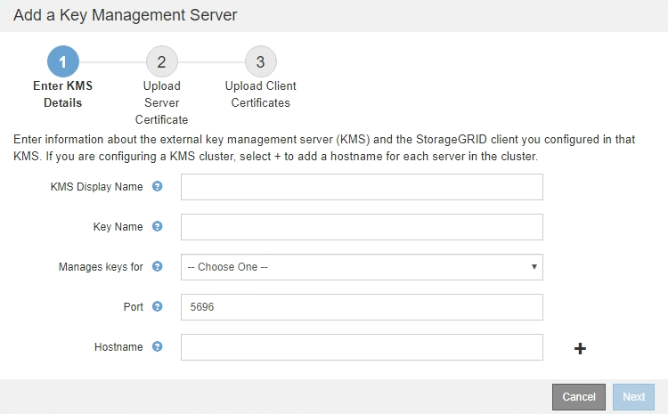

= Passo 1: Insira os detalhes do KMS
:allow-uri-read: 
:icons: font
:imagesdir: ../media/

[role="lead"]
Na Etapa 1 (Inserir detalhes do KMS) do assistente Adicionar um servidor de gerenciamento de chaves, você fornece detalhes sobre o cluster KMS ou KMS.

.Passos
. Selecione *Configuração* > *Configurações do sistema* > *servidor de gerenciamento de chaves*.
+
A página Key Management Server (servidor de gerenciamento de chaves) é exibida com a guia Configuration Details (Detalhes da configuração) selecionada.

+
image::../media/kms_configuration_details_no_kms.png[Detalhes Configuração KMS no KMS]

. Selecione *criar*.
+
O passo 1 (Digite os detalhes do KMS) do assistente Adicionar um servidor de gerenciamento de chaves é exibido.

+

. Insira as seguintes informações para o KMS e o cliente StorageGRID que você configurou nesse KMS.
+
[cols="1a,1a"]
|===
| Campo | Descrição 

 a| 
Nome de exibição de KMS
 a| 
Um nome descritivo para ajudá-lo a identificar este KMS. Deve ter entre 1 e 64 carateres.

 a| 
Nome da chave
 a| 
O alias exato da chave para o cliente StorageGRID no KMS. Deve ter entre 1 e 255 carateres.

 a| 
Gere as chaves para
 a| 
O site StorageGRID que será associado a este KMS. Se possível, você deve configurar qualquer servidor de gerenciamento de chaves específico do site antes de configurar um KMS padrão que se aplica a todos os sites não gerenciados por outro KMS.

** Selecione um site se este KMS gerenciará chaves de criptografia para os nós do dispositivo em um local específico.
** Selecione *Sites não gerenciados por outro KMS (KMS padrão)* para configurar um KMS padrão que se aplicará a quaisquer sites que não tenham um KMS dedicado e a quaisquer sites que você adicionar em expansões subsequentes.
+
*Nota:* Um erro de validação ocorrerá quando você salvar a configuração do KMS se você selecionar um site que foi criptografado anteriormente pelo KMS padrão, mas você não forneceu a versão atual da chave de criptografia original para o novo KMS.

 a| 
Porta
 a| 
A porta que o servidor KMS usa para comunicações KMIP (Key Management Interoperability Protocol). O padrão é 5696, que é a porta padrão KMIP.

 a| 
Nome do anfitrião
 a| 
O nome de domínio ou endereço IP totalmente qualificado para o KMS.

*Observação:* o campo SAN do certificado do servidor deve incluir o FQDN ou o endereço IP que você inserir aqui. Caso contrário, o StorageGRID não poderá se conetar ao KMS ou a todos os servidores em um cluster KMS.

|===
. Se você estiver usando um cluster KMS, selecione o sinal de mais image:../media/icon_plus_sign_black_on_white_old.png["Sinal Icon Plus"]para adicionar um nome de host para cada servidor no cluster.
. Selecione *seguinte*.
+
A etapa 2 (carregar certificado do servidor) do assistente Adicionar um servidor de gerenciamento de chaves é exibida.

