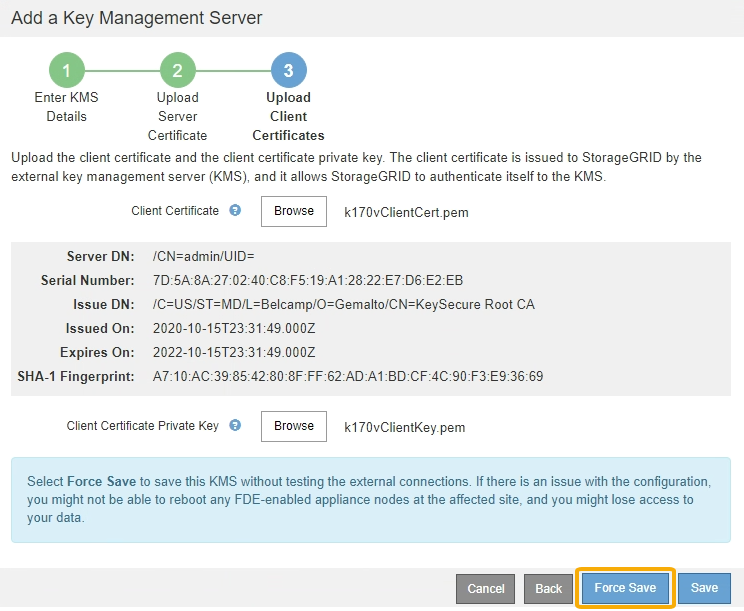

= Passo 3: Faça o upload de certificados de cliente
:allow-uri-read: 
:icons: font
:imagesdir: ../media/

[role="lead"]
Na Etapa 3 (carregar certificados de cliente) do assistente Adicionar um servidor de gerenciamento de chaves, você carrega o certificado de cliente e a chave privada do certificado de cliente. O certificado de cliente permite que o StorageGRID se autentique no KMS.

.Passos
. A partir do *passo 3 (carregar certificados de cliente)*, navegue até a localização do certificado de cliente.
+
image::../media/kms_step_3_upload_client_certificate.png[Kms passo 3 carregar certificado de cliente]

. Carregue o ficheiro de certificado do cliente.
+
Os metadados do certificado do cliente são exibidos.

. Navegue até a localização da chave privada para o certificado do cliente.
. Carregue o ficheiro de chave privada.
+
Os metadados do certificado de cliente e da chave privada do certificado de cliente são exibidos.

+
image::../media/kms_step_3_client_certificate_metadata.png[Kms passo 3 metadados do certificado do cliente]

. Selecione *Guardar*.
+
As conexões entre o servidor de gerenciamento de chaves e os nós do dispositivo são testadas. Se todas as conexões forem válidas e a chave correta for encontrada no KMS, o novo servidor de gerenciamento de chaves será adicionado à tabela na página servidor de gerenciamento de chaves.

+

NOTE: Imediatamente após adicionar um KMS, o status do certificado na página Key Management Server (servidor de gerenciamento de chaves) aparece como desconhecido. Pode demorar StorageGRID até 30 minutos para obter o status real de cada certificado. Você deve atualizar o navegador da Web para ver o status atual.

. Se uma mensagem de erro for exibida quando você selecionar *Salvar*, revise os detalhes da mensagem e selecione *OK*.
+
Por exemplo, você pode receber um erro de entidade 422: Não processável se um teste de conexão falhar.

. Se você precisar salvar a configuração atual sem testar a conexão externa, selecione *Force Save*.
+

+

IMPORTANT: Selecionar *Force Save* salva a configuração do KMS, mas não testa a conexão externa de cada dispositivo para esse KMS. Se houver um problema com a configuração, talvez você não consiga reinicializar os nós de dispositivo que têm a criptografia de nó ativada no site afetado. Você pode perder o acesso aos seus dados até que os problemas sejam resolvidos.

. Reveja o aviso de confirmação e selecione *OK* se tiver a certeza de que pretende forçar a gravação da configuração.
+
image::../media/kms_force_save_warning.png[Aviso de salvamento de força de KMS]

+
A configuração do KMS é salva, mas a conexão com o KMS não é testada.

