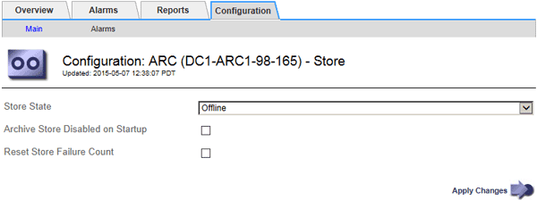

= Gerenciando um nó de arquivo quando o servidor TSM atinge a capacidade
:allow-uri-read: 
:icons: font
:imagesdir: ../media/

[role="lead"]
O servidor TSM não tem como notificar o nó de arquivo quando o banco de dados TSM ou o armazenamento de Mídia de arquivamento gerenciado pelo servidor TSM estiver próximo da capacidade. O nó de arquivo continua a aceitar dados de objeto para transferência para o servidor TSM depois que o servidor TSM parar de aceitar novo conteúdo. Este conteúdo não pode ser gravado em Mídia gerenciada pelo servidor TSM. Um alarme é acionado se isso acontecer. Esta situação pode ser evitada através do monitoramento proativo do servidor TSM.

.O que você vai precisar
* Você deve estar conetado ao Gerenciador de Grade usando um navegador compatível.
* Você deve ter permissões de acesso específicas.

.Sobre esta tarefa
Para evitar que o serviço ARC envie mais conteúdo para o servidor TSM, você pode colocar o nó de Arquivo offline, colocando o componente *ARC* > *Store* offline. Este procedimento também pode ser útil na prevenção de alarmes quando o servidor TSM não estiver disponível para manutenção.

.Passos
. Selecione *Support* > *Tools* > *Grid Topology*.
. Selecione *_Archive Node_* > *ARC* > *Store*.
. Selecione *Configuração* > *Principal*.
+

. Altere *Estado de armazenamento* para `Offline`.
. Selecione *Archive Store Disabled on Startup*.
. Clique em *aplicar alterações*.

