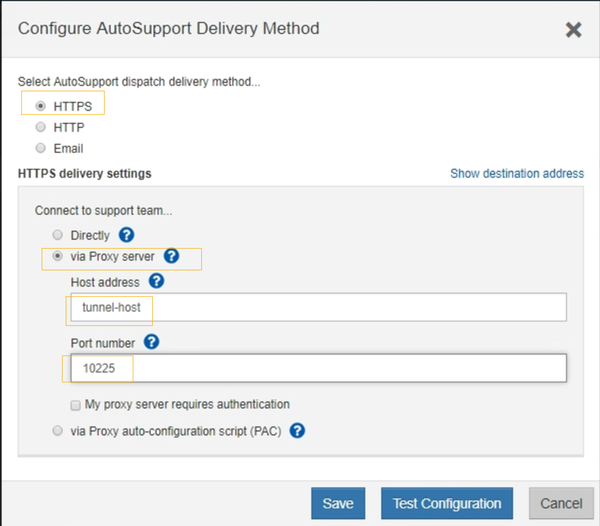

= Envio de mensagens do e-Series AutoSupport através do StorageGRID
:allow-uri-read: 
:icons: font
:imagesdir: ../media/

[role="lead"]
Você pode enviar mensagens do e-Series SANtricity System Manager AutoSupport para o suporte técnico por meio de um nó de administração do StorageGRID, em vez da porta de gerenciamento do dispositivo de storage.

.O que você vai precisar
* Você está conetado ao Gerenciador de Grade usando um navegador da Web compatível.
* Você tem a permissão Administrador do dispositivo de armazenamento ou a permissão de acesso root.

NOTE: Você deve ter o firmware SANtricity 8,70 ou superior para acessar o Gerenciador de sistema do SANtricity usando o Gerenciador de Grade.

.Sobre esta tarefa
As mensagens AutoSupport do e-Series contêm detalhes do hardware de armazenamento e são mais específicas do que outras mensagens AutoSupport enviadas pelo sistema StorageGRID.

Configure um endereço de servidor proxy especial no Gerenciador de sistema do SANtricity para fazer com que as mensagens do AutoSupport sejam transmitidas através de um nó de administração do StorageGRID sem o uso da porta de gerenciamento do dispositivo. As mensagens AutoSupport transmitidas desta forma respeitam as definições de proxy do Remetente e administrador preferenciais que podem ter sido configuradas no Gestor de grelha.

Se você quiser configurar o servidor proxy Admin no Gerenciador de Grade, consulte as instruções para configurar as configurações do proxy Admin.

link:configuring-admin-proxy-settings.html["Configurando as configurações de proxy Admin"]

[NOTE]
====
Este procedimento destina-se apenas à configuração de um servidor proxy StorageGRID para mensagens AutoSupport e-Series. Para obter detalhes adicionais sobre as informações de configuração do e-Series AutoSupport, consulte o centro de documentação do e-Series.

http://mysupport.netapp.com/info/web/ECMP1658252.html["Centro de Documentação de sistemas NetApp e-Series"^]

====
.Passos
. No Gerenciador de Grade, selecione *nós*.
. Na lista de nós à esquerda, selecione o nó do dispositivo de storage que deseja configurar.
. Selecione *Gerenciador do sistema SANtricity*.
+
É apresentada a página inicial do Gestor do sistema SANtricity.

+
image::../media/autosupport_santricity_home_page.png[Página inicial do AutoSupport SANtricity]

. Selecione *suporte* > *Centro de suporte* > *AutoSupport*.
+
É apresentada a página operations (operações de AutoSupport).

+
image:../media/autosupport_santricity_operations.png["Operações da AutoSupport SANtricity AutoSupport"]

. Selecione *Configurar método de entrega AutoSupport*.
+
A página Configurar método de entrega AutoSupport é exibida.

+

. Selecione *HTTPS* para o método de entrega.
+

NOTE: O certificado que ativa o protocolo HTTPS está pré-instalado.

. Selecione *via servidor Proxy*.
. Introduza `tunnel-host` o *Endereço anfitrião*.
+
`tunnel-host` É o endereço especial para usar um nó de administrador para enviar mensagens AutoSupport da série e.

. Introduza `10225` o *número da porta*.
+
`10225` É o número da porta no servidor proxy StorageGRID que recebe mensagens AutoSupport do controlador e-Series no dispositivo.

. Selecione *Configuração de teste* para testar o roteamento e a configuração do servidor proxy AutoSupport.
+
Se estiver correto, uma mensagem em um banner verde será exibida: ""sua configuração do AutoSupport foi verificada."

+
Se o teste falhar, uma mensagem de erro será exibida em um banner vermelho. Verifique as configurações de DNS e a rede do StorageGRID, verifique se o nó de administrador do remetente preferido pode se conetar ao site de suporte do NetApp e tente o teste novamente.

. Selecione *Guardar*.
+
A configuração é salva e uma mensagem de confirmação aparece: ""o método de entrega AutoSupport foi configurado."

