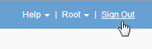

= Sair do Gerenciador de Grade
:allow-uri-read: 
:icons: font
:imagesdir: ../media/

[role="lead"]
Quando terminar de trabalhar com o Gerenciador de Grade, você deve sair para garantir que usuários não autorizados não possam acessar o sistema StorageGRID. Fechar seu navegador pode não sair do sistema, com base nas configurações de cookies do navegador.

.Passos
. Localize o link *Sair* no canto superior direito da interface do usuário.
+

. Clique em *Sair*.
+
[cols="1a,1a"]
|===
| Opção | Descrição 

 a| 
SSO não em uso
 a| 
Você está desconetado do Admin Node.

A página de login do Gerenciador de Grade é exibida.

*Nota:* se você tiver feito login em mais de um nó Admin, você deve sair de cada nó.

 a| 
SSO ativado
 a| 
Você está desconetado de todos os nós de administrador que estava acessando. É apresentada a página de início de sessão do StorageGRID. *Grid Manager* está listado como padrão no menu suspenso *Recent Accounts* e o campo *Account ID* mostra 0.

*Observação:* se o SSO estiver ativado e você também estiver conetado ao Gerenciador do Locatário, você também deverá sair da conta do locatário para sair do SSO.

|===

.Informações relacionadas
link:configuring-sso.html["Configurando logon único"]

link:../tenant/index.html["Use uma conta de locatário"]
