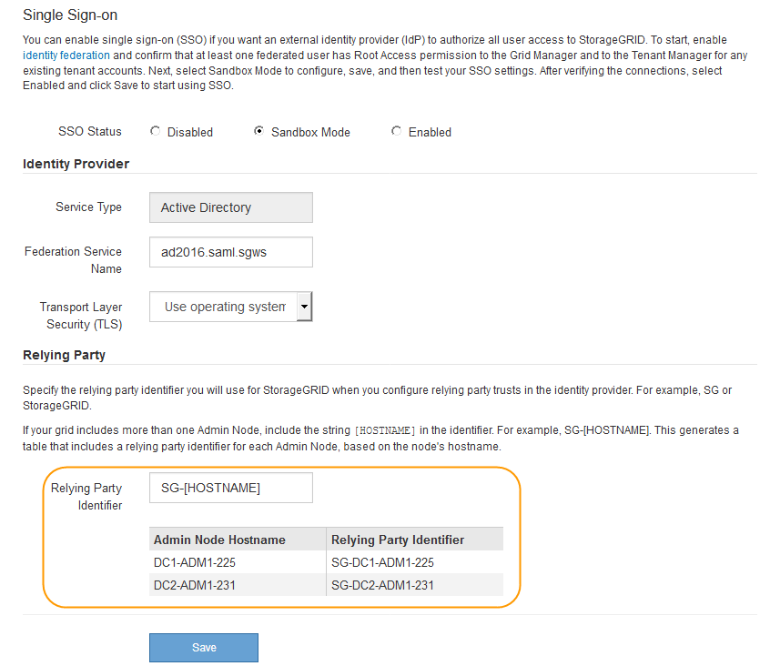

= Usando o modo sandbox
:allow-uri-read: 
:icons: font
:imagesdir: ../media/

[role="lead"]
Você pode usar o modo sandbox para configurar e testar as confianças de parte dependentes dos Serviços de Federação do ative Directory (AD FS) antes de aplicar o logon único (SSO) para usuários do StorageGRID. Depois que o SSO estiver ativado, você poderá reativar o modo sandbox para configurar ou testar novos e existentes trusts de terceiros. A reativação do modo sandbox desativa temporariamente o SSO para usuários do StorageGRID.

.O que você vai precisar
* Você deve estar conetado ao Gerenciador de Grade usando um navegador compatível.
* Você deve ter permissões de acesso específicas.

.Sobre esta tarefa
Quando o SSO está ativado e um usuário tenta entrar em um nó de administrador, o StorageGRID envia uma solicitação de autenticação para o AD FS. Por sua vez, o AD FS envia uma resposta de autenticação de volta ao StorageGRID, indicando se a solicitação de autorização foi bem-sucedida. Para solicitações bem-sucedidas, a resposta inclui um identificador universal exclusivo (UUID) para o usuário.

Para permitir que o StorageGRID (o provedor de serviços) e o AD FS (o provedor de identidade) se comuniquem com segurança sobre solicitações de autenticação de usuário, você deve configurar determinadas configurações no StorageGRID. Em seguida, você deve usar o AD FS para criar uma confiança de parte confiável para cada nó Admin. Finalmente, você deve retornar ao StorageGRID para ativar o SSO.

O modo Sandbox facilita a execução desta configuração de back-and-forth e testar todas as suas configurações antes de ativar o SSO.

NOTE: O uso do modo sandbox é altamente recomendado, mas não é estritamente necessário. Se você estiver preparado para criar confianças de parte dependentes do AD FS imediatamente após configurar o SSO no StorageGRID e não precisar testar os processos de SSO e logout único (SLO) para cada nó de administrador, clique em *habilitado*, insira as configurações do StorageGRID, crie uma confiança de parte confiável para cada nó de administrador no AD FS e clique em *Salvar* para ativar o SSO.

.Passos
. Selecione *Configuração* > *Controle de Acesso* > *Início de sessão único*.
+
A página Single Sign-On (Início de sessão único) é exibida, com a opção *Disabled* selecionada.

+
image::../media/sso_status_disabled.gif[Página de logon único com status SSO desativado]

+

NOTE: Se as opções de Status SSO não forem exibidas, confirme se você configurou o ative Directory como a origem de identidade federada. Consulte ""requisitos para utilizar o início de sessão único.""

. Selecione a opção *Sandbox Mode*.
+
As configurações Provedor de identidade e parte dependente aparecem. Na seção Provedor de identidade, o campo *tipo de serviço* é somente leitura. Ele mostra o tipo de serviço de federação de identidade que você está usando (por exemplo, ative Directory).

. Na seção Provedor de identidade:
+
.. Insira o nome do Serviço de Federação, exatamente como aparece no AD FS.
+

NOTE: Para localizar o Nome do Serviço de Federação, vá para Windows Server Manager. Selecione *Ferramentas* > *Gerenciamento do AD FS*. No menu Ação, selecione *Editar Propriedades do Serviço de Federação*. O Nome do Serviço de Federação é apresentado no segundo campo.

.. Especifique se deseja usar a Segurança da camada de Transporte (TLS) para proteger a conexão quando o provedor de identidade enviar informações de configuração SSO em resposta a solicitações StorageGRID.
+
*** *Use o certificado CA do sistema operacional*: Use o certificado CA padrão instalado no sistema operacional para proteger a conexão.
*** *Usar certificado CA personalizado*: Use um certificado CA personalizado para proteger a conexão.
+
Se você selecionar essa configuração, copie e cole o certificado na caixa de texto *certificado CA*.

*** *Não use TLS*: Não use um certificado TLS para proteger a conexão.

. Na seção parte dependente, especifique o identificador de parte dependente que você usará para nós de administrador do StorageGRID quando você configurar confianças de parte dependentes.
+
** Por exemplo, se sua grade tiver apenas um nó Admin e você não antecipar a adição de mais nós Admin no futuro, digite `SG` ou `StorageGRID`.
** Se sua grade incluir mais de um nó Admin, inclua a cadeia `[HOSTNAME]` no identificador. Por exemplo, `SG-[HOSTNAME]`. Isso gera uma tabela que inclui um identificador de parte confiável para cada nó Admin, com base no nome do host do nó. Observação: Você deve criar uma confiança de parte confiável para cada nó de administrador em seu sistema StorageGRID. Ter uma confiança de parte confiável para cada nó de administração garante que os usuários possam entrar e sair com segurança de qualquer nó de administração.

+

. Clique em *Salvar*.
+
** Uma marca de verificação verde aparece no botão *Save* durante alguns segundos.
+
image::../media/save_button_green_checkmark.gif[Botão Save (Guardar) com uma marca de verificação verde]

** O aviso de confirmação do modo Sandbox aparece, confirmando que o modo sandbox está agora ativado. Você pode usar esse modo enquanto usa o AD FS para configurar uma confiança de parte confiável para cada nó Admin e testar os processos de login único (SSO) e logout único (SLO).
+
image::../media/sso_sandbox_mode_enabled.gif[Modo SSO Sandbox ativado]

.Informações relacionadas
link:requirements-for-sso.html["Requisitos para o uso de logon único"]
