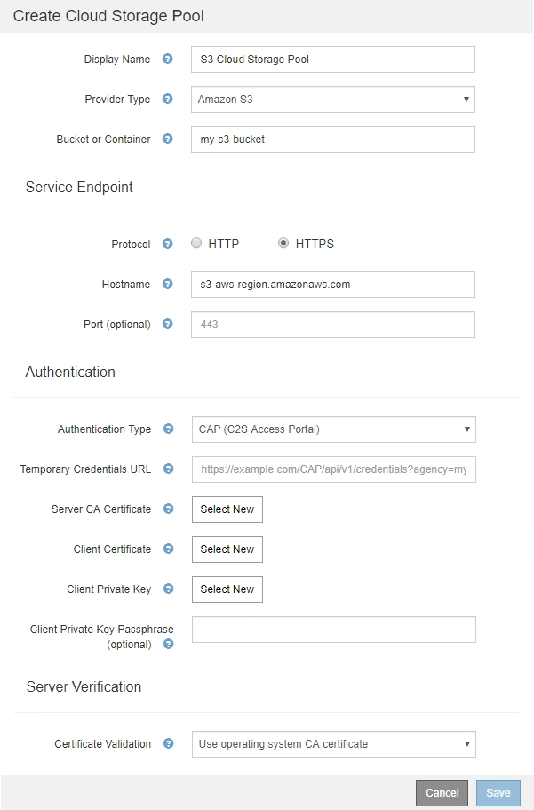

= C2S S3: Especificando detalhes de autenticação para um pool de armazenamento em nuvem
:allow-uri-read: 
:icons: font
:imagesdir: ../media/

[role="lead"]
Para usar o serviço de Serviços comerciais de nuvem (C2S) S3 como um pool de armazenamento em nuvem, você deve configurar o C2S Access Portal (CAP) como o tipo de autenticação, para que a StorageGRID possa solicitar credenciais temporárias para acessar o bucket do S3 na sua conta do C2S.

.O que você vai precisar
* Você deve ter inserido as informações básicas de um pool de armazenamento em nuvem do Amazon S3, incluindo o endpoint do serviço.
* Você deve saber o URL completo que o StorageGRID usará para obter credenciais temporárias do SERVIDOR CAP, incluindo todos os parâmetros de API necessários e opcionais atribuídos à sua conta C2S.
* Você deve ter um certificado de CA de servidor emitido por uma autoridade de certificação governamental (CA) apropriada. O StorageGRID usa esse certificado para verificar a identidade do SERVIDOR CAP. O certificado de CA do servidor deve usar a codificação PEM.
* Você deve ter um certificado de cliente emitido por uma autoridade de certificação governamental (CA) apropriada. O StorageGRID usa esse certificado para identificar-se para o servidor CAP. O certificado de cliente deve usar codificação PEM e deve ter acesso à sua conta C2S.
* Você deve ter uma chave privada codificada PEM para o certificado do cliente.
* Se a chave privada do certificado de cliente for encriptada, tem de ter a frase-passe para o desencriptar.

.Passos
. Na seção *Autenticação*, selecione *CAP (C2S Access Portal)* na lista suspensa *Authentication Type*.
+
Os campos de autenticação CAP C2S aparecem.

+

. Forneça as seguintes informações:
+
.. Para *URL de credenciais temporárias*, insira o URL completo que o StorageGRID usará para obter credenciais temporárias do SERVIDOR CAP, incluindo todos os parâmetros de API necessários e opcionais atribuídos à sua conta C2S.
.. Para *certificado CA do servidor*, clique em *Selecionar novo* e carregue o certificado CA codificado em PEM que o StorageGRID usará para verificar o servidor CAP.
.. Para *certificado de cliente*, clique em *Selecionar novo* e carregue o certificado codificado PEM que o StorageGRID usará para se identificar no servidor CAP.
.. Para *chave privada do cliente*, clique em *Select New* e carregue a chave privada codificada pelo PEM para o certificado do cliente.
+
Se a chave privada for criptografada, o formato tradicional deve ser usado. (O formato criptografado PKCS nº 8 não é suportado.)

.. Se a chave privada do cliente estiver encriptada, introduza a frase-passe para desencriptar a chave privada do cliente. Caso contrário, deixe o campo *frase-passe de chave privada do cliente* em branco.

. Na seção Verificação do servidor, forneça as seguintes informações:
+
.. Para *Validação de certificado*, selecione *usar certificado CA personalizado*.
.. Clique em *Select New* (Selecionar novo) e carregue o certificado CA codificado em PEM.

. Clique em *Salvar*.

Quando você salva um pool de storage de nuvem, o StorageGRID faz o seguinte:

* Valida que o intervalo e o endpoint de serviço existem e que eles podem ser alcançados usando as credenciais que você especificou.
* Grava um arquivo de marcador no bucket para identificar o bucket como um Cloud Storage Pool. Nunca remova esse arquivo, que é `x-ntap-sgws-cloud-pool-uuid` chamado .

Se a validação do Cloud Storage Pool falhar, você receberá uma mensagem de erro que explica por que a validação falhou. Por exemplo, um erro pode ser relatado se houver um erro de certificado ou se o intervalo especificado ainda não existir.

image::../media/cloud_storage_pool_create_error.gif[Erro de criação do pool de armazenamento na nuvem]

Consulte as instruções para solucionar problemas de pools de armazenamento em nuvem, resolver o problema e, em seguida, tente salvar o pool de armazenamento em nuvem novamente.

.Informações relacionadas
link:troubleshooting-cloud-storage-pools.html["Solução de problemas de Cloud Storage Pools"]
