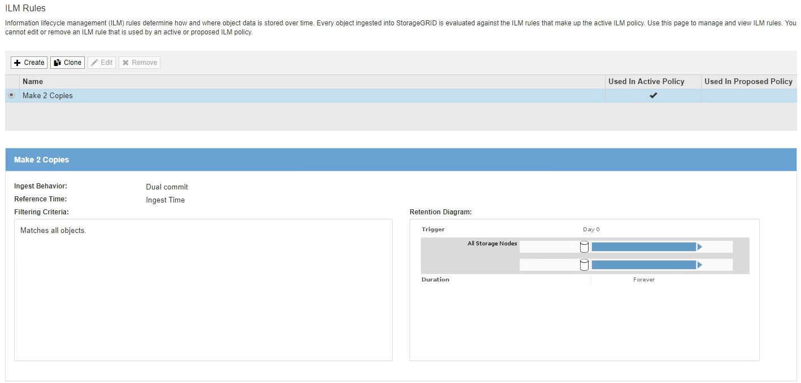

= Criando uma regra ILM
:allow-uri-read: 
:icons: font
:imagesdir: ../media/

[role="lead"]
As regras do ILM permitem gerenciar o posicionamento dos dados do objeto ao longo do tempo. Para criar uma regra ILM, use o assistente criar regra ILM.

.Antes de começar
* Você deve estar conetado ao Gerenciador de Grade usando um navegador compatível.
* Você deve ter permissões de acesso específicas.
* Se você quiser especificar a que contas de inquilino esta regra se aplica, você deve ter a permissão Contas de locatário ou você deve saber o ID da conta para cada conta.
* Se você quiser que a regra filtre objetos nos metadados da última hora de acesso, as atualizações da última hora de acesso devem ser habilitadas por bucket para S3 ou por container para Swift.
* Se você estiver criando cópias replicadas, terá que ter configurado todos os pools de storage ou pools de storage em nuvem que você planeja usar.
* Se estiver criando cópias codificadas para apagamento, você deverá ter configurado um perfil de codificação de apagamento.
* Você deve estar familiarizado com o link:data-protection-options-for-ingest.html["opções de proteção de dados para ingestão"].
* Se você precisar criar uma regra compatível para usar com o bloqueio de objetos S3, você deve estar familiarizado com o link:requirements-for-s3-object-lock.html["Requisitos para o bloqueio de objetos S3"].

NOTE: Para criar a regra ILM padrão para uma política, use este procedimento em vez disso: link:creating-default-ilm-rule.html["Criando uma regra ILM padrão"].

.Sobre esta tarefa
Ao criar regras ILM:

* Considere a topologia do sistema StorageGRID e as configurações de storage.
* Considere quais tipos de cópias de objetos você deseja fazer (replicadas ou codificadas para apagamento) e o número de cópias de cada objeto que são necessárias.
* Determine quais tipos de metadados de objetos são usados nos aplicativos que se conetam ao sistema StorageGRID. As regras do ILM filtram objetos com base em seus metadados.
* Considere onde você quer que cópias de objeto sejam colocadas ao longo do tempo.
* Decida qual opção usar para a opção de proteção de dados na ingestão (Balanced, strict ou Dual Commit)

.Passos
. Selecione *ILM* > *regras*.
+
A página ILM Rules (regras do ILM) é exibida, com a regra de estoque, faça 2 cópias, selecionadas.

+

+

NOTE: A página regras do ILM parece um pouco diferente se a configuração global de bloqueio de objetos do S3 tiver sido ativada para o sistema StorageGRID. A tabela de resumo inclui uma coluna *compliant* e os detalhes da regra selecionada incluem um campo *compliant*.

. Selecione *criar*.
+
A etapa 1 (Definir noções básicas) do assistente criar regra ILM é exibida. Você usa a página Definir noções básicas para definir quais objetos a regra se aplica.

.Informações relacionadas
link:../s3/index.html["Use S3"]

link:../swift/index.html["Use Swift"]

link:configuring-erasure-coding-profiles.html["Configurando perfis de codificação de apagamento"]

link:configuring-storage-pools.html["Configurando pools de armazenamento"]

link:using-cloud-storage-pools.html["Usando Cloud Storage Pools"]

link:data-protection-options-for-ingest.html["Opções de proteção de dados para ingestão"]

link:managing-objects-with-s3-object-lock.html["Gerenciando objetos com o S3 Object Lock"]
