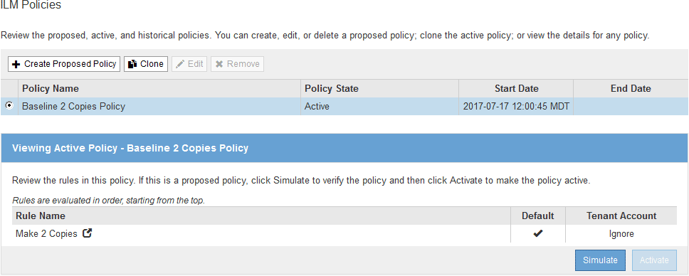
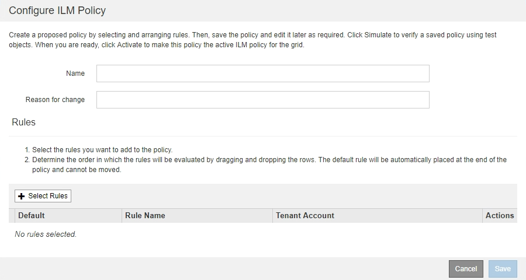
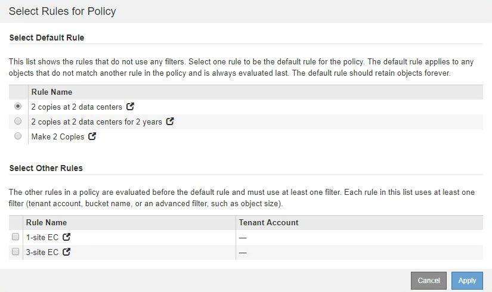
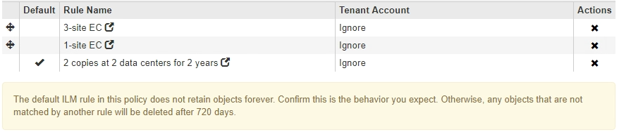

= Criando uma política proposta de ILM
:allow-uri-read: 
:icons: font
:imagesdir: ../media/

[role="lead"]
Você pode criar uma política de ILM proposta do zero ou clonar a política ativa atual se quiser começar com o mesmo conjunto de regras.

.O que você vai precisar
* Você deve estar conetado ao Gerenciador de Grade usando um navegador compatível.
* Você deve ter permissões de acesso específicas.
* Você deve ter criado as regras ILM que deseja adicionar à política proposta. Conforme necessário, você pode salvar uma política proposta, criar regras adicionais e editar a política proposta para adicionar as novas regras.
* Você deve ter criado uma regra ILM padrão para a política que não contém nenhum filtro.
+
link:creating-default-ilm-rule.html["Criando uma regra ILM padrão"]

.Sobre esta tarefa
As razões típicas para criar uma política de ILM proposta incluem:

* Você adicionou um novo site e precisa usar novas regras ILM para colocar objetos nesse site.
* Você está desativando um site e você precisa remover todas as regras que se referem ao site.
* Você adicionou um novo locatário com requisitos especiais de proteção de dados.
* Você começou a usar um Cloud Storage Pool.

IMPORTANT: Utilize a política incorporada do sistema, a Política de cópias da linha de base 2, apenas em sistemas de teste. A regra fazer cópias 2 nesta política usa o pool de storage todos os nós de storage, que contém todos os sites. Se o seu sistema StorageGRID tiver mais de um local, duas cópias de um objeto poderão ser colocadas no mesmo local.

[NOTE]
====
Se a configuração global S3 Object Lock tiver sido ativada, as etapas para criar uma política serão ligeiramente diferentes. Você deve garantir que a política ILM esteja em conformidade com os requisitos de buckets que têm o bloqueio de objeto S3 ativado.

link:creating-ilm-policy-after-s3-object-lock-is-enabled.html["Criar uma política ILM depois que o bloqueio de objetos S3 estiver ativado"]

====
.Passos
. Selecione *ILM* > *políticas*.
+
É apresentada a página ILM Policies (políticas ILM). Nesta página, você pode revisar a lista de políticas propostas, ativas e históricas; criar, editar ou remover uma política proposta; clonar a política ativa; ou exibir os detalhes de qualquer política.

+

. Determine como você deseja criar a política de ILM proposta.
+
[cols="1a,2a"]
|===
| Opção | Passos 

 a| 
Crie uma nova política proposta que não tenha regras já selecionadas
 a| 
.. Se uma política de ILM proposta existir atualmente, selecione essa política e clique em *Remover*.
+
Não é possível criar uma nova política proposta se uma política proposta já existir.

.. Clique em *criar política proposta*.

 a| 
Criar uma política proposta com base na política ativa
 a| 
.. Se uma política de ILM proposta existir atualmente, selecione essa política e clique em *Remover*.
+
Você não pode clonar a política ativa se uma política proposta já existir.

.. Selecione a política ativa na tabela.
.. Clique em *Clone*.

 a| 
Edite a política proposta existente
 a| 
.. Selecione a política proposta na tabela.
.. Clique em *Editar*.

|===
+
A caixa de diálogo Configurar política ILM é exibida.

+
Se você estiver criando uma nova política proposta, todos os campos estarão em branco e nenhuma regra será selecionada.

+

+
Se você estiver clonando a política ativa, o campo *Name* mostra o nome da política ativa, anexado por um número de versão ("'v2'" no exemplo). As regras usadas na política ativa são selecionadas e mostradas em sua ordem atual.

+
image::../media/ilm_policies_version.gif[Versão de políticas ILM]

. Digite um nome exclusivo para a política proposta no campo *Nome*.
+
Você deve inserir pelo menos 1 e não mais de 64 carateres. Se você estiver clonando a política ativa, poderá usar o nome atual com o número de versão anexado ou inserir um novo nome.

. Insira o motivo pelo qual você está criando uma nova política proposta no campo *motivo da mudança*.
+
Você deve inserir pelo menos 1 e não mais de 128 carateres.

. Para adicionar regras à política, selecione *Selecionar regras*.
+
A caixa de diálogo Selecionar regras para política é exibida, com todas as regras definidas listadas. Se você estiver clonando uma política:

+
** As regras usadas pela política de clonagem são selecionadas.
** Se a política que você está clonando usou quaisquer regras sem filtros que não eram a regra padrão, você será solicitado a remover todas, exceto uma dessas regras.
** Se a regra padrão usou um filtro, você será solicitado a selecionar uma nova regra padrão.
** Se a regra padrão não for a última regra, um botão permite mover a regra para o final da nova política. 

. Selecione um nome de regra ou o ícone mais detalhes image:../media/icon_nms_more_details.gif["ícone mais detalhes"]para exibir as configurações dessa regra.
+
Este exemplo mostra os detalhes de uma regra ILM que faz duas cópias replicadas em dois sites.

+
image::../media/ilm_rule_summary_page.png[Página Resumo da regra ILM]

. Na seção *Selecionar regra padrão*, selecione uma regra padrão para a política proposta.
+
A regra padrão se aplica a quaisquer objetos que não correspondam a outra regra na política. A regra padrão não pode usar nenhum filtro e é sempre avaliada por último.

+
[NOTE]
====
Se nenhuma regra estiver listada na seção Selecionar regra padrão, você deverá sair da página de política ILM e criar uma regra padrão.

link:creating-default-ilm-rule.html["Criando uma regra ILM padrão"]

====
+

IMPORTANT: Não use a regra fazer 2 cópias de estoque como a regra padrão para uma política. A regra fazer 2 cópias usa um único pool de storage, todos os nós de storage, que contém todos os locais. Se o seu sistema StorageGRID tiver mais de um local, duas cópias de um objeto poderão ser colocadas no mesmo local.

. Na seção *Selecionar outras regras*, selecione quaisquer outras regras que você deseja incluir na política.
+
As outras regras são avaliadas antes da regra padrão e devem usar pelo menos um filtro (conta de locatário, nome do intervalo ou um filtro avançado, como tamanho do objeto).

. Quando terminar de selecionar regras, selecione *aplicar*.
+
As regras selecionadas são listadas. A regra padrão está no final, com as outras regras acima dela.

+
image::../media/ilm_policies_selected_rules.png[Regras selecionadas de políticas ILM]

+
[NOTE]
====
Um aviso aparece se a regra padrão não retiver objetos para sempre. Quando você ativa essa política, você deve confirmar que deseja que o StorageGRID exclua objetos quando as instruções de posicionamento da regra padrão decorrerem (a menos que um ciclo de vida de bucket mantenha os objetos por mais tempo).

====
. Arraste e solte as linhas para as regras não padrão para determinar a ordem em que essas regras serão avaliadas.
+
Não é possível mover a regra padrão.

+

IMPORTANT: Você deve confirmar se as regras ILM estão na ordem correta. Quando a política é ativada, objetos novos e existentes são avaliados pelas regras na ordem listada, começando na parte superior.

. Conforme necessário, clique no ícone de exclusão image:../media/icon_nms_delete_new.gif["eliminar ícone"]para excluir quaisquer regras que você não deseja na política ou selecione *Selecionar regras* para adicionar mais regras.
. Quando terminar, selecione *Guardar*.
+
A página de políticas ILM é atualizada:

+
** A política que você salvou é mostrada como proposta. As políticas propostas não têm datas de início e fim.
** Os botões *Simulate* e *Activate* estão ativados. image:../media/ilm_policy_proposed_policy_saved.png["Política de ILM Política proposta guardada"]

. Vá para link:simulating-ilm-policy.html["Simulando uma política ILM"].

.Informações relacionadas
link:what-ilm-policy-is.html["O que é uma política ILM"]

link:managing-objects-with-s3-object-lock.html["Gerenciando objetos com o S3 Object Lock"]
