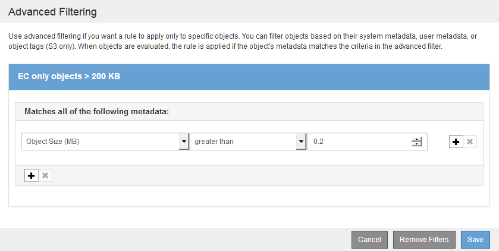
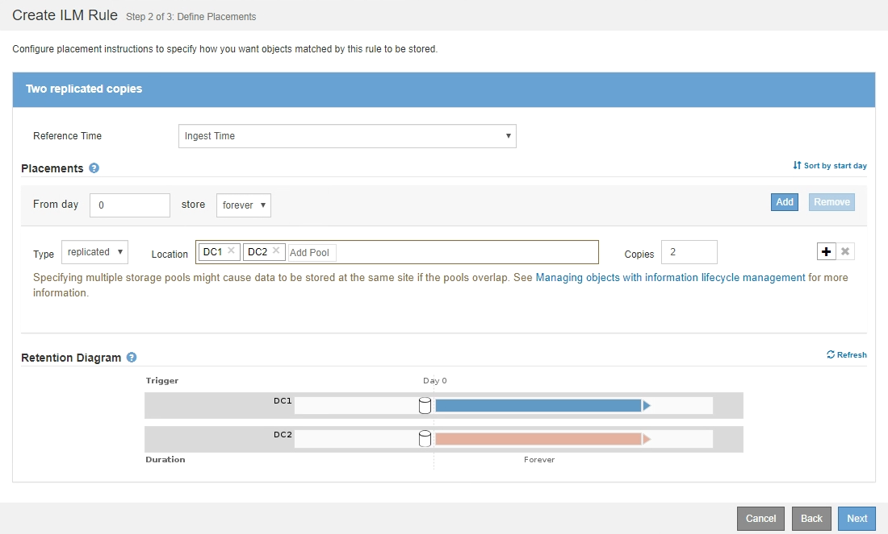

= Exemplo 2: Regras de ILM e política para filtragem de tamanho de objeto EC
:allow-uri-read: 
:icons: font
:imagesdir: ../media/

[role="lead"]
Você pode usar as seguintes regras e políticas de exemplo como pontos de partida para definir uma política de ILM que filtra por tamanho do objeto para atender aos requisitos de EC recomendados.

CAUTION: As seguintes regras e políticas do ILM são apenas exemplos. Existem muitas maneiras de configurar regras ILM. Antes de ativar uma nova política, simule a política proposta para confirmar que ela funcionará como a intenção de proteger o conteúdo contra perda.

== Regra ILM 1 por exemplo 2: Use EC para todos os objetos maiores que 200 KB

Este exemplo de exclusão de regra ILM codifica todos os objetos com mais de 200 KB (0,20 MB).

[cols="1a,2a"]
|===
| Definição de regra | Exemplo de valor 

 a| 
Nome da regra
 a| 
Objetos somente EC > 200 KB

 a| 
Tempo de referência
 a| 
Tempo de ingestão

 a| 
Filtragem Avançada para tamanho Objeto
 a| 
Tamanho do objeto (MB) maior que 0,20

 a| 
Colocação de conteúdo
 a| 
Crie uma cópia codificada por apagamento 2-1 usando três sites

|===

As instruções de colocação especificam que uma cópia codificada por apagamento 2-1 seja criada usando todos os três sites.

image::../media/policy_2_rule_1_ec_objects_placements.png[Regra ILM 1 por exemplo 2: Use EC para todos os objetos maiores que 200 KB]

== Regra ILM 2 por exemplo 2: Duas cópias replicadas

Este exemplo de regra ILM cria duas cópias replicadas e não filtra pelo tamanho do objeto. Esta regra é a segunda regra da política. Como a regra ILM 1, por exemplo, 2, filtra todos os objetos maiores que 200 KB, a regra ILM 2, por exemplo, 2, aplica-se apenas a objetos com 200 KB ou menores.

[cols="1a,2a"]
|===
| Definição de regra | Exemplo de valor 

 a| 
Nome da regra
 a| 
Duas cópias replicadas

 a| 
Tempo de referência
 a| 
Tempo de ingestão

 a| 
Filtragem Avançada para tamanho Objeto
 a| 
Nenhum

 a| 
Colocação de conteúdo
 a| 
Crie duas cópias replicadas e salve-as em dois data centers, DC1 e DC2

|===

== Política de ILM, por exemplo, 2: Use EC para objetos maiores que 200 KB

Nesta política de exemplo, objetos com mais de 200 KB são codificados para apagamento. Duas cópias replicadas são feitas de todos os outros objetos.

Este exemplo de política ILM inclui as seguintes regras ILM:

* Codificar para apagamento todos os objetos com mais de 200 KB.
* Se um objeto não corresponder à primeira regra ILM, use a regra ILM padrão para criar duas cópias replicadas desse objeto. Como objetos com mais de 200 KB foram filtrados pela regra 1, a regra 2 aplica-se apenas a objetos com 200 KB ou menos.
+
image::../media/policy_2_configured_policy.png[Política de ILM, por exemplo, 2: Use EC para objetos maiores que 200 KB]

