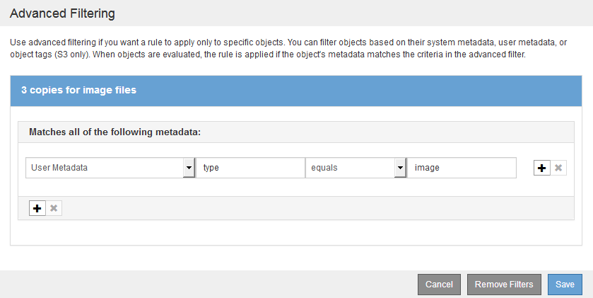

= Exemplo 3: Regras e política de ILM para melhor proteção para arquivos de imagem
:allow-uri-read: 
:icons: font
:imagesdir: ../media/

[role="lead"]
Você pode usar as regras e a política de exemplo a seguir para garantir que imagens maiores de 200 KB sejam codificadas para apagamento e que três cópias sejam feitas de imagens menores.

CAUTION: As seguintes regras e políticas do ILM são apenas exemplos. Existem muitas maneiras de configurar regras ILM. Antes de ativar uma nova política, simule a política proposta para confirmar que ela funcionará como a intenção de proteger o conteúdo contra perda.

== Regra ILM 1 por exemplo 3: Use EC para arquivos de imagem maiores que 200 KB

Este exemplo de regra ILM usa filtragem avançada para codificar todos os arquivos de imagem com mais de 200 KB.

[cols="1a,2a"]
|===
| Definição de regra | Exemplo de valor 

 a| 
Nome da regra
 a| 
Ficheiros de imagem EC > 200 KB

 a| 
Tempo de referência
 a| 
Tempo de ingestão

 a| 
Filtragem avançada para metadados do usuário
 a| 
O tipo de metadados do usuário é igual a arquivos de imagem

 a| 
Filtragem Avançada para tamanho Objeto
 a| 
Tamanho do objeto (MB) maior que 0,2

 a| 
Colocação de conteúdo
 a| 
Crie uma cópia codificada por apagamento 2-1 usando três sites

|===
image:../media/policy_3_rule_1_ec_images_adv_filtering.gif["Regra ILM 1 por exemplo 3: Use EC para arquivos de imagem maiores que 200 KB"]

Como essa regra é configurada como a primeira regra na política, a instrução de posicionamento de codificação de apagamento só se aplica a imagens maiores que 200 KB.

image::../media/policy_2_rule_1_ec_objects_placements.png[Regra ILM 1 por exemplo 3: Use EC para arquivos de imagem maiores que 200 KB]

== Regra ILM 2 por exemplo 3: Replique 3 cópias para todos os arquivos de imagem restantes

Este exemplo de regra ILM usa filtragem avançada para especificar que os arquivos de imagem sejam replicados.

[cols="1a,2a"]
|===
| Definição de regra | Exemplo de valor 

 a| 
Nome da regra
 a| 
3 cópias para arquivos de imagem

 a| 
Tempo de referência
 a| 
Tempo de ingestão

 a| 
Filtragem avançada para metadados do usuário
 a| 
O tipo de metadados do usuário é igual a arquivos de imagem

 a| 
Colocação de conteúdo
 a| 
Crie 3 cópias replicadas em todos os nós de storage

|===

Como a primeira regra na política já corresponde a arquivos de imagem maiores que 200 KB, essas instruções de colocação só se aplicam a arquivos de imagem 200 KB ou menores.

image::../media/policy_3_rule_2_copies_for_images_placements.png[Regra ILM 2 por exemplo 3: Replique 3 cópias para todos os arquivos de imagem restantes]

== Política ILM, por exemplo, 3: Melhor proteção para arquivos de imagem

Neste exemplo, a política ILM usa três regras ILM para criar uma política que codifique arquivos de imagem com mais de 200 KB (0,2 MB), crie cópias replicadas para arquivos de imagem com 200 KB ou menos e faça duas cópias replicadas para qualquer arquivo que não seja de imagem.

Este exemplo de política ILM inclui regras que executam o seguinte:

* Todos os arquivos de imagem com mais de 200 KB.
* Crie três cópias de quaisquer arquivos de imagem restantes (ou seja, imagens com 200 KB ou menos).
* Aplique a regra padrão a quaisquer objetos restantes (ou seja, todos os arquivos que não sejam de imagem).

image::../media/policy_3_configured_policy.gif[Política ILM, por exemplo, 3: Melhor proteção para arquivos de imagem]
