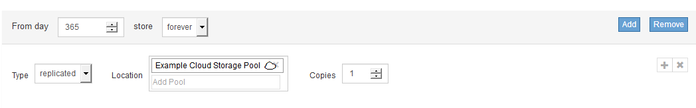
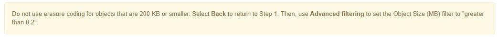

= Passo 2 de 3: Definir posicionamentos
:allow-uri-read: 
:icons: font
:imagesdir: ../media/

[role="lead"]
A etapa 2 (Definir posicionamentos) do assistente criar regra ILM permite definir as instruções de posicionamento que determinam quanto tempo os objetos são armazenados, o tipo de cópias (replicadas ou codificadas de apagamento), o local de armazenamento e o número de cópias.

.Sobre esta tarefa
Uma regra ILM pode incluir uma ou mais instruções de colocação. Cada instrução de colocação aplica-se a um único período de tempo. Quando você usa mais de uma instrução, os períodos de tempo devem ser contíguos, e pelo menos uma instrução deve começar no dia 0. As instruções podem continuar para sempre ou até que você não precise mais nenhuma cópia de objeto.

Cada instrução de colocação pode ter várias linhas se você quiser criar diferentes tipos de cópias ou usar locais diferentes durante esse período de tempo.

Este exemplo de regra ILM cria duas cópias replicadas para o primeiro ano. Cada cópia é salva em um pool de armazenamento em um local diferente. Após um ano, uma cópia codificada por apagamento de 2 mais de 1 é feita e salva em apenas um local.

image::../media/ilm_create_ilm_rule_wizard_2.png[Criar Assistente de regras ILM Página 2]

.Passos
. Para *tempo de referência*, selecione o tipo de tempo a ser utilizado para calcular a hora de início de uma instrução de colocação.
+
[cols="1a,2a"]
|===
| Opção | Descrição 

 a| 
Tempo de ingestão
 a| 
O tempo em que o objeto foi ingerido.

 a| 
Último tempo de acesso
 a| 
A hora em que o objeto foi recuperado pela última vez (lido ou visualizado).

*Observação:* para usar essa opção, as atualizações do último tempo de acesso devem estar ativadas para o bucket S3 ou o contentor Swift.

link:using-last-access-time-in-ilm-rules.html["Usando o último tempo de acesso nas regras do ILM"]

 a| 
Hora não atual
 a| 
O tempo em que uma versão de objeto se tornou não atual porque uma nova versão foi ingerida e substituída como a versão atual.

*Nota:* o tempo não atual aplica-se apenas a objetos S3D em buckets habilitados para versionamento.

Você pode usar essa opção para reduzir o impactos de armazenamento de objetos com controle de versão filtrando versões de objetos não atuais. Veja "'exemplo 4: Regras e política do ILM para objetos com versão S3.'"

 a| 
Tempo de criação definido pelo utilizador
 a| 
Um tempo especificado nos metadados definidos pelo usuário.

|===
+

NOTE: Se você quiser criar uma regra compatível, selecione *tempo de ingestão*.

. Na seção *colocações*, selecione uma hora de início e uma duração para o primeiro período de tempo.
+
Por exemplo, você pode querer especificar onde armazenar objetos para o primeiro ano ("dia 0 para 365 dias"). Pelo menos uma instrução deve começar no dia 0.

. Se você quiser criar cópias replicadas:
+
.. Na lista suspensa *tipo*, selecione *replicado*.
.. No campo *localização*, selecione *Adicionar pool* para cada pool de armazenamento que você deseja adicionar.
+
*Se você especificar apenas um pool de armazenamento*, esteja ciente de que o StorageGRID pode armazenar apenas uma cópia replicada de um objeto em qualquer nó de armazenamento. Se sua grade incluir três nós de storage e você selecionar 4 como o número de cópias, apenas três cópias serão feitas - uma cópia para cada nó de storage.

+

NOTE: O alerta *ILM Placement Unachievable* é acionado para indicar que a regra ILM não pôde ser completamente aplicada.

+
*Se você especificar mais de um pool de armazenamento*, tenha em mente estas regras:

+
*** O número de cópias não pode ser maior que o número de pools de armazenamento.
*** Se o número de cópias for igual ao número de pools de storage, uma cópia do objeto será armazenada em cada pool de storage.
*** Se o número de cópias for menor do que o número de pools de storage, o sistema distribui as cópias para manter o uso do disco entre os pools balanceado e garantir que nenhum local receba mais de uma cópia de um objeto.
*** Se os pools de storage se sobreporem (contiverem os mesmos nós de storage), todas as cópias do objeto poderão ser salvas em apenas um local. Por esse motivo, não especifique o pool de storage padrão de todos os nós de storage e outro pool de storage.
+
image::../media/ilm_rule_with_multiple_storage_pools.png[Instruções de colocação para vários pools de armazenamento]

.. Selecione o número de cópias que deseja fazer.
+
[IMPORTANT]
====
Um aviso será exibido se você alterar o número de cópias para 1. Uma regra de ILM que cria apenas uma cópia replicada para qualquer período de tempo coloca os dados em risco de perda permanente. Se existir apenas uma cópia replicada de um objeto durante um período de tempo, esse objeto será perdido se um nó de armazenamento falhar ou tiver um erro significativo. Você também perde temporariamente o acesso ao objeto durante procedimentos de manutenção, como atualizações.

image::../media/ilm_create_ilm_rule_warning_for_1_copy.png[Criar ILM Rule Page 2 Aviso para cópia 1]

Para evitar esses riscos, faça um ou mais dos seguintes procedimentos:

*** Aumente o número de cópias para o período de tempo.
*** Clique no ícone de sinal de adição image:../media/icon_plus_sign_black_on_white.gif["mais sinal preto sobre branco"]para criar cópias adicionais durante o período de tempo. Em seguida, selecione um pool de armazenamento diferente ou um pool de armazenamento em nuvem.
*** Selecione *codificar para apagamento* para tipo, em vez de *replicado*. Você pode ignorar esse aviso com segurança se essa regra já criar várias cópias para todos os períodos de tempo.

====
.. Se você especificou apenas um pool de armazenamento, ignore o campo *local temporário*.
+

NOTE: Os locais temporários são obsoletos e serão removidos em uma versão futura.

. Se você quiser armazenar objetos em um pool de armazenamento em nuvem:
+
.. Na lista suspensa *tipo*, selecione *replicado*.
.. No campo *localização*, selecione *Adicionar Piscina*. Em seguida, selecione um pool de armazenamento em nuvem.
+

+
Ao usar Cloud Storage Pools, tenha em mente estas regras:

+
*** Você não pode selecionar mais de um pool de armazenamento em nuvem em uma única instrução de colocação. Da mesma forma, você não pode selecionar um pool de armazenamento em nuvem e um pool de armazenamento na mesma instrução de colocação.
+
image::../media/ilm_cloud_storage_pool_error.gif[Regra ILM > erro de pool de armazenamento na nuvem]

*** Você pode armazenar apenas uma cópia de um objeto em qualquer pool de armazenamento em nuvem. Uma mensagem de erro será exibida se você definir *Copies* como 2 ou mais.
+
image::../media/ilm_cloud_storage_pool_error_one_copy.gif[Regra ILM: Erro de pool de armazenamento em nuvem se mais de uma cópia]

*** Você não pode armazenar mais de uma cópia de objeto em qualquer pool de armazenamento em nuvem ao mesmo tempo. Uma mensagem de erro será exibida se vários posicionamentos que usam um pool de armazenamento em nuvem tiverem datas sobrepostas ou se várias linhas no mesmo posicionamento usarem um pool de armazenamento em nuvem.
+
image::../media/ilm_rule_cloud_storage_pool_error_overlapping_dates.png[Datas de sobreposição de erro de pool de armazenamento na nuvem da regra ILM]

*** Você pode armazenar um objeto em um pool de storage de nuvem ao mesmo tempo em que o objeto está sendo armazenado como cópias replicadas ou codificadas de apagamento no StorageGRID. No entanto, como este exemplo mostra, você deve incluir mais de uma linha na instrução de colocação para o período de tempo, para que você possa especificar o número e os tipos de cópias para cada local.
+
image::../media/ilm_cloud_storage_pool_multiple_locations.png[Regra ILM > Cloud Storage Pool e outro local]

. Se você quiser criar uma cópia codificada por apagamento:
+
.. Na lista suspensa *Type*, selecione *Erasure Coded*.
+
O número de cópias muda para 1. Um aviso será exibido se a regra não tiver um filtro avançado para ignorar objetos com 200 KB ou menos.

+

+

IMPORTANT: Não use a codificação de apagamento para objetos com menos de 200 KB para evitar a sobrecarga de gerenciamento de fragmentos codificados de apagamento muito pequenos.

.. Se o aviso de tamanho do objeto aparecer, siga estas etapas para limpá-lo:
+
... Selecione *voltar* para voltar ao passo 1.
... Selecione *filtragem avançada*.
... Defina o filtro tamanho do objeto (MB) como "'maior que 0,2"".

.. Selecione o local de armazenamento.
+
O local de storage para uma cópia codificada por apagamento inclui o nome do pool de storage, seguido do nome do perfil de codificação de apagamento.

+
image::../media/storage_pool_and_erasure_coding_profile.png[Pool de armazenamento e nome do perfil EC]

. Opcionalmente, adicione períodos de tempo diferentes ou crie cópias adicionais em locais diferentes:
+
** Clique no ícone de mais para criar cópias adicionais em um local diferente durante o mesmo período de tempo.
** Clique em *Add* para adicionar um período de tempo diferente às instruções de colocação.
+

NOTE: Os objetos são automaticamente excluídos no final do período de tempo final, a menos que o período de tempo final termine com *Forever*.

. Clique em *Refresh* para atualizar o Diagrama de retenção e confirmar as instruções de colocação.
+
Cada linha no diagrama mostra onde e quando cópias de objetos serão colocadas. O tipo de cópia é representado por um dos seguintes ícones:

+
[cols="1a,2a"]
|===

 a| 
image:../media/icon_nms_replicated.gif["Ícone para cópias replicadas"]
 a| 
Cópia replicada

 a| 
image:../media/icon_nms_erasure_coded.gif["Ícone para cópia codificada de apagamento"]
 a| 
Com codificação de apagamento

 a| 
image:../media/icon_cloud_storage_pool.gif["Ícone do Cloud Storage Pool"]
 a| 
Cópia do Cloud Storage Pool

|===
+
Neste exemplo, duas cópias replicadas serão salvas em dois pools de armazenamento (DC1 e DC2) por um ano. Em seguida, uma cópia codificada por apagamento será salva por mais 10 anos, usando um esquema de codificação de apagamento de mais de 6 3 em três locais. Após 11 anos, os objetos serão excluídos do StorageGRID.

+
image::../media/ilm_rule_retention_diagram.png[Diagrama de retenção de regras ILM]

. Clique em *seguinte*.
+
A etapa 3 (Definir comportamento de ingestão) é exibida.

.Informações relacionadas
link:what-ilm-placement-instructions-are.html["Quais são as instruções de colocação de regras do ILM"]

link:example-4-ilm-rules-and-policy-for-s3-versioned-objects.html["Exemplo 4: Regras ILM e política para objetos com versão S3"]

link:why-you-should-not-use-single-copy-replication.html["Por que você não deve usar replicação de cópia única"]

link:managing-objects-with-s3-object-lock.html["Gerenciando objetos com o S3 Object Lock"]

link:using-storage-pool-as-temporary-location-deprecated.html["Usando um pool de armazenamento como um local temporário (obsoleto)"]

link:step-3-of-3-define-ingest-behavior.html["Etapa 3 de 3: Definir o comportamento de ingestão"]
