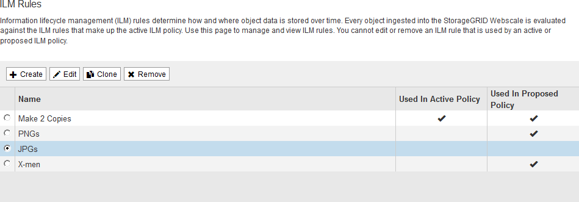

= Trabalhando com regras de ILM e políticas de ILM
:allow-uri-read: 
:icons: font
:imagesdir: ../media/

[role="lead"]
Depois de criar regras ILM e uma política ILM, você poderá continuar trabalhando com elas, modificando sua configuração à medida que seus requisitos de storage mudarem.

== Excluindo uma regra ILM

Para manter a lista de regras atuais do ILM gerenciável, exclua quaisquer regras do ILM que você provavelmente não usará.

.O que você vai precisar
* Você deve estar conetado ao Gerenciador de Grade usando um navegador compatível.
* Você deve ter permissões de acesso específicas.

[NOTE]
====
Não é possível excluir uma regra ILM se ela for usada atualmente na política ativa ou na política proposta. Se você precisar excluir uma regra ILM que é usada em uma política, execute estas etapas primeiro:

. Clonar a política ativa ou editar a política proposta.
. Remova a regra ILM da política.
. Salve, simule e ative a nova política para garantir que os objetos estejam protegidos conforme esperado.

====
.Passos
. Selecione *ILM* > *regras*.
. Revise a entrada da tabela para a regra que deseja remover.
+
Confirme se a regra não é usada na política ILM ativa ou na política ILM proposta.

. Se a regra que você deseja remover não estiver em uso, selecione o botão de opção e selecione *Remover*.
. Selecione *OK* para confirmar que deseja excluir a regra ILM.
+
A regra ILM é excluída.

+
[NOTE]
====
Se você excluir uma regra que é usada em uma política histórica, um image:../media/icon_ilm_rule_historical.png["Icon ILM Rule Historical"] ícone aparecerá para a regra quando você exibir a política, o que indica que a regra se tornou uma regra histórica.

image::../media/ilm_rule_historical.png[Histórico regra ILM]

====

.Informações relacionadas
link:creating-ilm-policy.html["Criando uma política ILM"]

== Editar uma regra ILM

Talvez seja necessário editar uma regra ILM para alterar um filtro ou uma instrução de colocação.

.O que você vai precisar
* Você deve estar conetado ao Gerenciador de Grade usando um navegador compatível.
* Você deve ter permissões de acesso específicas.

.Sobre esta tarefa
Não é possível editar uma regra se ela estiver sendo usada na política ILM proposta ou na política ILM ativa. Em vez disso, você pode clonar essas regras e fazer as alterações necessárias na cópia clonada. Você também não pode editar a regra ILM de estoque (fazer 2 cópias) ou regras ILM criadas antes da versão 10,3 do StorageGRID.

NOTE: Antes de adicionar uma regra editada à política ILM ativa, esteja ciente de que uma alteração nas instruções de posicionamento de um objeto pode causar um aumento de carga no sistema.

.Passos
. Selecione *ILM* > *regras*.
+
A página regras do ILM é exibida. Esta página mostra todas as regras disponíveis e indica quais regras estão sendo usadas na política ativa ou na política proposta.

+

. Selecione uma regra que não esteja sendo usada e clique em *Editar*.
+
O assistente Editar regra ILM é aberto.

+
image::../media/edit_ilm_rule_step_1.png[Editar página de regra ILM]

. Complete as páginas do assistente Editar regra ILM, seguindo as etapas para criar uma regra ILM e usar filtros avançados, conforme necessário.
+
Ao editar uma regra ILM, você não pode alterar seu nome.

. Clique em *Salvar*.
+
[NOTE]
====
Se você editar uma regra que é usada em uma política histórica, um image:../media/icon_ilm_rule_historical.png["Icon ILM Rule Historical"] ícone aparecerá para a regra quando você exibir a política, o que indica que a regra se tornou uma regra histórica.

image::../media/ilm_rule_historical.png[Histórico regra ILM]

====

.Informações relacionadas
link:creating-ilm-rule.html["Criando uma regra ILM"]

link:using-advanced-filters-in-ilm-rules.html["Usando filtros avançados em regras ILM"]

== Clonar uma regra ILM

Não é possível editar uma regra se ela estiver sendo usada na política ILM proposta ou na política ILM ativa. Em vez disso, você pode clonar uma regra e fazer as alterações necessárias à cópia clonada. Então, se necessário, você pode remover a regra original da política proposta e substituí-la pela versão modificada. Você não pode clonar uma regra ILM se ela foi criada usando o StorageGRID versão 10,2 ou anterior.

.O que você vai precisar
* Você deve estar conetado ao Gerenciador de Grade usando um navegador compatível.
* Você deve ter permissões de acesso específicas.

.Sobre esta tarefa
Antes de adicionar uma regra clonada à política ILM ativa, esteja ciente de que uma alteração nas instruções de posicionamento de um objeto pode causar um aumento de carga no sistema.

.Passos
. Selecione *ILM* > *regras*.
+
A página regras do ILM é exibida.

+

. Selecione a regra ILM que deseja clonar e clique em *Clone*.
+
O assistente criar regra ILM é aberto.

. Atualize a regra clonada seguindo as etapas para editar uma regra ILM e usando filtros avançados.
+
Ao clonar uma regra ILM, você deve inserir um novo nome.

. Clique em *Salvar*.
+
A nova regra ILM é criada.

.Informações relacionadas
link:working-with-ilm-rules-and-ilm-policies.html["Trabalhando com regras de ILM e políticas de ILM"]

link:using-advanced-filters-in-ilm-rules.html["Usando filtros avançados em regras ILM"]

== Visualizar a fila de atividades da política ILM

Você pode exibir o número de objetos que estão na fila a serem avaliados em relação à política ILM a qualquer momento. Você pode querer monitorar a fila de processamento ILM para determinar o desempenho do sistema. Uma fila grande pode indicar que o sistema não é capaz de acompanhar a taxa de ingestão, a carga dos aplicativos cliente é muito grande ou que existe alguma condição anormal.

.O que você vai precisar
* Você deve estar conetado ao Gerenciador de Grade usando um navegador compatível.
* Você deve ter permissões de acesso específicas.

.Passos
. Selecione *Painel*.
+
image::../media/grid_manager_dashboard.png[Painel na interface de gerenciamento de grade]

. Monitore a seção Gerenciamento do ciclo de vida das informações (ILM).
+
Você pode clicar no ponto de interrogação image:../media/icon_nms_question.gif["ícone de ponto de interrogação"]para ver uma descrição dos itens nesta seção.

