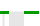

= Legenda da carta
:allow-uri-read: 
:icons: font
:imagesdir: ../media/

[role="lead"]
As linhas e cores usadas para desenhar gráficos têm significado específico.

|===
| Amostra | Significado 

 a| 
image:../media/dark_green_chart_line.gif["captura de tela mostrando linha verde escura"]
 a| 
Os valores de atributo relatados são plotados usando linhas verdes escuras.

 a| 
image:../media/light_green_chart_line.gif["captura de tela mostrando sombreamento que indica binning de dados"]
 a| 
O sombreamento verde claro em torno de linhas verdes escuras indica que os valores reais nesse intervalo de tempo variam e foram "binned" para plotagem mais rápida. A linha escura representa a média ponderada. O intervalo em verde claro indica os valores máximo e mínimo dentro do compartimento. O sombreamento castanho claro é usado para gráficos de área para indicar dados volumétricos.

 a| 

 a| 
Áreas em branco (sem dados plotados) indicam que os valores do atributo não estavam disponíveis. O fundo pode ser azul, cinza ou uma mistura de cinza e azul, dependendo do estado do serviço que relata o atributo.

 a| 
image:../media/light_blue_chart_shading.gif["captura de tela mostrando sombreamento azul claro indicando valores indeterminados"]
 a| 
O sombreamento azul claro indica que alguns ou todos os valores do atributo naquele momento eram indeterminados; o atributo não estava relatando valores porque o serviço estava em um estado desconhecido.

 a| 
image:../media/gray_chart_shading.gif["captura de tela mostrando sombreamento cinza devido a valores desconhecidos"]
 a| 
O sombreamento cinza indica que alguns ou todos os valores de atributo naquele momento não eram conhecidos porque o serviço que relata os atributos estava administrativamente inativo.

 a| 
image:../media/gray_blue_chart_shading.gif["captura de tela mostrando a mistura de valores indeterminados e desconhecidos"]
 a| 
Uma mistura de sombreamento cinza e azul indica que alguns dos valores de atributo na época eram indeterminados (porque o serviço estava em um estado desconhecido), enquanto outros não eram conhecidos porque o serviço relatando os atributos estava administrativamente para baixo.

|===