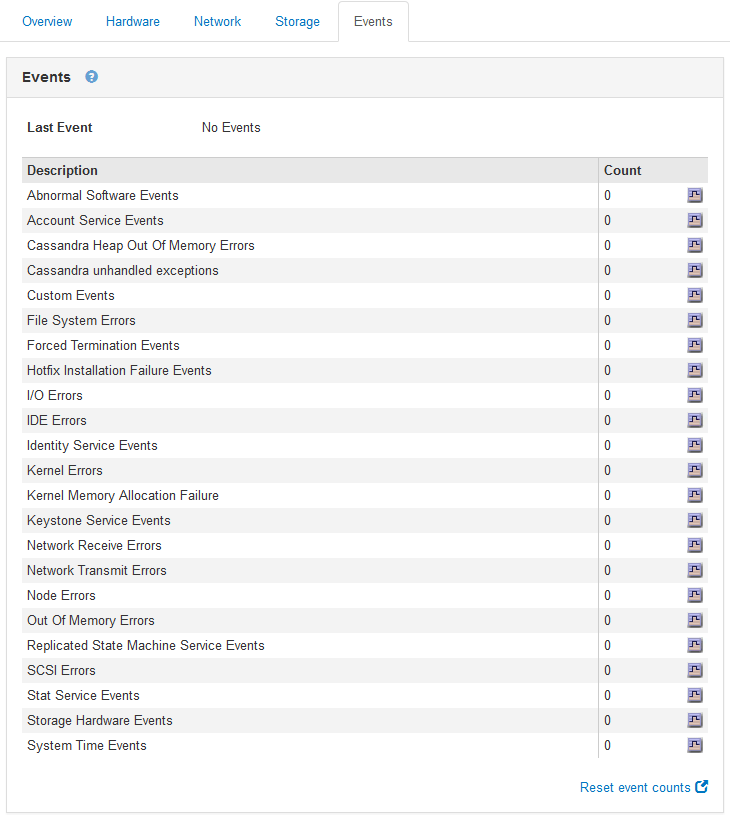

= Criando eventos syslog personalizados
:allow-uri-read: 
:icons: font
:imagesdir: ../media/

[role="lead"]
Eventos personalizados permitem que você acompanhe todos os eventos de usuário do kernel, daemon, erro e nível crítico registrados no servidor syslog. Um evento personalizado pode ser útil para monitorar a ocorrência de mensagens de log do sistema (e, portanto, eventos de segurança de rede e falhas de hardware).

.Sobre esta tarefa
Considere criar eventos personalizados para monitorar problemas recorrentes. As considerações a seguir se aplicam a eventos personalizados.

* Depois que um evento personalizado é criado, cada ocorrência dele é monitorada. Você pode visualizar um valor de contagem cumulativa para todos os eventos personalizados na página *nós* *_grid node_* *Eventos*.
* Para criar um evento personalizado com base em palavras-chave `/var/log/messages` nos arquivos ou `/var/log/syslog`, os Registros nesses arquivos devem ser:
+
** Gerado pelo kernel
** Gerado pelo daemon ou programa do usuário no nível de erro ou crítico

*Nota:* nem todas as entradas nos `/var/log/messages` arquivos OR `/var/log/syslog` serão correspondidas, a menos que satisfaçam os requisitos acima indicados.

.Passos
. Selecione *Configuração* *Monitoramento* *Eventos*.
. Clique em *Edit* image:../media/icon_nms_edit.gif["ícone de lápis"](ou *Insert* image:../media/icon_nms_insert.gif["ícone plus"] se este não for o primeiro evento).
. Introduza uma cadeia de eventos personalizada, por exemplo, encerramento
+
image::../media/custom_events.gif[captura de tela mostrando onde inserir string de evento personalizado]

. Clique em *aplicar alterações*.
. Selecione *nós*. Em seguida, selecione *_grid node_* *Events*.
. Localize a entrada de Eventos personalizados na tabela Eventos e monitore o valor de *Count*.
+
Se a contagem aumentar, um evento personalizado que você está monitorando está sendo acionado nesse nó de grade.

+

