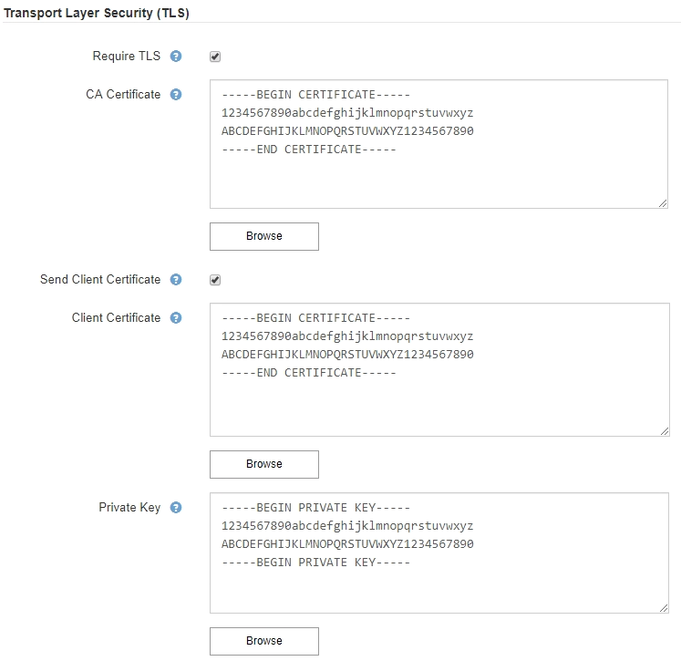

= Gerenciamento de alertas
:allow-uri-read: 
:icons: font
:imagesdir: ../media/

[role="lead"]
Os alertas permitem-lhe monitorizar vários eventos e condições no seu sistema StorageGRID. Você pode gerenciar alertas criando alertas personalizados, editando ou desativando os alertas padrão, configurando notificações de e-mail para alertas e silenciando notificações de alerta.

.Informações relacionadas
link:viewing-current-alerts.html["Visualização de alertas atuais"]

link:viewing-resolved-alerts.html["Visualização de alertas resolvidos"]

link:viewing-specific-alert.html["Visualizar um alerta específico"]

link:alerts-reference.html["Referência de alertas"]

== Quais são os alertas

O sistema de alerta fornece uma interface fácil de usar para detetar, avaliar e resolver os problemas que podem ocorrer durante a operação do StorageGRID.

* O sistema de alerta se concentra em problemas acionáveis no sistema. Ao contrário de alguns alarmes no sistema legado, os alertas são acionados para eventos que exigem sua atenção imediata, não para eventos que podem ser ignorados com segurança.
* A página Alertas atuais fornece uma interface amigável para visualizar problemas atuais. Você pode classificar a lista por alertas individuais e grupos de alertas. Por exemplo, talvez você queira classificar todos os alertas por nó/site para ver quais alertas estão afetando um nó específico. Ou, talvez você queira classificar os alertas em um grupo por tempo acionado para encontrar a instância mais recente de um alerta específico.
* A página Alertas resolvidos fornece informações semelhantes às da página Alertas atuais, mas permite pesquisar e visualizar um histórico dos alertas que foram resolvidos, incluindo quando o alerta foi acionado e quando foi resolvido.
* Vários alertas do mesmo tipo são agrupados em um e-mail para reduzir o número de notificações. Além disso, vários alertas do mesmo tipo são exibidos como um grupo na página Alertas. Você pode expandir e recolher grupos de alerta para mostrar ou ocultar os alertas individuais. Por exemplo, se vários nós relatarem o alerta *não é possível se comunicar com o nó* aproximadamente ao mesmo tempo, somente um email é enviado e o alerta é mostrado como um grupo na página Alertas.
* Os alertas usam nomes e descrições intuitivas para ajudá-lo a entender rapidamente o problema. As notificações de alerta incluem detalhes sobre o nó e o site afetado, a gravidade do alerta, o tempo em que a regra de alerta foi acionada e o valor atual das métricas relacionadas ao alerta.
* As notificações de e-mails de alerta e as listagens de alerta nas páginas Alertas atuais e alertas resolvidos fornecem ações recomendadas para resolver um alerta. Essas ações recomendadas geralmente incluem links diretos para o centro de documentação do StorageGRID para facilitar a localização e o acesso a procedimentos de solução de problemas mais detalhados.
* Se você precisar suprimir temporariamente as notificações de um alerta em um ou mais níveis de gravidade, poderá silenciar facilmente uma regra de alerta específica por uma duração especificada e para toda a grade, um único local ou um único nó. Você também pode silenciar todas as regras de alerta, por exemplo, durante um procedimento de manutenção planejado, como uma atualização de software.
* Você pode editar as regras de alerta padrão conforme necessário. Você pode desativar completamente uma regra de alerta ou alterar suas condições de ativação e duração.
* Você pode criar regras de alerta personalizadas para direcionar as condições específicas que são relevantes para a sua situação e para fornecer suas próprias ações recomendadas. Para definir as condições para um alerta personalizado, você cria expressões usando as métricas Prometheus disponíveis na seção métricas da API de Gerenciamento de Grade.

== Gerenciando regras de alerta

As regras de alerta definem as condições que acionam alertas específicos. O StorageGRID inclui um conjunto de regras de alerta padrão, que você pode usar como está ou modificar, ou você pode criar regras de alerta personalizadas.

=== Visualizar regras de alerta

Você pode ver a lista de todas as regras de alerta padrão e personalizado para saber quais condições acionarão cada alerta e para ver se algum alerta está desativado.

.O que você vai precisar
* Você deve estar conetado ao Gerenciador de Grade usando um navegador compatível.
* Você deve ter a permissão Gerenciar Alertas ou acesso root.

.Passos
. Selecione *Alertas* *regras de alerta*.
+
A página regras de alerta é exibida.

+
image::../media/alert_rules_page.png[Página de regras de alerta]

. Reveja as informações na tabela de regras de alerta:
+
|===
| Cabeçalho da coluna | Descrição 

 a| 
Nome
 a| 
O nome exclusivo e a descrição da regra de alerta. As regras de alerta personalizadas são listadas primeiro, seguidas pelas regras de alerta padrão. O nome da regra de alerta é o assunto das notificações por e-mail.

 a| 
Condições
 a| 
As expressões Prometheus que determinam quando esse alerta é acionado. Um alerta pode ser acionado em um ou mais dos seguintes níveis de gravidade, mas não é necessária uma condição para cada gravidade.

** *Crítico* image:../media/icon_alert_red_critical.png["Ícone Alerta Vermelho crítico"]: existe uma condição anormal que interrompeu as operações normais de um nó ou serviço StorageGRID. Você deve abordar o problema subjacente imediatamente. A interrupção do serviço e a perda de dados podem resultar se o problema não for resolvido.
** *Major* image:../media/icon_alert_orange_major.png["Ícone Alerta Laranja maior"]: existe uma condição anormal que está afetando as operações atuais ou se aproximando do limite para um alerta crítico. Você deve investigar os principais alertas e resolver quaisquer problemas subjacentes para garantir que a condição anormal não pare a operação normal de um nó ou serviço StorageGRID.
** *Minor* image:../media/icon_alert_yellow_miinor.png["Ícone Alerta Amarelo menor"]: o sistema está operando normalmente, mas existe uma condição anormal que pode afetar a capacidade do sistema de operar se ele continuar. Você deve monitorar e resolver alertas menores que não sejam claros por conta própria para garantir que eles não resultem em um problema mais sério.

 a| 
Tipo
 a| 
O tipo de regra de alerta:

** *Default*: Uma regra de alerta fornecida com o sistema. Você pode desativar uma regra de alerta padrão ou editar as condições e a duração de uma regra de alerta padrão. Não é possível remover uma regra de alerta padrão.
** *Padrão**: Uma regra de alerta padrão que inclui uma condição ou duração editada. Conforme necessário, você pode reverter facilmente uma condição modificada de volta ao padrão original.
** *Custom*: Uma regra de alerta que você criou. Você pode desativar, editar e remover regras de alerta personalizadas.

 a| 
Estado
 a| 
Se esta regra de alerta está atualmente ativada ou desativada. As condições para regras de alerta desativadas não são avaliadas, portanto, nenhum alerta é acionado.

|===

.Informações relacionadas
link:alerts-reference.html["Referência de alertas"]

=== Criando regras de alerta personalizadas

Você pode criar regras de alerta personalizadas para definir suas próprias condições para acionar alertas.

.O que você vai precisar
* Você deve estar conetado ao Gerenciador de Grade usando um navegador compatível.
* Você deve ter a permissão Gerenciar Alertas ou acesso root.

.Sobre esta tarefa
O StorageGRID não valida alertas personalizados. Se você decidir criar regras de alerta personalizadas, siga estas diretrizes gerais:

* Observe as condições para as regras de alerta padrão e use-as como exemplos para suas regras de alerta personalizadas.
* Se você definir mais de uma condição para uma regra de alerta, use a mesma expressão para todas as condições. Em seguida, altere o valor limite para cada condição.
* Verifique cuidadosamente cada condição para erros de digitação e lógica.
* Use apenas as métricas listadas na API de Gerenciamento de Grade.
* Ao testar uma expressão usando a API Grid Management, esteja ciente de que uma resposta "de sucesso" pode simplesmente ser um corpo de resposta vazio (nenhum alerta acionado). Para ver se o alerta é realmente acionado, você pode definir temporariamente um limite para um valor que você espera ser verdadeiro atualmente.
+
Por exemplo, para testar a expressão `node_memory_MemTotal_bytes < 24000000000`, execute primeiro `node_memory_MemTotal_bytes >= 0` e certifique-se de obter os resultados esperados (todos os nós retornam um valor). Em seguida, altere o operador e o limite de volta para os valores pretendidos e execute novamente. Nenhum resultado indica que não há alertas atuais para essa expressão.

* Não assuma que um alerta personalizado está funcionando, a menos que você tenha validado que o alerta é acionado quando esperado.

.Passos
. Selecione *Alertas* *regras de alerta*.
+
A página regras de alerta é exibida.

. Selecione *criar regra personalizada*.
+
A caixa de diálogo criar regra personalizada é exibida.

+
image::../media/alerts_create_custom_rule.png[Alertas criar regra personalizada]

. Marque ou desmarque a caixa de seleção *Enabled* para determinar se essa regra de alerta está ativada no momento.
+
Se uma regra de alerta estiver desativada, suas expressões não serão avaliadas e nenhum alerta será acionado.

. Introduza as seguintes informações:
+
|===
| Campo | Descrição 

 a| 
Nome único
 a| 
Um nome exclusivo para esta regra. O nome da regra de alerta é mostrado na página Alertas e também é o assunto das notificações por e-mail. Os nomes das regras de alerta podem ter entre 1 e 64 carateres.

 a| 
Descrição
 a| 
Uma descrição do problema que está ocorrendo. A descrição é a mensagem de alerta mostrada na página Alertas e nas notificações por e-mail. As descrições das regras de alerta podem ter entre 1 e 128 carateres.

 a| 
Ações recomendadas
 a| 
Opcionalmente, as ações recomendadas a serem tomadas quando esse alerta for acionado. Insira as ações recomendadas como texto simples (sem códigos de formatação). As ações recomendadas para regras de alerta podem ter entre 0 e 1.024 carateres.

|===
. Na seção condições, insira uma expressão Prometheus para um ou mais níveis de gravidade de alerta.
+
Uma expressão básica é geralmente da forma:

+
[listing]
----
[metric] [operator] [value]
----
+
As expressões podem ter qualquer comprimento, mas aparecem em uma única linha na interface do usuário. Pelo menos uma expressão é necessária.

+
Para ver as métricas disponíveis e testar expressões Prometheus, clique no ícone de ajuda image:../media/icon_nms_question.gif["ícone de ponto de interrogação"]e siga o link para a seção métricas da API de Gerenciamento de Grade.

+
Para saber mais sobre como usar a API de gerenciamento de grade, consulte as instruções para administrar o StorageGRID. Para obter detalhes sobre a sintaxe das consultas Prometheus, consulte a documentação do Prometheus.

+
Esta expressão faz com que um alerta seja acionado se a quantidade de RAM instalada para um nó for inferior a 24.000.000.000 bytes (24 GB).

+
[listing]
----
node_memory_MemTotal_bytes < 24000000000
----
. No campo *duração*, insira o período de tempo em que uma condição deve permanecer em vigor continuamente antes que o alerta seja acionado e selecione uma unidade de tempo.
+
Para acionar um alerta imediatamente quando uma condição se tornar verdadeira, digite *0*. Aumente esse valor para evitar que condições temporárias acionem alertas.

+
O padrão é 5 minutos.

. Clique em *Salvar*.
+
A caixa de diálogo fecha-se e a nova regra de alerta personalizada aparece na tabela regras de alerta.

.Informações relacionadas
link:../admin/index.html["Administrar o StorageGRID"]

link:commonly-used-prometheus-metrics.html["Métricas de Prometheus comumente usadas"]

https://prometheus.io/docs/querying/basics/["Prometheus: Noções básicas de consulta"]

=== Editar uma regra de alerta

Você pode editar uma regra de alerta para alterar as condições do gatilho. Para uma regra de alerta personalizada, você também pode atualizar o nome da regra, a descrição e as ações recomendadas.

.O que você vai precisar
* Você deve estar conetado ao Gerenciador de Grade usando um navegador compatível.
* Você deve ter a permissão Gerenciar Alertas ou acesso root.

.Sobre esta tarefa
Ao editar uma regra de alerta padrão, você pode alterar as condições para alertas menores, maiores e críticos e a duração. Ao editar uma regra de alerta personalizada, você também pode editar o nome, a descrição e as ações recomendadas da regra.

IMPORTANT: Tenha cuidado ao decidir editar uma regra de alerta. Se você alterar os valores do gatilho, talvez não detete um problema subjacente até que ele impeça que uma operação crítica seja concluída.

.Passos
. Selecione *Alertas* *regras de alerta*.
+
A página regras de alerta é exibida.

. Selecione o botão de opção para a regra de alerta que deseja editar.
. Selecione *Editar regra*.
+
A caixa de diálogo Editar regra é exibida. Este exemplo mostra uma regra de alerta padrão - os campos Nome exclusivo, Descrição e ações recomendadas estão desativados e não podem ser editados.

+
image::../media/alert_rules_edit_rule.png[Regra de edição de alertas]

. Marque ou desmarque a caixa de seleção *Enabled* para determinar se essa regra de alerta está ativada no momento.
+
Se uma regra de alerta estiver desativada, suas expressões não serão avaliadas e nenhum alerta será acionado.

+

NOTE: Se desativar a regra de alerta para um alerta atual, tem de aguardar alguns minutos para que o alerta deixe de aparecer como um alerta ativo.

+

IMPORTANT: Em geral, desativar uma regra de alerta padrão não é recomendado. Se uma regra de alerta estiver desativada, talvez você não detete um problema subjacente até que ela impeça que uma operação crítica seja concluída.

. Para regras de alerta personalizadas, atualize as seguintes informações conforme necessário.
+

NOTE: Não é possível editar essas informações para regras de alerta padrão.

+
|===
| Campo | Descrição 

 a| 
Nome único
 a| 
Um nome exclusivo para esta regra. O nome da regra de alerta é mostrado na página Alertas e também é o assunto das notificações por e-mail. Os nomes das regras de alerta podem ter entre 1 e 64 carateres.

 a| 
Descrição
 a| 
Uma descrição do problema que está ocorrendo. A descrição é a mensagem de alerta mostrada na página Alertas e nas notificações por e-mail. As descrições das regras de alerta podem ter entre 1 e 128 carateres.

 a| 
Ações recomendadas
 a| 
Opcionalmente, as ações recomendadas a serem tomadas quando esse alerta for acionado. Insira as ações recomendadas como texto simples (sem códigos de formatação). As ações recomendadas para regras de alerta podem ter entre 0 e 1.024 carateres.

|===
. Na seção condições, insira ou atualize a expressão Prometheus para um ou mais níveis de gravidade de alerta.
+

NOTE: Se você quiser restaurar uma condição para uma regra de alerta padrão editada de volta ao seu valor original, clique nos três pontos à direita da condição modificada.

+
image::../media/alert_rules_edit_revert_to_default.png[Regras de alerta: Revertendo uma condição editada para o valor padrão]

+

NOTE: Se você atualizar as condições para um alerta atual, suas alterações podem não ser implementadas até que a condição anterior seja resolvida. Da próxima vez que uma das condições para a regra for atendida, o alerta refletirá os valores atualizados.

+
Uma expressão básica é geralmente da forma:

+
[listing]
----
[metric] [operator] [value]
----
+
As expressões podem ter qualquer comprimento, mas aparecem em uma única linha na interface do usuário. Pelo menos uma expressão é necessária.

+
Para ver as métricas disponíveis e testar expressões Prometheus, clique no ícone de ajuda image:../media/icon_nms_question.gif["ícone de ponto de interrogação"]e siga o link para a seção métricas da API de Gerenciamento de Grade.

+
Para saber mais sobre como usar a API de gerenciamento de grade, consulte as instruções para administrar o StorageGRID. Para obter detalhes sobre a sintaxe das consultas Prometheus, consulte a documentação do Prometheus.

+
Esta expressão faz com que um alerta seja acionado se a quantidade de RAM instalada para um nó for inferior a 24.000.000.000 bytes (24 GB).

+
[listing]
----
node_memory_MemTotal_bytes < 24000000000
----
. No campo *duração*, insira o período de tempo em que uma condição deve permanecer em vigor continuamente antes que o alerta seja acionado e selecione a unidade de tempo.
+
Para acionar um alerta imediatamente quando uma condição se tornar verdadeira, digite *0*. Aumente esse valor para evitar que condições temporárias acionem alertas.

+
O padrão é 5 minutos.

. Clique em *Salvar*.
+
Se você editou uma regra de alerta padrão, *padrão** aparecerá na coluna tipo. Se você desativou uma regra de alerta padrão ou personalizada, *Disabled* será exibido na coluna *Status*.

.Informações relacionadas
link:../admin/index.html["Administrar o StorageGRID"]

link:commonly-used-prometheus-metrics.html["Métricas de Prometheus comumente usadas"]

https://prometheus.io/docs/querying/basics/["Prometheus: Noções básicas de consulta"]

=== Desativar uma regra de alerta

Você pode alterar o estado ativado/desativado para uma regra de alerta padrão ou personalizada.

.O que você vai precisar
* Você deve estar conetado ao Gerenciador de Grade usando um navegador compatível.
* Você deve ter a permissão Gerenciar Alertas ou acesso root.

.Sobre esta tarefa
Quando uma regra de alerta é desativada, suas expressões não são avaliadas e nenhum alerta é acionado.

IMPORTANT: Em geral, desativar uma regra de alerta padrão não é recomendado. Se uma regra de alerta estiver desativada, talvez você não detete um problema subjacente até que ela impeça que uma operação crítica seja concluída.

.Passos
. Selecione *Alertas* *regras de alerta*.
+
A página regras de alerta é exibida.

. Selecione o botão de opção para a regra de alerta que deseja desativar ou ativar.
. Selecione *Editar regra*.
+
A caixa de diálogo Editar regra é exibida.

. Marque ou desmarque a caixa de seleção *Enabled* para determinar se essa regra de alerta está ativada no momento.
+
Se uma regra de alerta estiver desativada, suas expressões não serão avaliadas e nenhum alerta será acionado.

+

NOTE: Se desativar a regra de alerta para um alerta atual, tem de aguardar alguns minutos para que o alerta deixe de ser apresentado como um alerta ativo.

. Clique em *Salvar*.
+
*Disabled* aparece na coluna *Status*.

=== Removendo uma regra de alerta personalizada

Você pode remover uma regra de alerta personalizada se não quiser mais usá-la.

.O que você vai precisar
* Você deve estar conetado ao Gerenciador de Grade usando um navegador compatível.
* Você deve ter a permissão Gerenciar Alertas ou acesso root.

.Passos
. Selecione *Alertas* *regras de alerta*.
+
A página regras de alerta é exibida.

. Selecione o botão de opção para a regra de alerta personalizada que deseja remover.
+
Não é possível remover uma regra de alerta padrão.

. Clique em *Remover regra personalizada*.
+
É apresentada uma caixa de diálogo de confirmação.

. Clique em *OK* para remover a regra de alerta.
+
Todas as instâncias ativas do alerta serão resolvidas dentro de 10 minutos.

== Gerenciando notificações de alerta

Quando um alerta é acionado, o StorageGRID pode enviar notificações por e-mail e notificações (traps) de Protocolo de Gerenciamento de rede simples (SNMP).

=== Configurar notificações SNMP para alertas

Se você quiser que o StorageGRID envie notificações SNMP quando ocorrerem alertas, você deverá ativar o agente SNMP do StorageGRID e configurar um ou mais destinos de intercetação.

.Sobre esta tarefa
Você pode usar a opção *Configuração* *Monitoramento* *Agente SNMP* no Gerenciador de Grade ou os endpoints SNMP da API de Gerenciamento de Grade para habilitar e configurar o agente SNMP do StorageGRID. O agente SNMP suporta todas as três versões do protocolo SNMP.

Para saber como configurar o agente SNMP, consulte a seção para usar o monitoramento SNMP.

Depois de configurar o agente SNMP do StorageGRID, dois tipos de notificações orientadas a eventos podem ser enviados:

* Traps são notificações enviadas pelo agente SNMP que não requerem confirmação pelo sistema de gerenciamento. Traps servem para notificar o sistema de gerenciamento de que algo aconteceu dentro do StorageGRID, como um alerta sendo acionado. Traps são suportados em todas as três versões do SNMP
* Os informes são semelhantes aos traps, mas requerem reconhecimento pelo sistema de gestão. Se o agente SNMP não receber uma confirmação dentro de um determinado período de tempo, ele reenvia a informação até que uma confirmação seja recebida ou o valor máximo de tentativa tenha sido atingido. As informações são suportadas em SNMPv2c e SNMPv3.

Notificações de intercetação e informação são enviadas quando um alerta padrão ou personalizado é acionado em qualquer nível de gravidade. Para suprimir notificações SNMP para um alerta, tem de configurar um silêncio para o alerta. As notificações de alerta são enviadas por qualquer nó Admin configurado para ser o remetente preferido. Por padrão, o nó de administração principal é selecionado. Para obter detalhes, consulte as instruções para administrar o StorageGRID.

NOTE: Notificações de intercetação e informação também são enviadas quando certos alarmes (sistema legado) são acionados em níveis de gravidade especificados ou superiores; no entanto, as notificações SNMP não são enviadas para cada alarme ou para cada gravidade de alarme.

.Informações relacionadas
link:using-snmp-monitoring.html["Utilizar a monitorização SNMP"]

link:managing-alerts.html["Silenciar notificações de alerta"]

link:../admin/index.html["Administrar o StorageGRID"]

link:alarms-that-generate-snmp-notifications.html["Alarmes que geram notificações SNMP (sistema legado)"]

=== Configurar notificações por e-mail para alertas

Se você quiser que as notificações por e-mail sejam enviadas quando os alertas ocorrerem, você deve fornecer informações sobre o servidor SMTP. Você também deve inserir endereços de e-mail para os destinatários das notificações de alerta.

.O que você vai precisar
* Você deve estar conetado ao Gerenciador de Grade usando um navegador compatível.
* Você deve ter a permissão Gerenciar Alertas ou acesso root.

.O que você vai precisar
Como os alarmes e alertas são sistemas independentes, a configuração de e-mail usada para notificações de alerta não é usada para notificações de alarme e mensagens AutoSupport. No entanto, você pode usar o mesmo servidor de e-mail para todas as notificações.

Se sua implantação do StorageGRID incluir vários nós de administração, você poderá selecionar qual nó de administração deve ser o remetente preferido das notificações de alerta. O mesmo ""remetente preferido"" também é usado para notificações de alarme e mensagens AutoSupport. Por padrão, o nó de administração principal é selecionado. Para obter detalhes, consulte as instruções para administrar o StorageGRID.

.Passos
. Selecione *Alertas* *Configuração de e-mail*.
+
A página Configuração de e-mail é exibida.

+
image::../media/alerts_email_setup_disabled.png[Configuração de e-mail de alertas desativada]

. Marque a caixa de seleção *Ativar notificações por e-mail* para indicar que deseja que os e-mails de notificação sejam enviados quando os alertas atingirem limites configurados.
+
As seções servidor de e-mail (SMTP), TLS (Transport Layer Security), endereços de e-mail e filtros são exibidas.

. Na seção servidor de e-mail (SMTP), insira as informações que o StorageGRID precisa para acessar seu servidor SMTP.
+
Se o servidor SMTP exigir autenticação, você deve fornecer um nome de usuário e uma senha. Você também deve exigir TLS e fornecer um certificado de CA.

+
|===
| Campo | Introduza 

 a| 
Servidor de correio
 a| 
O nome de domínio totalmente qualificado (FQDN) ou o endereço IP do servidor SMTP.

 a| 
Porta
 a| 
A porta usada para acessar o servidor SMTP. Deve estar entre 1 e 65535.

 a| 
Nome de utilizador (opcional)
 a| 
Se o servidor SMTP exigir autenticação, insira o nome de usuário com o qual se autenticar.

 a| 
Senha (opcional)
 a| 
Se o servidor SMTP exigir autenticação, introduza a palavra-passe com a qual pretende autenticar.

|===
+
image:../media/alerts_email_smtp_server.png["Alerta servidor SMTP de e-mail"]

. Na seção endereços de e-mail, insira endereços de e-mail para o remetente e para cada destinatário.
+
.. Para *Endereço de e-mail do remetente*, especifique um endereço de e-mail válido para usar como endereço de para notificações de alerta.
+
Por exemplo: `storagegrid-alerts@example.com`

.. Na seção destinatários, insira um endereço de e-mail para cada lista de e-mail ou pessoa que deve receber um e-mail quando ocorrer um alerta.
+
Clique no ícone de mais image:../media/icon_plus_sign_black_on_white.gif["ícone plus"]para adicionar destinatários.

+
image::../media/alerts_email_recipients.png[Alertas destinatários de e-mail]

. Na seção Transport Layer Security (TLS), marque a caixa de seleção *Require TLS* se a Transport Layer Security (TLS) for necessária para comunicações com o servidor SMTP.
+
.. No campo *certificado CA*, forneça o certificado CA que será usado para verificar a identificação do servidor SMTP.
+
Você pode copiar e colar o conteúdo neste campo, ou clique em *Procurar* e selecione o arquivo.

+
Você deve fornecer um único arquivo que contenha os certificados de cada autoridade de certificação de emissão intermediária (CA). O arquivo deve conter cada um dos arquivos de certificado CA codificados em PEM, concatenados em ordem de cadeia de certificados.

.. Marque a caixa de seleção *Enviar certificado de cliente* se o servidor de e-mail SMTP exigir que os remetentes de e-mail forneçam certificados de cliente para autenticação.
.. No campo *Client Certificate*, forneça o certificado de cliente codificado em PEM para enviar para o servidor SMTP.
+
Você pode copiar e colar o conteúdo neste campo, ou clique em *Procurar* e selecione o arquivo.

.. No campo *chave privada*, insira a chave privada do certificado do cliente na codificação PEM não criptografada.
+
Você pode copiar e colar o conteúdo neste campo, ou clique em *Procurar* e selecione o arquivo.

+

NOTE: Se você precisar editar a configuração do e-mail, clique no ícone de lápis para atualizar esse campo.

+

. Na seção filtros, selecione quais níveis de gravidade de alerta devem resultar em notificações por e-mail, a menos que a regra de um alerta específico tenha sido silenciada.
+
|===
| Gravidade | Descrição 

 a| 
Menor, maior, crítico
 a| 
Uma notificação por e-mail é enviada quando a condição menor, maior ou crítica de uma regra de alerta é atendida.

 a| 
Importante, crítico
 a| 
Uma notificação por e-mail é enviada quando a condição principal ou crítica de uma regra de alerta é atendida. As notificações não são enviadas para alertas menores.

 a| 
Apenas crítica
 a| 
Uma notificação por e-mail é enviada somente quando a condição crítica de uma regra de alerta é atendida. As notificações não são enviadas para alertas menores ou maiores.

|===
+
image:../media/alerts_email_filters.png["Filtros de e-mail de alertas"]

. Quando estiver pronto para testar suas configurações de e-mail, execute estas etapas:
+
.. Clique em *Enviar e-mail de teste*.
+
Uma mensagem de confirmação é exibida, indicando que um e-mail de teste foi enviado.

.. Marque as caixas de entrada de todos os destinatários de e-mail e confirme se um e-mail de teste foi recebido.
+

NOTE: Se o e-mail não for recebido em poucos minutos ou se o alerta *Falha na notificação por e-mail* for acionado, verifique as configurações e tente novamente.

.. Faça login em qualquer outro nó Admin e envie um e-mail de teste para verificar a conetividade de todos os sites.
+

NOTE: Ao testar notificações de alerta, você deve entrar em cada nó de administração para verificar a conetividade. Isso é em contraste com o teste de notificações de alarme e mensagens AutoSupport, onde todos os nós de administração enviam o e-mail de teste.

. Clique em *Salvar*.
+
Enviar um e-mail de teste não salva suas configurações. Você deve clicar em *Salvar*.

+
As configurações de e-mail são salvas.

.Informações relacionadas
link:managing-alerts.html["Solução de problemas de notificações por e-mail de alerta"]

link:../maintain/index.html["Manter  recuperar"]

=== Informações incluídas nas notificações por e-mail de alerta

Depois de configurar o servidor de e-mail SMTP, as notificações de e-mail são enviadas aos destinatários designados quando um alerta é acionado, a menos que a regra de alerta seja suprimida por um silêncio.

As notificações por e-mail incluem as seguintes informações:

image::../media/alerts_email_notification.png[Notificação por e-mail de alertas]

[cols="1a,5a"]
|===
|  | Descrição 

 a| 
1
 a| 
O nome do alerta, seguido pelo número de instâncias ativas deste alerta.

 a| 
2
 a| 
A descrição do alerta.

 a| 
3
 a| 
Quaisquer ações recomendadas para o alerta.

 a| 
4
 a| 
Detalhes sobre cada instância ativa do alerta, incluindo o nó e o site afetados, a gravidade do alerta, a hora UTC em que a regra de alerta foi acionada e o nome da tarefa e serviço afetados.

 a| 
5
 a| 
O nome do host do nó Admin que enviou a notificação.

|===
.Informações relacionadas
link:managing-alerts.html["Silenciar notificações de alerta"]

=== Como o StorageGRID agrupa alertas em notificações por e-mail

Para evitar que um número excessivo de notificações por e-mail seja enviado quando os alertas são acionados, o StorageGRID tenta agrupar vários alertas na mesma notificação.

Consulte a tabela a seguir para obter exemplos de como o StorageGRID agrupa vários alertas em notificações por e-mail.

|===
| Comportamento | Exemplo 

 a| 
Cada notificação de alerta aplica-se apenas a alertas com o mesmo nome. Se dois alertas com nomes diferentes forem acionados ao mesmo tempo, duas notificações por e-mail serão enviadas.
 a| 
* O alerta A é acionado em dois nós ao mesmo tempo. Apenas uma notificação é enviada.
* O alerta A é acionado no nó 1 e o alerta B é acionado no nó 2 ao mesmo tempo. Duas notificações são enviadas - uma para cada alerta.

 a| 
Para um alerta específico em um nó específico, se os limites forem atingidos por mais de uma gravidade, uma notificação será enviada apenas para o alerta mais grave.
 a| 
* O alerta A é acionado e os limites de alerta menor, maior e crítico são atingidos. Uma notificação é enviada para o alerta crítico.

 a| 
Na primeira vez que um alerta é acionado, o StorageGRID aguarda 2 minutos antes de enviar uma notificação. Se outros alertas com o mesmo nome forem acionados durante esse período, o StorageGRID agrupa todos os alertas na notificação inicial.​
 a| 
. O alerta A é acionado no nó 1 às 08:00. Nenhuma notificação é enviada.
. O alerta A é acionado no nó 2 às 08:01. Nenhuma notificação é enviada.
. Às 08:02, uma notificação é enviada para relatar ambas as instâncias do alerta.

 a| 
Se um outro alerta com o mesmo nome for acionado, o StorageGRID aguarda 10 minutos antes de enviar uma nova notificação. A nova notificação relata todos os alertas ativos (alertas atuais que não foram silenciados), mesmo que tenham sido reportados anteriormente.
 a| 
. O alerta A é acionado no nó 1 às 08:00. Uma notificação é enviada às 08:02.
. O alerta A é acionado no nó 2 às 08:05. Uma segunda notificação é enviada às 08:15 (10 minutos depois). Ambos os nós são relatados.

 a| 
Se houver vários alertas atuais com o mesmo nome e um desses alertas for resolvido, uma nova notificação não será enviada se o alerta ocorrer novamente no nó para o qual o alerta foi resolvido.
 a| 
. O alerta A é acionado para o nó 1. Uma notificação é enviada.
. O alerta A é acionado para o nó 2. Uma segunda notificação é enviada.
. O alerta A foi resolvido para o nó 2, mas permanece ativo para o nó 1.
. O alerta A é acionado novamente para o nó 2. Nenhuma nova notificação é enviada porque o alerta ainda está ativo para o nó 1.

 a| 
O StorageGRID continua a enviar notificações por e-mail uma vez a cada 7 dias até que todas as instâncias do alerta sejam resolvidas ou a regra de alerta seja silenciada.
 a| 
. O alerta A é acionado para o nó 1 em 8 de março. Uma notificação é enviada.
. O alerta A não foi resolvido ou silenciado. Notificações adicionais são enviadas em 15 de março, 22 de março, 29 de março, e assim por diante.

|===

=== Solução de problemas de notificações por e-mail de alerta

Se o alerta *Falha na notificação por e-mail* for acionado ou você não conseguir receber a notificação por e-mail de alerta de teste, siga estas etapas para resolver o problema.

.O que você vai precisar
* Você deve estar conetado ao Gerenciador de Grade usando um navegador compatível.
* Você deve ter a permissão Gerenciar Alertas ou acesso root.

.Passos
. Verifique as suas definições.
+
.. Selecione *Alertas* *Configuração de e-mail*.
.. Verifique se as configurações do servidor de e-mail (SMTP) estão corretas.
.. Verifique se você especificou endereços de e-mail válidos para os destinatários.

. Verifique o filtro de spam e certifique-se de que o e-mail não foi enviado para uma pasta de lixo eletrônico.
. Peça ao administrador de e-mail para confirmar que os e-mails do endereço do remetente não estão sendo bloqueados.
. Colete um arquivo de log para o Admin Node e entre em Contato com o suporte técnico.
+
O suporte técnico pode usar as informações nos logs para ajudar a determinar o que deu errado. Por exemplo, o arquivo prometheus.log pode mostrar um erro ao se conetar ao servidor especificado.

.Informações relacionadas
link:collecting-log-files-and-system-data.html["Coletando arquivos de log e dados do sistema"]

== Silenciar notificações de alerta

Opcionalmente, você pode configurar silêncios para suprimir temporariamente as notificações de alerta.

.O que você vai precisar
* Você deve estar conetado ao Gerenciador de Grade usando um navegador compatível.
* Você deve ter a permissão Gerenciar Alertas ou acesso root.

.Sobre esta tarefa
Você pode silenciar as regras de alerta em toda a grade, em um único local ou em um único nó e para uma ou mais severidades. Cada silêncio suprime todas as notificações de uma única regra de alerta ou de todas as regras de alerta.

Se tiver ativado o agente SNMP, os silêncios também suprimem traps SNMP e informam.

IMPORTANT: Tenha cuidado ao decidir silenciar uma regra de alerta. Se você silenciar um alerta, talvez não detete um problema subjacente até que ele impeça que uma operação crítica seja concluída.

NOTE: Como os alarmes e alertas são sistemas independentes, você não pode usar essa funcionalidade para suprimir as notificações de alarme.

.Passos
. Selecione *Alertas* *silêncios*.
+
É apresentada a página silêncios.

+
image::../media/alerts_silences_page.png[Página de silêncios de alertas]

. Selecione *criar*.
+
A caixa de diálogo criar Silêncio é exibida.

+
image::../media/alerts_create_silence.png[Alertas criam Silêncio]

. Selecione ou introduza as seguintes informações:
+
[cols="1a,3a"]
|===
| Campo | Descrição 

 a| 
Regra de alerta
 a| 
O nome da regra de alerta que você deseja silenciar. Você pode selecionar qualquer regra de alerta padrão ou personalizada, mesmo que a regra de alerta esteja desativada.

*Observação:* Selecione *todas as regras* se quiser silenciar todas as regras de alerta usando os critérios especificados nesta caixa de diálogo.

 a| 
Descrição
 a| 
Opcionalmente, uma descrição do silêncio. Por exemplo, descreva o propósito deste silêncio.

 a| 
Duração
 a| 
Quanto tempo você quer que esse silêncio permaneça em vigor, em minutos, horas ou dias. Um silêncio pode estar em vigor de 5 minutos a 1.825 dias (5 anos).

*Nota:* você não deve silenciar uma regra de alerta por um período prolongado de tempo. Se uma regra de alerta for silenciada, talvez você não detete um problema subjacente até que ela impeça que uma operação crítica seja concluída. No entanto, talvez seja necessário usar um silêncio prolongado se um alerta for acionado por uma configuração específica e intencional, como pode ser o caso dos alertas de link do *Services Appliance para baixo* e dos alertas de link do Storage Appliance para baixo*.

 a| 
Gravidade
 a| 
Que gravidade de alerta ou severidades devem ser silenciadas. Se o alerta for acionado em uma das severidades selecionadas, nenhuma notificação será enviada.

 a| 
Nós
 a| 
A que nó ou nós você deseja que esse silêncio se aplique. Você pode suprimir uma regra de alerta ou todas as regras em toda a grade, em um único local ou em um único nó. Se selecionar toda a grelha, o silêncio aplica-se a todos os locais e a todos os nós. Se selecionar um local, o silêncio aplica-se apenas aos nós nesse local.

*Observação:* você não pode selecionar mais de um nó ou mais de um site para cada silêncio. Você deve criar silêncios adicionais se quiser suprimir a mesma regra de alerta em mais de um nó ou mais de um local de cada vez.

|===
. Clique em *Salvar*.
. Se você quiser modificar ou terminar um silêncio antes que ele expire, você pode editá-lo ou removê-lo.
+
[cols="1a,3a"]
|===
| Opção | Descrição 

 a| 
Edite um silêncio
 a| 
.. Selecione *Alertas* *silêncios*.
.. Na tabela, selecione o botão de opção para o silêncio que deseja editar.
.. Clique em *Editar*.
.. Altere a descrição, a quantidade de tempo restante, as severidades selecionadas ou o nó afetado.
.. Clique em *Salvar*.

 a| 
Remova um silêncio
 a| 
.. Selecione *Alertas* *silêncios*.
.. Na tabela, selecione o botão de opção para o silêncio que deseja remover.
.. Clique em *Remover*.
.. Clique em *OK* para confirmar que deseja remover esse silêncio.
+
*Nota*: As notificações serão agora enviadas quando este alerta for acionado (a menos que seja suprimido por outro silêncio). Se este alerta for acionado no momento, pode demorar alguns minutos para que as notificações por e-mail ou SNMP sejam enviadas e para que a página Alertas seja atualizada.

|===

.Informações relacionadas
link:configuring-snmp-agent.html["Configurando o agente SNMP"]
