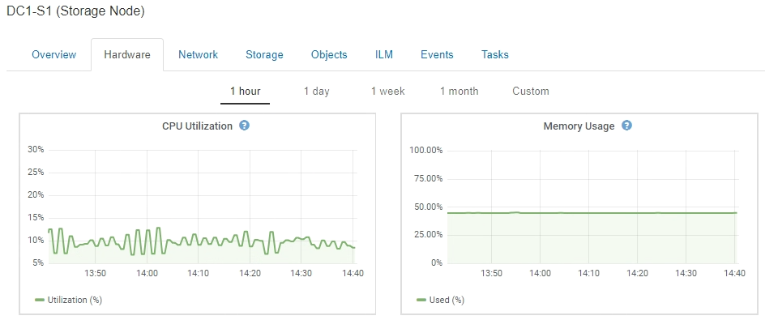

= Monitoramento de recursos no nível do nó
:allow-uri-read: 
:icons: font
:imagesdir: ../media/

[role="lead"]
Você deve monitorar nós de grade individuais para verificar seus níveis de utilização de recursos.

.O que você vai precisar
* Você deve estar conetado ao Gerenciador de Grade usando um navegador compatível.

.Sobre esta tarefa
Se os nós estiverem sobrecarregados consistentemente, mais nós poderão ser necessários para operações eficientes.

.Passos
. Para exibir informações sobre a utilização de hardware de um nó de grade:
+
.. Na página *nós*, selecione o nó.
.. Selecione a guia *hardware* para exibir gráficos de utilização da CPU e uso da memória.
+

.. Para exibir um intervalo de tempo diferente, selecione um dos controles acima do gráfico ou gráfico. Você pode exibir as informações disponíveis para intervalos de 1 hora, 1 dia, 1 semana ou 1 mês. Você também pode definir um intervalo personalizado, que permite especificar intervalos de data e hora.
.. Se o nó estiver hospedado em um dispositivo de armazenamento ou em um dispositivo de serviços, role para baixo para exibir as tabelas de componentes. O status de todos os componentes deve ser "nominal". Investigue componentes que tenham qualquer outro status.

.Informações relacionadas
link:viewing-information-about-appliance-storage-nodes.html["Exibição de informações sobre os nós de storage do dispositivo"]

link:viewing-information-about-appliance-admin-nodes-and-gateway-nodes.html["Exibindo informações sobre nós de administração do dispositivo e nós de gateway"]
