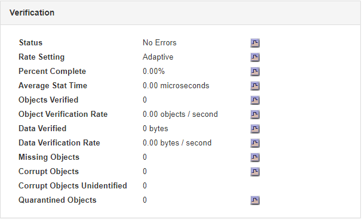

= Monitoramento de operações de verificação de objetos
:allow-uri-read: 
:icons: font
:imagesdir: ../media/

[role="lead"]
O sistema StorageGRID pode verificar a integridade dos dados de objetos nos nós de storage, verificando se há objetos corrompidos ou ausentes.

.O que você vai precisar
Você deve estar conetado ao Gerenciador de Grade usando um navegador compatível.

.Sobre esta tarefa
Existem dois processos de verificação que funcionam em conjunto para garantir a integridade dos dados:

* * A verificação em segundo plano* é executada automaticamente, verificando continuamente a correção dos dados do objeto.
+
A verificação em segundo plano verifica automaticamente e continuamente todos os nós de storage para determinar se há cópias corrompidas de dados de objetos replicados e codificados por apagamento. Se forem encontrados problemas, o sistema StorageGRID tentará substituir automaticamente os dados de objetos corrompidos de cópias armazenadas em outro lugar do sistema. A verificação em segundo plano não é executada em nós de arquivamento ou em objetos em um pool de storage de nuvem.

+

NOTE: O alerta *Objeto corrompido não identificado detetado* é acionado se o sistema detetar um objeto corrompido que não pode ser corrigido automaticamente.

* *A verificação de primeiro plano* pode ser acionada por um usuário para verificar mais rapidamente a existência (embora não a correção) de dados de objeto.
+
A verificação em primeiro plano permite verificar a existência de dados de objeto replicados e codificados por apagamento em um nó de armazenamento específico, verificando se cada objeto que se espera estar presente está lá. Você pode executar a verificação em primeiro plano em todos ou alguns armazenamentos de objetos de um nó de armazenamento para ajudar a determinar se há problemas de integridade com um dispositivo de armazenamento. Um grande número de objetos ausentes pode indicar que há um problema com o armazenamento.

Para analisar os resultados de verificações em segundo plano e primeiro plano, como objetos corrompidos ou ausentes, você pode olhar para a página nós para um nó de storage. Você deve investigar quaisquer instâncias de dados de objetos corrompidos ou ausentes imediatamente, para determinar a causa raiz.

.Passos
. Selecione *nós*.
. Selecione *_Storage Node_* *Objects*.
. Para verificar os resultados da verificação:
+
** Para verificar a verificação de dados de objetos replicados, observe os atributos na seção Verificação.
+

+

NOTE: Clique no nome de um atributo na tabela para exibir o texto de ajuda.

** Para verificar a verificação de fragmentos codificados por apagamento, selecione *_Storage Node_* *ILM* e veja os atributos na tabela Verificação de codificação de apagamento.
+
image::../media/nodes_storage_node_ilm_ec_verification.gif[Verificação de EC do nó de storage de nós]

+

NOTE: Clique no nome de um atributo na tabela para exibir o texto de ajuda.

.Informações relacionadas
link:../troubleshoot/troubleshooting-storagegrid-system.html["Verificando a integridade do objeto"]
