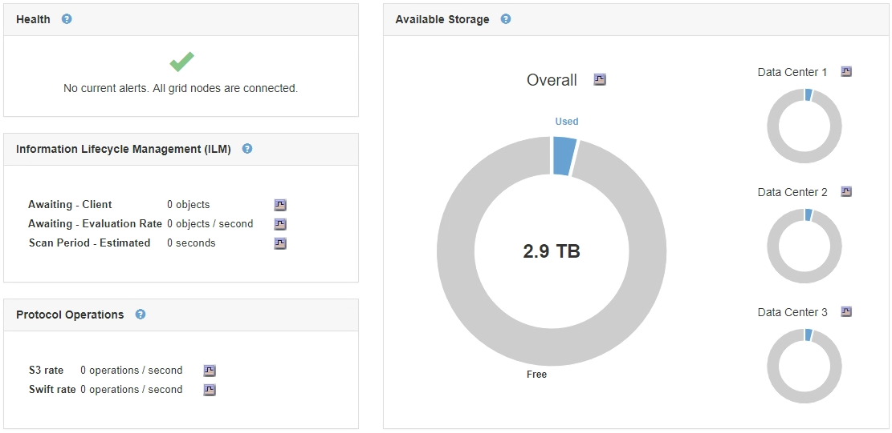

= Monitoramento da capacidade de armazenamento para toda a grade
:allow-uri-read: 
:icons: font
:imagesdir: ../media/

[role="lead"]
Você precisa monitorar a capacidade geral de storage da grade para garantir que haja espaço livre adequado para os dados de objetos e metadados de objetos. Entender como a capacidade de storage muda ao longo do tempo pode ajudar você a Planejar adicionar nós de storage ou volumes de storage antes que a capacidade de storage utilizável da grade seja consumida.

.O que você vai precisar
Você deve estar conetado ao Gerenciador de Grade usando um navegador compatível.

.Sobre esta tarefa
O Painel no Gerenciador de Grade permite que você avalie rapidamente quanto armazenamento está disponível para toda a grade e para cada data center. A página nós fornece valores mais detalhados para dados de objetos e metadados de objetos.

.Passos
. Avalie a quantidade de storage disponível para toda a grade e para cada data center.
+
.. Selecione *Painel*.
.. No painel armazenamento disponível, anote o resumo geral da capacidade de armazenamento livre e usada.
+

NOTE: O resumo não inclui Mídia de arquivamento.

+

.. Coloque o cursor sobre as seções de capacidade livre ou usada do gráfico para ver exatamente quanto espaço é livre ou usado.
+
image::../media/storage_capacity_used.gif[Tabela de capacidade livre ou usada do painel]

.. Para grades de vários locais, revise o gráfico de cada data center.
.. Clique no ícone do gráfico image:../media/icon_chart_new.gif["Ícone de carta"]para o gráfico geral ou para um data center individual para exibir um gráfico que mostra o uso da capacidade ao longo do tempo.
+
Aparece um gráfico que mostra a percentagem de capacidade de armazenamento utilizada (%) em comparação com o tempo.

. Determine quanto storage foi usado e quanto storage permanece disponível para dados de objetos e metadados de objetos.
+
.. Selecione *nós*.
.. Selecione *_grid_* *Storage*.
+
image::../media/nodes_deployment_storage_tab.png[Guia de storage de implantação de nós]

.. Passe o cursor sobre os gráficos Storage Used - Object Data e Storage Used - Object Metadata (armazenamento usado) para ver quanto armazenamento de metadados de objetos e objetos está disponível para toda a grade e quanto foi usado ao longo do tempo.
+

NOTE: Os valores totais de um site ou da grade não incluem nós que não tenham métricas relatadas por pelo menos cinco minutos, como nós off-line.

. Conforme orientação do suporte técnico, veja detalhes adicionais sobre a capacidade de storage da sua grade.
+
.. Selecione *Support* > *Tools* > *Grid Topology*.
.. Selecione *_grid_* *Visão geral* *Principal*.
+
image::../media/system_wide_storage_capacity.gif[Capacidade de armazenamento em todo o sistema--Árvore de topologia de grade]

. Planeje realizar uma expansão para adicionar nós de storage ou volumes de storage antes que a capacidade de storage utilizável da grade seja consumida.
+
Ao Planejar o momento de uma expansão, considere quanto tempo levará para adquirir e instalar armazenamento adicional.

+

NOTE: Se sua política de ILM usa codificação de apagamento, talvez você prefira expandir quando os nós de storage existentes estiverem aproximadamente 70% cheios para reduzir o número de nós que precisam ser adicionados.

+
Para obter mais informações sobre como Planejar uma expansão de armazenamento, consulte as instruções para expandir o StorageGRID.

.Informações relacionadas
link:../expand/index.html["Expanda sua grade"]
