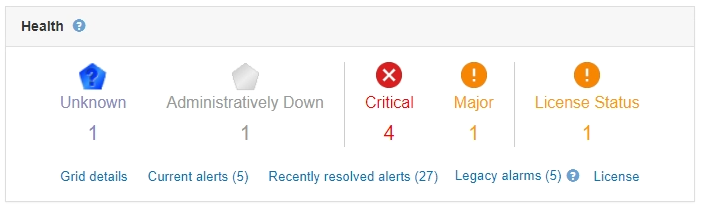

= Monitoramento da integridade do sistema
:allow-uri-read: 
:icons: font
:imagesdir: ../media/

[role="lead"]
Você deve monitorar diariamente a integridade geral do seu sistema StorageGRID.

O sistema StorageGRID é tolerante a falhas e pode continuar a funcionar mesmo quando partes da grade não estão disponíveis. O primeiro sinal de um possível problema com o seu sistema StorageGRID é provavelmente um alerta ou um alarme (sistema legado) e não necessariamente um problema com as operações do sistema. Prestar atenção à integridade do sistema pode ajudá-lo a detetar problemas menores antes que eles afetem as operações ou a eficiência da rede.

O painel Saúde no Painel do Gerenciador de Grade fornece um resumo dos problemas que podem estar afetando o sistema. Você deve investigar quaisquer problemas que são mostrados no Dashboard.

NOTE: Para ser notificado de alertas assim que eles são acionados, você pode configurar notificações de e-mail para alertas ou configurar traps SNMP.

. Faça login no Gerenciador de Grade para exibir o Dashboard.
. Reveja as informações no painel Saúde.
+

+
Quando existem problemas, aparecem links que permitem visualizar detalhes adicionais:

+
|===
| Link | Indica 

 a| 
Detalhes da grelha
 a| 
Aparece se algum nó estiver desconetado (estado de conexão desconhecido ou administrativamente inativo). Clique no link ou clique no ícone azul ou cinza para determinar que nó ou nós são afetados.

 a| 
Alertas atuais
 a| 
Aparece se algum alerta estiver ativo no momento. Clique no link ou clique em *Crítica*, *Principal* ou *menor* para ver os detalhes na página *Alertas* *atual*.

 a| 
Alertas resolvidos recentemente
 a| 
Aparece se quaisquer alertas acionados na semana passada estiverem agora resolvidos. Clique no link para ver os detalhes na página *Alertas* *resolvido*.

 a| 
Alarmes legados
 a| 
Aparece se algum alarme (sistema legado) estiver ativo no momento. Clique no link para ver os detalhes na página *suporte* *Alarmes (legado)* *Alarmes atuais*.

*Nota:* enquanto o sistema de alarme antigo continua a ser suportado, o sistema de alerta oferece benefícios significativos e é mais fácil de usar.

 a| 
Licença
 a| 
É apresentado se existir um problema com a licença de software para este sistema StorageGRID. Clique no link para ver os detalhes na página *Manutenção* *sistema* *Licença*.

|===

.Informações relacionadas
link:../admin/index.html["Administrar o StorageGRID"]

link:managing-alerts.html["Configurar notificações por e-mail para alertas"]

link:using-snmp-monitoring.html["Utilizar a monitorização SNMP"]
