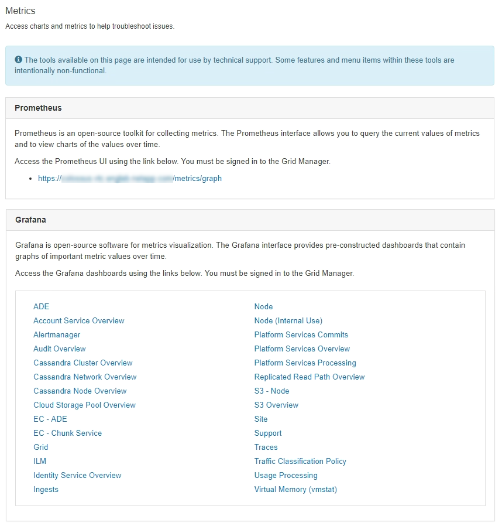

= Revisão das métricas de suporte
:allow-uri-read: 
:icons: font
:imagesdir: ../media/

[role="lead"]
Ao solucionar um problema, você pode trabalhar com suporte técnico para analisar métricas e gráficos detalhados do seu sistema StorageGRID.

.O que você vai precisar
* Você deve estar conetado ao Gerenciador de Grade usando um navegador compatível.
* Você deve ter permissões de acesso específicas.

.Sobre esta tarefa
A página Metrics permite que você acesse as interfaces de usuário Prometheus e Grafana. Prometheus é um software de código aberto para coletar métricas. Grafana é um software de código aberto para visualização de métricas.

IMPORTANT: As ferramentas disponíveis na página Metrics destinam-se a ser utilizadas pelo suporte técnico. Alguns recursos e itens de menu dentro dessas ferramentas são intencionalmente não funcionais e estão sujeitos a alterações.

.Passos
. Conforme indicado pelo suporte técnico, selecione *suporte* *Ferramentas* *métricas*.
+
É apresentada a página Metrics (métricas).

+

. Para consultar os valores atuais das métricas do StorageGRID e visualizar gráficos dos valores ao longo do tempo, clique no link na seção Prometheus.
+
A interface Prometheus é exibida. Você pode usar essa interface para executar consultas sobre as métricas disponíveis do StorageGRID e para traçar métricas do StorageGRID ao longo do tempo.

+
image::../media/metrics_page_prometheus.png[Página de métricas Prometheus]

+

NOTE: As métricas que incluem _private_ em seus nomes são destinadas apenas para uso interno e estão sujeitas a alterações entre as versões do StorageGRID sem aviso prévio.

. Para acessar painéis pré-construídos contendo gráficos de métricas do StorageGRID ao longo do tempo, clique nos links na seção Grafana.
+
A interface Grafana para o link selecionado é exibida.

+
image::../media/metrics_page_grafana.png[Página de métricas Grafana]

.Informações relacionadas
link:commonly-used-prometheus-metrics.html["Métricas de Prometheus comumente usadas"]
