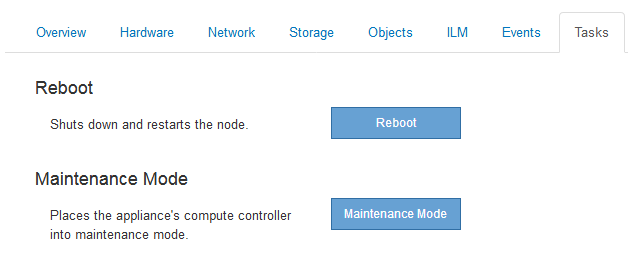

= Usando a guia tarefa para reinicializar um nó de grade
:allow-uri-read: 
:icons: font
:imagesdir: ../media/

[role="lead"]
A guia tarefa permite reinicializar o nó selecionado. A guia tarefa é mostrada para todos os nós.

.O que você vai precisar
* Você deve estar conetado ao Gerenciador de Grade usando um navegador compatível.
* Tem de ter a permissão Manutenção ou Acesso root.
* Você deve ter a senha de provisionamento.

.Sobre esta tarefa
Você pode usar a guia tarefa para reinicializar um nó. Para nós de dispositivo, você também pode usar a guia tarefa para colocar o dispositivo no modo de manutenção.

* Reiniciar um nó de grade a partir da guia tarefa emite o comando reboot no nó de destino. Quando você reinicia um nó, o nó é encerrado e reinicia. Todos os serviços são reiniciados automaticamente.
+
Se você planeja reinicializar um nó de armazenamento, observe o seguinte:

+
** Se uma regra ILM especificar um comportamento de ingestão de confirmação dupla ou a regra especificar balanceado e não for possível criar imediatamente todas as cópias necessárias, o StorageGRID enviará imediatamente quaisquer objetos recém-ingeridos a dois nós de armazenamento no mesmo local e avaliará o ILM posteriormente. Se você quiser reinicializar dois ou mais nós de storage em um determinado site, talvez não seja possível acessar esses objetos durante a reinicialização.
** Para garantir que você possa acessar todos os objetos enquanto um nó de armazenamento estiver reiniciando, pare de ingerir objetos em um site por aproximadamente uma hora antes de reiniciar o nó.

* Talvez seja necessário colocar um dispositivo StorageGRID no modo de manutenção para executar determinados procedimentos, como alterar a configuração do link ou substituir um controlador de armazenamento. Para obter instruções, consulte as instruções de instalação e manutenção do equipamento.
+

NOTE: Colocar um aparelho no modo de manutenção pode tornar o aparelho indisponível para acesso remoto.

.Passos
. Selecione *nós*.
. Selecione o nó de grade que deseja reinicializar.
. Selecione a guia *tarefas*.
+
image::../media/nodes_tasks_reboot.gif[Botão de reinicialização das tarefas dos nós]

. Clique em *Reboot*.
+
É apresentada uma caixa de diálogo de confirmação.

+
image::../media/reboot_node_confirmation.gif[Caixa de diálogo de confirmação para o nó da grade de reinicialização]

+

NOTE: Se você estiver reinicializando o nó Admin principal, a caixa de diálogo de confirmação lembra que a conexão do seu navegador com o Gerenciador de Grade será perdida temporariamente quando os serviços forem interrompidos.

. Digite a senha de provisionamento e clique em *OK*.
. Aguarde até que o nó seja reiniciado.
+
Pode levar algum tempo para que os serviços sejam desativados.

+
Quando o nó é reinicializado, o ícone cinza (administrativamente para baixo) aparece no lado esquerdo da página nós. Quando todos os serviços tiverem sido iniciados novamente, o ícone muda novamente para a cor original.

.Informações relacionadas
link:../sg6000/index.html["SG6000 dispositivos de armazenamento"]

link:../sg5700/index.html["SG5700 dispositivos de armazenamento"]

link:../sg5600/index.html["SG5600 dispositivos de armazenamento"]

link:../sg100-1000/index.html["Aparelhos de serviços SG100  SG1000"]
