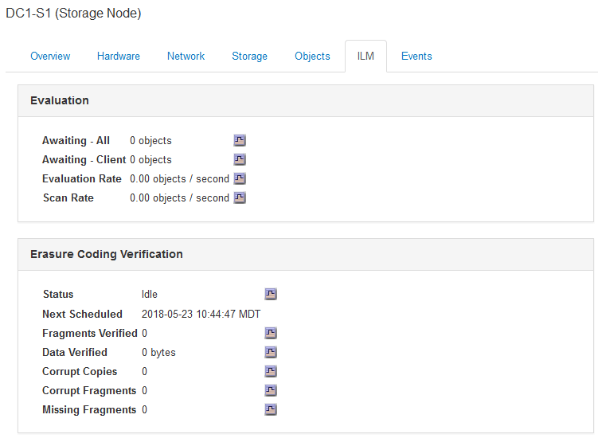

= Visualizar o separador ILM
:allow-uri-read: 
:icons: font
:imagesdir: ../media/

[role="lead"]
A guia ILM fornece informações sobre as operações do Information Lifecycle Management (ILM).

A guia ILM é mostrada para cada nó de armazenamento, cada local e toda a grade. Para cada local e grade, a guia ILM mostra um gráfico da fila ILM ao longo do tempo. Para a grade, esta guia também fornece o tempo estimado para concluir uma varredura ILM completa de todos os objetos.

Para nós de storage, a guia ILM fornece detalhes sobre a avaliação ILM e a verificação em segundo plano para objetos codificados de apagamento.

.Informações relacionadas
link:monitoring-information-lifecycle-management.html["Monitoramento do gerenciamento do ciclo de vida das informações"]

link:../admin/index.html["Administrar o StorageGRID"]
