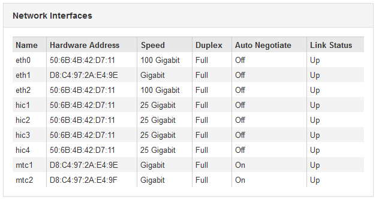

= Exibição de informações sobre os nós de storage do dispositivo
:allow-uri-read: 
:icons: font
:imagesdir: ../media/

[role="lead"]
A página nós lista informações sobre a integridade do serviço e todos os recursos computacionais, de dispositivo de disco e de rede para cada nó de storage do dispositivo. Você também pode ver memória, hardware de armazenamento, versão do firmware do controlador, recursos de rede, interfaces de rede, endereços de rede e receber e transmitir dados.

.Passos
. Na página nós, selecione um nó de storage do dispositivo.
. Selecione *Visão geral*.
+
A tabela informações do nó na guia Visão geral exibe a ID e o nome do nó, o tipo de nó, a versão do software instalada e os endereços IP associados ao nó. A coluna Interface contém o nome da interface, da seguinte forma:

+
** *eth*: Rede de Grade, rede Admin ou rede de cliente.
** *Hic*: Uma das portas físicas de 10, 25 ou 100 GbE no dispositivo. Estas portas podem ser Unidas e ligadas à rede de grelha StorageGRID (eth0) e à rede de clientes (eth2).
** *mtc*: Uma das portas físicas de 1 GbE no dispositivo, que pode ser ligada ou ligada à rede de administração do StorageGRID (eth1). image:../media/nodes_page_overview_tab_extended.png["Visão geral da página dos nós estendida"]

. Selecione *hardware* para ver mais informações sobre o aparelho.
+
.. Visualize os gráficos de utilização da CPU e memória para determinar as percentagens de utilização da CPU e da memória ao longo do tempo. Para exibir um intervalo de tempo diferente, selecione um dos controles acima do gráfico ou gráfico. Você pode exibir as informações disponíveis para intervalos de 1 hora, 1 dia, 1 semana ou 1 mês. Você também pode definir um intervalo personalizado, que permite especificar intervalos de data e hora.
+
image::../media/nodes_page_hardware_tab_graphs.png[Gráficos de hardware]

.. Role para baixo para ver a tabela de componentes do aparelho. Esta tabela contém informações como o nome do modelo do aparelho; nomes do controlador, números de série e endereços IP; e o status de cada componente.
+

NOTE: Alguns campos, como BMC IP do controlador de computação e hardware de computação, aparecem apenas para dispositivos com esse recurso.

+
Os componentes das prateleiras de armazenamento e das prateleiras de expansão, se fizerem parte da instalação, aparecerão em uma tabela separada abaixo da tabela do dispositivo.

+
image::../media/nodes_page_hardware_tab_for_appliance.png[Guia hardware da página de nós para o dispositivo]

+
|===
| Campo na mesa do aparelho | Descrição 

 a| 
Modelo do aparelho
 a| 
O número do modelo para este dispositivo StorageGRID mostrado no software SANtricity.

 a| 
Nome do controlador de armazenamento
 a| 
O nome deste dispositivo StorageGRID mostrado no software SANtricity.

 a| 
Controlador de armazenamento Um IP de gerenciamento
 a| 
Endereço IP da porta de gerenciamento 1 no controlador de armazenamento A. você usa esse IP para acessar o software SANtricity para solucionar problemas de armazenamento.

 a| 
IP de gerenciamento do controlador de armazenamento B.
 a| 
Endereço IP da porta de gerenciamento 1 no controlador de storage B. você usa esse IP para acessar o software SANtricity para solucionar problemas de storage.

Alguns modelos de aparelhos não têm um controlador de armazenamento B..

 a| 
WWID do controlador de armazenamento
 a| 
O identificador mundial do controlador de storage mostrado no software SANtricity.

 a| 
Número de série do chassis do dispositivo de armazenamento
 a| 
O número de série do chassis do aparelho.

 a| 
Versão do firmware do controlador de armazenamento
 a| 
A versão do firmware no controlador de armazenamento para este dispositivo.

 a| 
Hardware de armazenamento
 a| 
O status geral do hardware do controlador de storage. Se o Gerenciador de sistema do SANtricity relatar um status de precisa de atenção para o hardware de storage, o sistema StorageGRID também informará esse valor.

Se o status for "precisa de atenção", primeiro verifique o controlador de armazenamento usando o software SANtricity. Em seguida, certifique-se de que não existem outros alarmes que se apliquem ao controlador de computação.

 a| 
Falha na contagem de unidades do controlador de armazenamento
 a| 
O número de unidades que não são ideais.

 a| 
Controlador de armazenamento A
 a| 
O status do controlador de armazenamento A..

 a| 
Controlador de armazenamento B
 a| 
O estado do controlador de armazenamento B. alguns modelos de aparelhos não têm um controlador de armazenamento B.

 a| 
Fonte de alimentação A do controlador de armazenamento
 a| 
O estado da fonte de Alimentação A para o controlador de armazenamento.

 a| 
Fonte de alimentação B do controlador de armazenamento
 a| 
O estado da fonte de alimentação B para o controlador de armazenamento.

 a| 
Tipo de unidade de dados de armazenamento
 a| 
O tipo de unidades no dispositivo, como HDD (unidade de disco rígido) ou SSD (unidade de estado sólido).

 a| 
Tamanho da unidade de dados de armazenamento
 a| 
Capacidade total, incluindo todas as unidades de dados do dispositivo.

 a| 
Modo RAID de armazenamento
 a| 
O modo RAID configurado para o dispositivo.

 a| 
Conetividade de armazenamento
 a| 
O estado de conetividade de storage.

 a| 
Fonte de alimentação geral
 a| 
O estado de todas as fontes de alimentação do aparelho.

 a| 
IP do controlador de computação BMC
 a| 
O endereço IP da porta do controlador de gerenciamento de placa base (BMC) no controlador de computação. Você usa esse IP para se conetar à interface do BMC para monitorar e diagnosticar o hardware do dispositivo.

Este campo não é apresentado para modelos de aparelhos que não contêm um BMC.

 a| 
Número de série do controlador de computação
 a| 
O número de série do controlador de computação.

 a| 
Hardware de computação
 a| 
O status do hardware do controlador de computação. Esse campo não é exibido para modelos de dispositivo que não têm hardware de computação e hardware de storage separados.

 a| 
Temperatura da CPU do controlador de computação
 a| 
O status da temperatura da CPU do controlador de computação.

 a| 
Temperatura do chassi do controlador de computação
 a| 
O status da temperatura do controlador de computação.

|===
+
|===
| Coluna na tabela prateleiras de armazenamento | Descrição 

 a| 
Número de série do chassi da prateleira
 a| 
O número de série do chassi do compartimento de armazenamento.

 a| 
ID do compartimento
 a| 
O identificador numérico da prateleira de armazenamento.

*** 99: Compartimento do controlador de storage
*** 0: Primeira prateleira de expansão
*** 1: Segunda prateleira de expansão

*Nota:* as prateleiras de expansão aplicam-se apenas ao SG6060.

 a| 
Status do compartimento
 a| 
O status geral da gaveta de storage.

 a| 
Estado IOM
 a| 
O status dos módulos de entrada/saída (IOMs) em quaisquer prateleiras de expansão. N/A se este não for um compartimento de expansão.

 a| 
Estado da fonte de alimentação
 a| 
O status geral das fontes de alimentação para o compartimento de armazenamento.

 a| 
Estado da gaveta
 a| 
O estado das gavetas na prateleira de arrumação. N/A se a prateleira não contiver gavetas.

 a| 
Estado da ventoinha
 a| 
O status geral dos ventiladores de resfriamento na prateleira de armazenamento.

 a| 
Ranhuras da unidade
 a| 
O número total de slots de unidade no compartimento de armazenamento.

 a| 
Unidades de dados
 a| 
O número de unidades no compartimento de storage usadas para o storage de dados.

 a| 
Tamanho da unidade de dados
 a| 
O tamanho efetivo de uma unidade de dados no compartimento de storage.

 a| 
Unidades de cache
 a| 
O número de unidades no compartimento de armazenamento que são usadas como cache.

 a| 
Tamanho da unidade de cache
 a| 
O tamanho da menor unidade de cache no compartimento de armazenamento. Normalmente, as unidades de cache têm o mesmo tamanho.

 a| 
Estado da configuração
 a| 
O status de configuração do compartimento de storage.

|===

. Confirme se todos os Estados são ""nominais"".
+
Se um status não for "nominal", revise os alertas atuais. Você também pode usar o Gerenciador de sistema do SANtricity para saber mais sobre alguns desses valores de hardware. Consulte as instruções para instalar e manter o seu aparelho.

. Selecione *rede* para ver as informações de cada rede.
+
O gráfico tráfego de rede fornece um resumo do tráfego de rede geral.

+
image::../media/nodes_page_network_traffic_graph.gif[Gráfico de tráfego de rede da página de nós]

+
.. Reveja a secção interfaces de rede.
+

+
Use a tabela a seguir com os valores na coluna *velocidade* na tabela interfaces de rede para determinar se as portas de rede 10/25-GbE no dispositivo foram configuradas para usar o modo ativo/backup ou o modo LACP.

+

NOTE: Os valores mostrados na tabela assumem que todos os quatro links são usados.

+
|===
| Modo de ligação | Modo Bond | Velocidade de ligação HIC individual (hic1, hic2, hic3, hic4) | Velocidade esperada da rede do cliente/grade (eth0,eth2) 

 a| 
Agregado
 a| 
LACP
 a| 
25
 a| 
100

 a| 
Fixo
 a| 
LACP
 a| 
25
 a| 
50

 a| 
Fixo
 a| 
Ativo/Backup
 a| 
25
 a| 
25

 a| 
Agregado
 a| 
LACP
 a| 
10
 a| 
40

 a| 
Fixo
 a| 
LACP
 a| 
10
 a| 
20

 a| 
Fixo
 a| 
Ativo/Backup
 a| 
10
 a| 
10

|===
+
Consulte as instruções de instalação e manutenção do seu dispositivo para obter mais informações sobre como configurar as portas 10/25-GbE.

.. Reveja a secção Comunicação de rede.
+
As tabelas de receção e transmissão mostram quantos bytes e pacotes foram recebidos e enviados através de cada rede, bem como outras métricas de receção e transmissão.

+
image::../media/nodes_page_network_communication.gif[Comunicação de rede de Página de nós]

. Selecione *armazenamento* para visualizar gráficos que mostram as porcentagens de armazenamento usadas ao longo do tempo para dados de objetos e metadados de objetos, bem como informações sobre dispositivos de disco, volumes e armazenamentos de objetos.
+
image::../media/nodes_page_storage_used_object_data.png[Armazenamento usado - dados do objeto]

+
image::../media/storage_used_object_metadata.png[Armazenamento usado - metadados Objeto]

+
.. Role para baixo para ver as quantidades de armazenamento disponível para cada volume e armazenamento de objetos.
+
O Nome Mundial para cada disco corresponde ao identificador mundial de volume (WWID) que aparece quando você visualiza propriedades de volume padrão no software SANtricity (o software de gerenciamento conetado ao controlador de armazenamento do dispositivo).

+
Para ajudá-lo a interpretar estatísticas de leitura e gravação de disco relacionadas aos pontos de montagem de volume, a primeira parte do nome mostrado na coluna *Nome* da tabela dispositivos de disco (ou seja, _sdc_, _sdd_, _sde_, etc.) corresponde ao valor mostrado na coluna *dispositivo* da tabela volumes.

+
image::../media/nodes_page_storage_tables.png[Tabelas de storage de páginas de nós]

.Informações relacionadas
link:../sg6000/index.html["SG6000 dispositivos de armazenamento"]

link:../sg5700/index.html["SG5700 dispositivos de armazenamento"]

link:../sg5600/index.html["SG5600 dispositivos de armazenamento"]
