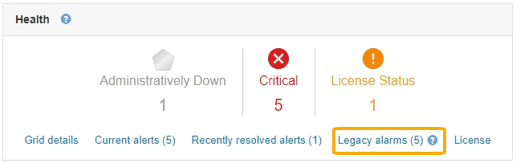

= Visualização de alarmes legados
:allow-uri-read: 
:icons: font
:imagesdir: ../media/

[role="lead"]
Os alarmes (sistema legado) são acionados quando os atributos do sistema atingem os valores de limite de alarme. Pode visualizar os alarmes atualmente ativos a partir do Painel de instrumentos ou da página Alarmes atuais.

.O que você vai precisar
* Você deve estar conetado ao Gerenciador de Grade usando um navegador compatível.

.Sobre esta tarefa
Se um ou mais alarmes herdados estiverem ativos no momento, o painel Saúde no Painel inclui um link *Alarmes herdados*. O número entre parênteses indica quantos alarmes estão ativos no momento.

A contagem de *Legacy Alarms* no Dashboard é incrementada sempre que um alarme legado é acionado. Esta contagem é incrementada mesmo que tenha desativado as notificações por e-mail de alarme. Normalmente, pode ignorar este número (uma vez que os alertas fornecem uma melhor visualização do sistema) ou pode visualizar os alarmes que estão atualmente ativos.

NOTE: Embora o sistema de alarme antigo continue a ser suportado, o sistema de alerta oferece benefícios significativos e é mais fácil de usar.

.Passos
. Para exibir os alarmes legados que estão atualmente ativos, execute um dos seguintes procedimentos:
+
** No painel Saúde no Painel, clique em *Legacy Alarms*. Este link aparece somente se pelo menos um alarme estiver ativo no momento.
** Selecione *suporte* *Alarmes (legado)* *Alarmes atuais*. A página Alarmes atuais é exibida.

image::../media/current_alarms_page.png[Página Alarmes atuais]

O ícone de alarme indica a gravidade de cada alarme, da seguinte forma:

|===
| Ícone | Cor | Gravidade do alarme | Significado 

 a| 
image:../media/icon_alarm_yellow_notice.gif["ícone quadrado amarelo"]
 a| 
Amarelo
 a| 
Aviso
 a| 
O nó está conetado à grade, mas existe uma condição incomum que não afeta as operações normais.

 a| 
image:../media/icon_alarm_light_orange_minor.gif["ícone de diamante laranja claro"]
 a| 
Laranja claro
 a| 
Menor
 a| 
O nó está conetado à grade, mas existe uma condição anormal que pode afetar a operação no futuro. Você deve investigar para evitar o escalonamento.

 a| 
image:../media/icon_alarm_orange_major.gif["ícone de diamante laranja escuro"]
 a| 
Laranja escuro
 a| 
Maior
 a| 
O nó está conetado à grade, mas existe uma condição anormal que afeta atualmente a operação. Isso requer atenção imediata para evitar o escalonamento.

 a| 
image:../media/icon_alarm_red_critical.gif["ícone vermelho x"]
 a| 
Vermelho
 a| 
Crítico
 a| 
O nó está conetado à grade, mas existe uma condição anormal que parou as operações normais. Você deve resolver o problema imediatamente.

|===
. Para saber mais sobre o atributo que fez com que o alarme fosse acionado, clique com o botão direito do Mouse no nome do atributo na tabela.
. Para ver detalhes adicionais sobre um alarme, clique no nome do serviço na tabela.
+
A guia Alarmes para o serviço selecionado é exibida (*suporte* *Ferramentas* *topologia de Grade* *_Grid Node_* *_Service_* *Alarmes*).

+
image::../media/alarms_acknowledging.png[Reconhecimento de alarmes]

. Se você quiser limpar a contagem de alarmes atuais, você pode, opcionalmente, fazer o seguinte:
+
** Confirme o alarme. Um alarme reconhecido não é mais incluído na contagem de alarmes herdados, a menos que seja acionado no próximo nível de gravidade ou seja resolvido e ocorra novamente.
** Desative um alarme padrão específico ou um alarme personalizado global para todo o sistema para evitar que ele seja acionado novamente.

.Informações relacionadas
link:alarms-reference.html["Referência de alarmes (sistema legado)"]

link:managing-alarms.html["Reconhecer alarmes atuais (sistema legado)"]

link:managing-alarms.html["Desativar alarmes (sistema legado)"]
