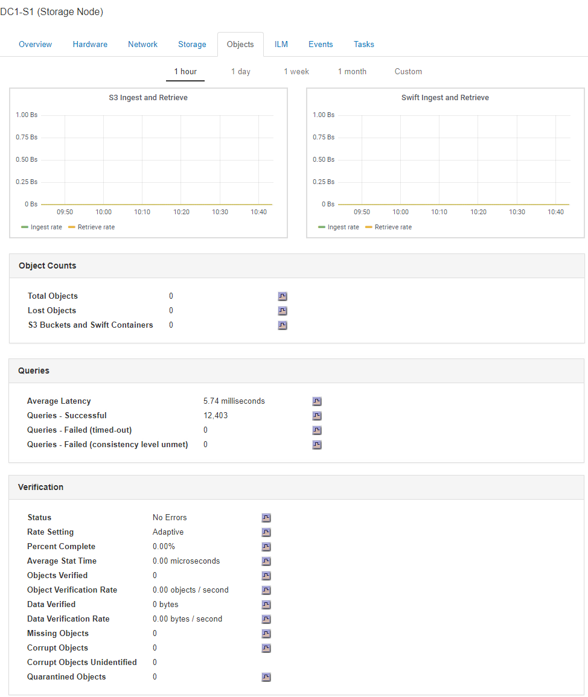

= Exibindo a guia objetos
:allow-uri-read: 
:icons: font
:imagesdir: ../media/

[role="lead"]
A guia objetos fornece informações sobre taxas de ingestão e recuperação S3 e Swift.

A guia objetos é exibida para cada nó de armazenamento, cada local e toda a grade. Para nós de storage, a guia objetos também fornece contagens de objetos e informações sobre consultas de metadados e verificação em segundo plano.

.Informações relacionadas
link:../s3/index.html["Use S3"]

link:../swift/index.html["Use Swift"]
