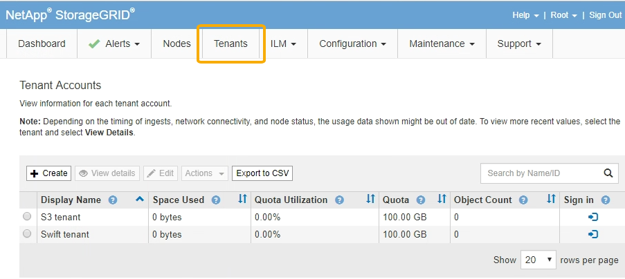

= Explorando o Gerenciador de Grade
:allow-uri-read: 
:icons: font
:imagesdir: ../media/

[role="lead"]
O Gerenciador de Grade é a interface gráfica baseada em navegador que permite configurar, gerenciar e monitorar seu sistema StorageGRID.

Quando você entra no Gerenciador de Grade, você está se conetando a um nó Admin. Cada sistema StorageGRID inclui um nó de administração principal e qualquer número de nós de administração não primários. Você pode se conetar a qualquer nó de administrador e cada nó de administrador exibe uma exibição semelhante do sistema StorageGRID.

Você pode acessar o Gerenciador de Grade usando um navegador da Web compatível.

== Requisitos do navegador da Web

Você deve usar um navegador da Web compatível.

[cols="1a,1a"]
|===
| Navegador da Web | Versão mínima suportada 

 a| 
Google Chrome
 a| 
87

 a| 
Microsoft Edge
 a| 
87

 a| 
Mozilla Firefox
 a| 
84

|===
Você deve definir a janela do navegador para uma largura recomendada.

[cols="1a,1a"]
|===
| Largura do navegador | Pixels 

 a| 
Mínimo
 a| 
1024

 a| 
Ótimo
 a| 
1280

|===

== Painel do Grid Manager

Ao iniciar sessão pela primeira vez no Gestor de grelha, pode utilizar o Painel para monitorizar rapidamente as atividades do sistema.

O Dashboard inclui informações resumidas sobre a integridade do sistema, o uso do storage, os processos ILM e as operações S3 e Swift.

image::../media/grid_manager_dashboard.png[Painel no Gerenciador de Grade]

Para obter uma explicação das informações em cada painel, clique no ícone de ajuda image:../media/icon_nms_question.gif["ícone de ponto de interrogação"]desse painel.

.Informações relacionadas
link:../monitor/index.html["Monitorizar  Resolução de problemas"]

== Menu de alertas

O menu Alertas fornece uma interface fácil de usar para detetar, avaliar e resolver problemas que possam ocorrer durante a operação do StorageGRID.

image::../media/alerts_menu.png[Menu de alertas]

No menu Alertas, você pode fazer o seguinte:

* Reveja os alertas atuais
* Reveja os alertas resolvidos
* Configure silêncios para suprimir notificações de alerta
* Configure o servidor de e-mail para receber notificações de alerta
* Defina regras de alerta para condições que acionam alertas

.Informações relacionadas
link:monitoring-and-managing-alerts.html["Monitoramento e gerenciamento de alertas"]

link:../monitor/index.html["Monitorizar  Resolução de problemas"]

== Página de nós

A página nós exibe informações sobre toda a grade, cada local na grade e cada nó em um local.

A home page dos nós exibe métricas combinadas para toda a grade. Para exibir informações de um site ou nó específico, clique no link apropriado à esquerda.

image::../media/nodes_menu.png[página principal dos nós]

.Informações relacionadas
link:viewing-nodes-page.html["Exibindo a página de nós"]

link:../monitor/index.html["Monitorizar  Resolução de problemas"]

== Página de contas de inquilino

A página Contas do locatário permite criar e monitorar as contas de locatário de storage do seu sistema StorageGRID. Você deve criar pelo menos uma conta de locatário para especificar quem pode armazenar e recuperar objetos e qual funcionalidade está disponível para eles.

A página Contas do locatário também fornece detalhes de uso para cada locatário, incluindo a quantidade de armazenamento usado e o número de objetos. Se você definir uma cota quando criou o locatário, poderá ver quanto dessa cota foi usada.

.Informações relacionadas
link:managing-tenants-and-client-connections.html["Gerenciamento de locatários e conexões de clientes"]

link:../admin/index.html["Administrar o StorageGRID"]

link:../tenant/index.html["Use uma conta de locatário"]

== Menu ILM

O menu ILM permite configurar as regras e políticas de gerenciamento do ciclo de vida das informações (ILM) que regem a durabilidade e a disponibilidade dos dados. Você também pode inserir um identificador de objeto para exibir os metadados desse objeto.

image::../media/ilm_menu_and_page.png[Menu e Página ILM]

.Informações relacionadas
link:using-information-lifecycle-management.html["Uso do gerenciamento do ciclo de vida das informações"]

link:../ilm/index.html["Gerenciar objetos com ILM"]

== Menu de configuração

O menu Configuration (Configuração) permite especificar definições de rede, definições do sistema, opções de monitorização e opções de controlo de acesso.

image::../media/configuration_menu.png[Menu de configuração]

.Informações relacionadas
link:configuring-network-settings.html["Configurar definições de rede"]

link:managing-tenants-and-client-connections.html["Gerenciamento de locatários e conexões de clientes"]

link:reviewing-audit-messages.html["Rever mensagens de auditoria"]

link:controlling-storagegrid-access.html["Controlar o acesso à StorageGRID"]

link:../admin/index.html["Administrar o StorageGRID"]

link:../monitor/index.html["Monitorizar  Resolução de problemas"]

link:../audit/index.html["Rever registos de auditoria"]

== Menu de manutenção

O menu Manutenção permite executar tarefas de manutenção, tarefas de rede e tarefas do sistema.

image::../media/maintenance_menu_and_page.png[Menu e Página de Manutenção]

=== Tarefas de manutenção

As tarefas de manutenção incluem:

* Desativar operações para remover locais e nós de grade não utilizados.
* Operações de expansão para adicionar novos nós de grade e locais.
* Operações de recuperação para substituir um nó com falha e restaurar dados.

=== Rede

As tarefas de rede que podem ser executadas no menu Manutenção incluem:

* Editando informações sobre servidores DNS.
* Configurando as sub-redes que são usadas na rede de Grade.
* Editando informações sobre servidores NTP.

=== Sistema

As tarefas do sistema que podem ser executadas no menu Manutenção incluem:

* Rever detalhes da licença atual do StorageGRID ou carregar uma nova licença.
* Gerando um pacote de recuperação.
* Executar atualizações de software do StorageGRID, incluindo atualizações de software, hotfixes e atualizações do software SANtricity os em dispositivos selecionados.

.Informações relacionadas
link:performing-maintenance-procedures.html["Executar procedimentos de manutenção"]

link:downloading-recovery-package.html["Transferir o pacote de recuperação"]

link:../expand/index.html["Expanda sua grade"]

link:../upgrade/index.html["Atualizar o software"]

link:../maintain/index.html["Manter  recuperar"]

link:../sg6000/index.html["SG6000 dispositivos de armazenamento"]

link:../sg5700/index.html["SG5700 dispositivos de armazenamento"]

link:../sg5600/index.html["SG5600 dispositivos de armazenamento"]

== Menu de suporte

O menu suporte fornece opções que ajudam o suporte técnico a analisar e solucionar problemas do seu sistema. Existem duas partes no menu suporte: Ferramentas e Alarmes (legado).

image::../media/support_menu.png[Menu de suporte]

=== Ferramentas

Na seção Ferramentas do menu suporte, você pode:

* Ative o AutoSupport.
* Execute um conjunto de verificações de diagnóstico no estado atual da grelha.
* Acesse a árvore de topologia de grade para exibir informações detalhadas sobre nós, serviços e atributos de grade.
* Recuperar arquivos de log e dados do sistema.
* Analise métricas e gráficos detalhados.
+

IMPORTANT: As ferramentas disponíveis na opção *Metrics* destinam-se a ser utilizadas pelo suporte técnico. Alguns recursos e itens de menu dentro dessas ferramentas são intencionalmente não funcionais.

=== Alarmes (legado)

Na seção Alarmes (legado) do menu suporte, você pode revisar alarmes atuais, históricos e globais e configurar notificações por e-mail para alarmes legados e AutoSupport.

.Informações relacionadas
link:storagegrid-architecture-and-network-topology.html["Topologia de rede e arquitetura StorageGRID"]

link:storagegrid-attributes.html["Atributos do StorageGRID"]

link:using-storagegrid-support-options.html["Usando as opções de suporte do StorageGRID"]

link:../admin/index.html["Administrar o StorageGRID"]

link:../monitor/index.html["Monitorizar  Resolução de problemas"]

== Menu Ajuda

A opção Ajuda fornece acesso ao Centro de Documentação do StorageGRID para a versão atual e para a documentação da API. Você também pode determinar qual versão do StorageGRID está instalada atualmente.

image::../media/help_menu.png[Menu Ajuda]

.Informações relacionadas
link:../admin/index.html["Administrar o StorageGRID"]
