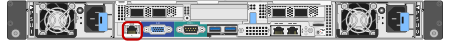

= Acessando a interface BMC
:allow-uri-read: 
:icons: font
:imagesdir: ../media/

[role="lead"]
Você pode acessar a interface BMC no utilitário de serviços usando o DHCP ou o endereço IP estático para a porta de gerenciamento BMC.

.O que você vai precisar
* O cliente de gerenciamento está usando um navegador da Web compatível.
* A porta de gerenciamento do BMC no dispositivo de serviços está conetada à rede de gerenciamento que você planeja usar.
+
*SG100 porta de gerenciamento BMC*

+

+
*SG1000 porta de gerenciamento BMC*

+
image::../media/sg1000_bmc_management_port.png[SG1000 porta de gestão BMC]

.Passos
. Digite o URL para a interface do BMC
`*https://_BMC_Port_IP_*`
+
Para `_BMC_Port_IP_`, utilize o DHCP ou o endereço IP estático para a porta de gestão BMC.

+
É apresentada a página de início de sessão do BMC.

. Digite o nome de usuário e a senha raiz, usando a senha definida quando você alterou a senha padrão do root
`*root*`
+
`*_password_*`

+
image::../media/bmc_signin_page.gif[Página de login do BMC]

. Clique em *Sign me in*
+
O painel BMC é exibido.

+
image::../media/bmc_dashboard.gif[Painel do BMC]

. Opcionalmente, crie usuários adicionais selecionando *Configurações* *Gerenciamento de usuários* e clicando em qualquer usuário "habilitado".
+

NOTE: Quando os usuários entram pela primeira vez, eles podem ser solicitados a alterar sua senha para aumentar a segurança.

.Informações relacionadas
link:changing-root-password-for-bmc-interface-sg1000.html["Alterar a senha raiz da interface BMC"]
