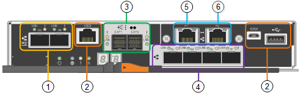

= Controladores no dispositivo StorageGRID
:allow-uri-read: 
:icons: font
:imagesdir: ../media/

[role="lead"]
Os modelos SG5712 e SG5760 do dispositivo StorageGRID incluem um controlador E5700SG e um controlador E2800. Você deve rever os diagramas para aprender as diferenças entre os controladores.

== Controlador E5700SG

* Opera como o servidor de computação do dispositivo.
* Inclui o instalador do dispositivo StorageGRID.
+

NOTE: O software StorageGRID não está pré-instalado no dispositivo. Este software é acessado a partir do Admin Node quando você implantar o dispositivo.

* Pode se conetar a todas as três redes StorageGRID, incluindo a rede de Grade, a rede Admin e a rede cliente.
* Liga-se ao controlador E2800 e funciona como iniciador.

Esta figura mostra os conetores na parte de trás do controlador E5700SG.

[cols="1a,2a,2a,3a"]
|===
|  | Porta | Tipo | Utilização 

 a| 
1
 a| 
Portas de interconexão 1 e 2
 a| 
Canal de fibra (FC) de 16GB GB/s, SFPa ótico
 a| 
Ligue o controlador E5700SG ao controlador E2800.

 a| 
2
 a| 
Portas de diagnóstico e suporte
 a| 
* Porta serial RJ-45
* Porta serial micro USB
* Porta de USB

 a| 
Reservado para suporte técnico.

 a| 
3
 a| 
Portas de expansão da unidade
 a| 
SAS de 12GB GB/s.
 a| 
Não utilizado. Os dispositivos StorageGRID não são compatíveis com gavetas de unidades de expansão.

 a| 
4
 a| 
Portas de rede 1-4
 a| 
10 GbE ou 25 GbE, com base no tipo de transcetor SFP, na velocidade do switch e na velocidade do link configurada
 a| 
Conete-se à rede de grade e à rede de cliente para StorageGRID.

 a| 
5
 a| 
Porta de gerenciamento 1
 a| 
Ethernet de 1 GB (RJ-45)
 a| 
Conete-se à rede de administração para StorageGRID.

 a| 
6
 a| 
Porta de gerenciamento 2
 a| 
Ethernet de 1 GB (RJ-45)
 a| 
Opções:

* Vincular com a porta de gerenciamento 1 para uma conexão redundante com a rede de administração para StorageGRID.
* Deixe desconetado e disponível para acesso local temporário (IP 169.254.0.1).
* Durante a instalação, utilize a porta 2 para a configuração IP se os endereços IP atribuídos pelo DHCP não estiverem disponíveis.

|===

== Controlador E2800

* Funciona como o controlador de armazenamento do dispositivo.
* Gerencia o armazenamento de dados nas unidades.
* Funciona como um controlador padrão da série e no modo simplex.
* Inclui o software SANtricity os (firmware do controlador).
* Inclui o Gerenciador de sistema do SANtricity para monitorar o hardware do dispositivo e gerenciar alertas, o recurso AutoSupport e o recurso de segurança da unidade.
* Liga-se ao controlador E5700SG e funciona como alvo.

Esta figura mostra os conetores na parte de trás do controlador E2800.

image::../media/e2800_controller_with_callouts.gif[Conetores no controlador E2800]

[cols="1a,2a,2a,3a"]
|===
|  | Porta | Tipo | Utilização 

 a| 
1
 a| 
Portas de interconexão 1 e 2
 a| 
SFPa ótico FC de 16GB GB/s
 a| 
Ligue o controlador E2800 ao controlador E5700SG.

 a| 
2
 a| 
Portas de gerenciamento 1 e 2
 a| 
Ethernet de 1 GB (RJ-45)
 a| 
* A porta 1 coneta-se à rede onde você acessa o Gerenciador de sistema do SANtricity em um navegador.
* A porta 2 está reservada para uso de suporte técnico.

 a| 
3
 a| 
Portas de diagnóstico e suporte
 a| 
* Porta serial RJ-45
* Porta serial micro USB
* Porta de USB

 a| 
Reservado para uso de suporte técnico.

 a| 
4
 a| 
Portas de expansão da unidade.
 a| 
SAS de 12GB GB/s.
 a| 
Não utilizado. Os dispositivos StorageGRID não são compatíveis com gavetas de unidades de expansão.

|===