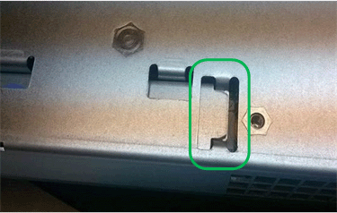

= Substituição do controlador E2800
:allow-uri-read: 
:icons: font
:imagesdir: ../media/

[role="lead"]
Talvez seja necessário substituir o controlador E2800 se ele não estiver funcionando de forma ideal ou se ele tiver falhado.

.Sobre esta tarefa
* Você tem um controlador de substituição com o mesmo número de peça do controlador que está substituindo.
* Você baixou as instruções para substituir a configuração simplex de um recipiente de controlador E2800 com falha.
+

IMPORTANT: Consulte as instruções da Série e apenas quando for direcionado ou se precisar de mais detalhes para executar uma etapa específica. Não confie nas instruções do e-Series para substituir um controlador no dispositivo StorageGRID, porque os procedimentos não são os mesmos.

* Você tem etiquetas para identificar cada cabo conetado ao controlador.
* Se todas as unidades estiverem protegidas, você revisou as etapas do procedimento de substituição do controlador simplex E2800, que incluem o download e a instalação do e-Series SANtricity Storage Manager do site de suporte da NetApp e, em seguida, usando a janela de gerenciamento empresarial (EMW) para desbloquear as unidades protegidas depois de ter substituído o controlador.
+

IMPORTANT: Não poderá utilizar o aparelho até desbloquear as unidades com a chave guardada.

* Você deve ter permissões de acesso específicas.
* Você deve estar conetado ao Gerenciador de Grade usando um navegador compatível.

.Sobre esta tarefa
Você pode determinar se você tem um recipiente de controlador com falha de duas maneiras:

* O Guru de recuperação no Gerenciador de sistema do SANtricity direciona você para substituir o controlador.
* O LED âmbar de atenção no controlador está aceso, indicando que o controlador tem uma avaria.

O nó de storage do dispositivo não estará acessível quando você substituir o controlador. Se o controlador E2800 estiver a funcionar o suficiente, pode colocar o controlador E5700SG no modo de manutenção.

link:placing-appliance-into-maintenance-mode.html["Colocar um aparelho no modo de manutenção"]

Quando substituir um controlador, tem de remover a bateria do controlador original e instalá-la no controlador de substituição.

NOTE: O controlador E2800 no dispositivo não inclui uma placa de interface de host (HIC).

.Passos
. Siga as instruções no procedimento de substituição do controlador E2800 para preparar a remoção do controlador.
+
Use o Gerenciador de sistema do SANtricity para executar estas etapas.

+
.. Anote qual versão do software SANtricity os está atualmente instalada no controlador.
.. Anote qual versão do NVSRAM está instalada atualmente.
.. Se o recurso Segurança da unidade estiver ativado, verifique se existe uma chave salva e se você sabe a frase-passe necessária para instalá-la.
+

IMPORTANT: *Possível perda de acesso a dados --* se todas as unidades do dispositivo estiverem habilitadas para segurança, o novo controlador não poderá acessar o dispositivo até que você desbloqueie as unidades protegidas usando a janela Gerenciamento Empresarial no SANtricity Storage Manager.

.. Faça uma cópia de segurança da base de dados de configuração.
+
Se ocorrer um problema ao remover um controlador, pode utilizar o ficheiro guardado para restaurar a configuração.

.. Colete dados de suporte para o dispositivo.
+

NOTE: A coleta de dados de suporte antes e depois da substituição de um componente garante que você possa enviar um conjunto completo de logs para o suporte técnico caso a substituição não resolva o problema.

. Se o dispositivo StorageGRID estiver a funcionar num sistema StorageGRID, coloque o controlador E5700SG no modo de manutenção.
+
link:placing-appliance-into-maintenance-mode.html["Colocar um aparelho no modo de manutenção"]

. Se o controlador E2800 estiver a funcionar o suficiente para permitir um encerramento controlado, confirme que todas as operações foram concluídas.
+
.. Na página inicial do Gerenciador do sistema do SANtricity, selecione *Exibir operações em andamento*.
.. Confirme se todas as operações foram concluídas.

. Retire o controlador do aparelho:
+
.. Coloque uma pulseira antiestática ou tome outras precauções antiestáticas.
.. Identifique os cabos e, em seguida, desligue os cabos e SFPs.
+

IMPORTANT: Para evitar um desempenho degradado, não torça, dobre, aperte ou pise nos cabos.

.. Solte o controlador do aparelho apertando o trinco na pega do came até soltar e, em seguida, abra a pega do came para a direita.
.. Utilizando as duas mãos e a pega do came, deslize o controlador para fora do aparelho.
+

IMPORTANT: Utilize sempre duas mãos para suportar o peso do controlador.

.. Coloque o controlador numa superfície plana e sem estática com a tampa amovível virada para cima.
.. Remova a tampa pressionando o botão e deslizando a tampa para fora.

. Remova a bateria do controlador com falha e instale-a no controlador de substituição:
+
.. Confirme se o LED verde dentro do controlador (entre a bateria e os DIMMs) está desligado.
+
Se este LED verde estiver ligado, o controlador ainda está a utilizar a bateria. Deve aguardar que este LED se apague antes de remover quaisquer componentes.

+
image::../media/e2800_internal_cache_active_led.gif[LED verde no E2800]

+
|===
| Item | Descrição 

 a| 
image:../media/icon_legend_01.gif["ícone número 1"]
 a| 
LED Ativo Cache Interno

 a| 
image:../media/icon_legend_02.gif["ícone número 2"]
 a| 
Bateria

|===
.. Localize a trava de liberação azul da bateria.
.. Desengate a bateria empurrando a trava de liberação para baixo e afastando-a do controlador.
+
image::../media/e2800_remove_battery.gif[Trinco da bateria]

+
|===
| Item | Descrição 

 a| 
image:../media/icon_legend_01.gif["ícone número 1"]
 a| 
Trinco de desbloqueio da bateria

 a| 
image:../media/icon_legend_02.gif["ícone número 2"]
 a| 
Bateria

|===
.. Levante a bateria e deslize-a para fora do controlador.
.. Retire a tampa do controlador de substituição.
.. Oriente o controlador de substituição para que a ranhura da bateria fique voltada para si.
.. Introduza a bateria no controlador a um ligeiro ângulo descendente.
+
Deve inserir a flange metálica na parte frontal da bateria na ranhura na parte inferior do controlador e deslizar a parte superior da bateria por baixo do pequeno pino de alinhamento no lado esquerdo do controlador.

.. Desloque o trinco da bateria para cima para fixar a bateria.
+
Quando a trava se encaixa no lugar, a parte inferior da trava se encaixa em uma ranhura metálica no chassi.

.. Vire o controlador para confirmar que a bateria está instalada corretamente.
+

IMPORTANT: *Possíveis danos ao hardware* -- a flange metálica na parte frontal da bateria deve ser completamente inserida na ranhura do controlador (como mostrado na primeira figura). Se a bateria não estiver instalada corretamente (como mostrado na segunda figura), a flange metálica pode entrar em Contato com a placa controladora, causando danos.

+
*** *Correto -- a flange de metal da bateria está completamente inserida na ranhura do controlador:*
+

*** *Incorreto -- a flange metálica da bateria não está inserida na ranhura do controlador:*
+
image::../media/e2800_battery_flange_not_ok.gif[Flange da bateria incorreta]

.. Volte a colocar a tampa do controlador.

. Instale o controlador de substituição no aparelho.
+
.. Vire o controlador ao contrário, de modo a que a tampa amovível fique virada para baixo.
.. Com a pega do came na posição aberta, deslize o controlador até ao aparelho.
.. Mova a alavanca do came para a esquerda para bloquear o controlador no lugar.
.. Substitua os cabos e SFPs.
.. Aguarde até que o controlador E2800 seja reiniciado. Verifique se o visor de sete segmentos mostra um estado `99` de .
.. Determine como você atribuirá um endereço IP ao controlador de substituição.
+

NOTE: As etapas para atribuir um endereço IP ao controlador de substituição dependem se você conetou a porta de gerenciamento 1 a uma rede com um servidor DHCP e se todas as unidades estão protegidas.

+
*** Se a porta de gerenciamento 1 estiver conetada a uma rede com um servidor DHCP, o novo controlador obterá seu endereço IP do servidor DHCP. Este valor pode ser diferente do endereço IP do controlador original.
*** Se todas as unidades estiverem protegidas, você deverá usar a janela Gerenciamento Empresarial (EMW) no SANtricity Storage Manager para desbloquear as unidades protegidas. Não é possível aceder ao novo controlador até desbloquear as unidades com a chave guardada. Consulte as instruções da e-Series para substituir um controlador simplex E2800.

. Se o aparelho usar unidades seguras, siga as instruções no procedimento de substituição do controlador E2800 para importar a chave de segurança da unidade.
. Volte a colocar o aparelho no modo de funcionamento normal. No Instalador de dispositivos StorageGRID, selecione *Avançado* *controlador de reinicialização* e, em seguida, selecione *Reiniciar no StorageGRID*.
+
image::../media/reboot_controller_from_maintenance_mode.png[Reinicie o controlador no modo de manutenção]

+
Durante a reinicialização, é apresentado o seguinte ecrã:

+
image::../media/reboot_controller_in_progress.png[Reinicialização em andamento]

+
O aparelho reinicia e regozija-se com a grelha. Este processo pode demorar até 20 minutos.

. Confirme se a reinicialização está concluída e se o nó voltou a ingressar na grade. No Gerenciador de Grade, verifique se a guia *nós* exibe um status normal image:../media/icon_alert_green_checkmark.png["ícone alerta verde marca de verificação"]para o nó do dispositivo, indicando que nenhum alerta está ativo e o nó está conetado à grade.
+
image::../media/node_rejoin_grid_confirmation.png[Nó do dispositivo voltou a unir a grade]

. No Gerenciador de sistemas do SANtricity, confirme se o novo controlador é ideal e colete dados de suporte.

.Informações relacionadas
http://mysupport.netapp.com/info/web/ECMP1658252.html["Site de Documentação de sistemas NetApp e-Series"^]
