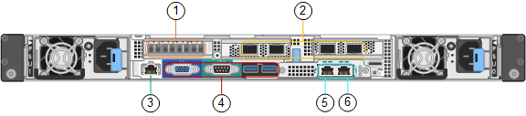

= Controladores nos dispositivos SG6000
:allow-uri-read: 
:icons: font
:imagesdir: ../media/

[role="lead"]
Cada modelo do dispositivo StorageGRIDSG6000 inclui um controlador de computação SG6000-CN em um gabinete 1U e controladores de storage duplex e-Series em um gabinete 2U ou 4U, dependendo do modelo. Reveja os diagramas para saber mais sobre cada tipo de controlador.

== Todos os dispositivos: Controlador de computação SG6000-CN

* Fornece recursos de computação para o dispositivo.
* Inclui o instalador do dispositivo StorageGRID.
+

NOTE: O software StorageGRID não está pré-instalado no dispositivo. Este software é recuperado a partir do Admin Node quando você implementa o dispositivo.

* Pode se conetar a todas as três redes StorageGRID, incluindo a rede de Grade, a rede Admin e a rede cliente.
* Conecta-se aos controladores de storage e-Series e opera como iniciador.

Esta figura mostra os conetores na parte de trás do SG6000-CN.

|===
|  | Porta | Tipo | Utilização 

 a| 
1
 a| 
Portas de interconexão 1-4
 a| 
Fibre Channel (FC) de 16 GB/s, com ótica integrada
 a| 
Ligue o controlador SG6000-CN aos controladores E2800 (duas ligações a cada E2800).

 a| 
2
 a| 
Portas de rede 1-4
 a| 
10 GbE ou 25 GbE, com base no tipo de transcetor de cabo ou SFP, na velocidade do switch e na velocidade do link configurada
 a| 
Conete-se à rede de grade e à rede de cliente para StorageGRID.

 a| 
3
 a| 
Porta de gerenciamento de BMC
 a| 
1 GbE (RJ-45)
 a| 
Conete-se ao controlador de gerenciamento de placa base SG6000-CN.

 a| 
4
 a| 
Portas de diagnóstico e suporte
 a| 
* VGA
* Série, 115200 8-N-1
* USB

 a| 
Reservado para uso de suporte técnico.

 a| 
5
 a| 
Admin Network port 1
 a| 
1 GbE (RJ-45)
 a| 
Ligue o SG6000-CN à rede de administração para StorageGRID.

 a| 
6
 a| 
Admin Network port 2
 a| 
1 GbE (RJ-45)
 a| 
Opções:

* Vincular com a porta de gerenciamento 1 para uma conexão redundante com a rede de administração para StorageGRID.
* Deixe desconetado e disponível para acesso local temporário (IP 169.254.0.1).
* Durante a instalação, utilize a porta 2 para a configuração IP se os endereços IP atribuídos pelo DHCP não estiverem disponíveis.

|===

== SG6060: E2800 controladoras de storage

* Duas controladoras para suporte a failover.
* Gerenciar o armazenamento de dados nas unidades.
* Funciona como controladores padrão da série e em uma configuração duplex.
* Inclua o software SANtricity os (firmware do controlador).
* Inclua o Gerenciador do sistema do SANtricity para monitorar o hardware de armazenamento e gerenciar alertas, o recurso AutoSupport e o recurso de segurança da unidade.
* Conete-se ao controlador SG6000-CN e forneça acesso ao armazenamento.

Esta figura mostra os conetores na parte de trás de cada um dos E2800 controladores.

image::../media/e2800_controller_with_callouts.gif[Conetores no controlador E2800]

|===
|  | Porta | Tipo | Utilização 

 a| 
1
 a| 
Portas de interconexão 1 e 2
 a| 
SFPa ótico FC de 16 GB/s
| Ligue cada um dos controladores E2800 ao controlador SG6000-CN. Existem quatro ligações ao controlador SG6000-CN (duas de cada E2800). 

 a| 
2
 a| 
Portas de gerenciamento 1 e 2
 a| 
Ethernet de 1 GB (RJ-45)
 a| 
* A porta 1 coneta-se à rede onde você acessa o Gerenciador de sistema do SANtricity em um navegador.
* A porta 2 está reservada para uso de suporte técnico.

 a| 
3
 a| 
Portas de diagnóstico e suporte
 a| 
* Porta serial RJ-45
* Porta serial micro USB
* Porta de USB

 a| 
Reservado para uso de suporte técnico.

 a| 
4
 a| 
Portas de expansão da unidade 1 e 2
 a| 
SAS de 12GB GB/s.
 a| 
Conete as portas às portas de expansão da unidade nas IOMs no compartimento de expansão.

|===

== SGF6024: EF570 controladoras de storage

* Duas controladoras para suporte a failover.
* Gerenciar o armazenamento de dados nas unidades.
* Funciona como controladores padrão da série e em uma configuração duplex.
* Inclua o software SANtricity os (firmware do controlador).
* Inclua o Gerenciador do sistema do SANtricity para monitorar o hardware de armazenamento e gerenciar alertas, o recurso AutoSupport e o recurso de segurança da unidade.
* Conete-se ao controlador SG6000-CN e forneça acesso ao armazenamento flash.

Esta figura mostra os conetores na parte de trás de cada um dos EF570 controladores.

image::../media/ef570_rear_connectors.gif[EF570 conetores traseiros]

|===
|  | Porta | Tipo | Utilização 

 a| 
1
 a| 
Portas de interconexão 1 e 2
 a| 
SFPa ótico FC de 16 GB/s
| Ligue cada um dos controladores EF570 ao controlador SG6000-CN. Existem quatro ligações ao controlador SG6000-CN (duas de cada EF570). 

 a| 
2
 a| 
Portas de diagnóstico e suporte
 a| 
* Porta serial RJ-45
* Porta serial micro USB
* Porta de USB

 a| 
Reservado para uso de suporte técnico.

 a| 
3
 a| 
Portas de expansão da unidade
 a| 
SAS de 12GB GB/s.
 a| 
Não utilizado. O dispositivo SGF6024 não é compatível com compartimentos de unidades de expansão.

 a| 
4
 a| 
Portas de gerenciamento 1 e 2
 a| 
Ethernet de 1 GB (RJ-45)
 a| 
* A porta 1 coneta-se à rede onde você acessa o Gerenciador de sistema do SANtricity em um navegador.
* A porta 2 está reservada para uso de suporte técnico.

|===

== SG6060: Módulos de entrada/saída para prateleiras de expansão opcionais

O compartimento de expansão contém dois módulos de entrada/saída (IOMs) que se conectam aos controladores de storage ou a outros compartimentos de expansão.

image::../media/iom_connectors.gif[Traseira IOM]

|===
|  | Porta | Tipo | Utilização 

 a| 
1
 a| 
Portas de expansão da unidade 1-4
 a| 
SAS de 12GB GB/s.
 a| 
Conecte cada porta aos controladores de storage ou ao compartimento de expansão adicional (se houver).

|===