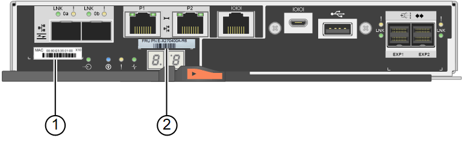

= Substituição de um controlador de armazenamento
:allow-uri-read: 
:icons: font
:imagesdir: ../media/

[role="lead"]
Pode ser necessário substituir um controlador E2800 ou um controlador EF570 se não estiver a funcionar de forma ideal ou se tiver falhado.

.O que você vai precisar
* Você tem um controlador de substituição com o mesmo número de peça do controlador que está substituindo.
* Você tem etiquetas para identificar cada cabo conetado ao controlador.
* Você tem uma pulseira antiestática ou tomou outras precauções antiestáticas.
* Você tem uma chave de fenda Phillips nº 1.
* Você tem as instruções e-Series para substituir um controlador na configuração duplex.
+

IMPORTANT: Consulte as instruções da Série e apenas quando for direcionado ou se precisar de mais detalhes para executar uma etapa específica. Não confie nas instruções do e-Series para substituir um controlador no dispositivo StorageGRID, porque os procedimentos não são os mesmos.

* Você localizou fisicamente o dispositivo de armazenamento onde está substituindo o controlador no data center.
+
link:locating-controller-in-data-center.html["Localizar o controlador em um data center"]

.Sobre esta tarefa
Você pode determinar se você tem um controlador com falha de duas maneiras:

* O Guru de recuperação no Gerenciador de sistema do SANtricity direciona você para substituir o controlador.
* O LED âmbar de atenção no controlador está aceso, indicando que o controlador tem uma avaria.
+

IMPORTANT: Se ambos os controladores na gaveta tiverem seus LEDs de atenção ligados, entre em Contato com o suporte técnico para obter assistência.

Como o compartimento da controladora de storage contém duas controladoras de storage, você pode substituir uma delas enquanto o dispositivo está ligado e executa operações de leitura/gravação, contanto que as condições a seguir sejam verdadeiras:

* O segundo controlador na gaveta tem o status ideal.
* O campo "OK para remover" na área Detalhes do Guru de recuperação no Gerenciador de sistemas do SANtricity exibe Sim, indicando que é seguro remover esse componente.

IMPORTANT: Se o segundo recipiente do controlador na gaveta não tiver o status ideal ou se o Recovery Guru indicar que não é bom remover o recipiente do controlador, entre em Contato com o suporte técnico.

Quando substituir um controlador, tem de remover a bateria do controlador original e instalá-la no controlador de substituição.

NOTE: Os controladores de storage no dispositivo não incluem placas de interface de host (HIC).

.Passos
. Desembale o novo controlador e coloque-o numa superfície plana e livre de estática.
+
Guarde os materiais de embalagem a utilizar ao enviar o controlador avariado.

. Localize o endereço MAC e as etiquetas de número de peça FRU na parte traseira do controlador de substituição.
+
Esta figura mostra o controlador E2800. O procedimento de substituição do controlador EF570 é idêntico.

+

+
|===
| Etiqueta | Etiqueta | Descrição 

 a| 
1
 a| 
Endereço MAC
 a| 
O endereço MAC da porta de gerenciamento 1 ("'P1"). Se você usou DHCP para obter o endereço IP do controlador original, precisará desse endereço para se conetar ao novo controlador.

 a| 
2
 a| 
Número de peça FRU
 a| 
O número de peça da FRU. Este número deve corresponder ao número de peça de substituição para o controlador atualmente instalado.

|===
. Prepare-se para remover o controlador.
+
Use o Gerenciador de sistema do SANtricity para executar estas etapas. Conforme necessário para obter detalhes adicionais, consulte as instruções do e-Series para substituir o controlador de storage.

+
.. Confirme se o número de peça de substituição para o controlador com falha é o mesmo que o número de peça FRU para o controlador de substituição.
+
Quando um controlador tem uma falha e precisa ser substituído, o número de peça de substituição é exibido na área Detalhes do Recovery Guru. Se você precisar encontrar esse número manualmente, você pode procurar o controlador na guia *base*.

+

IMPORTANT: *Possível perda de acesso aos dados --* se os dois números de peça não forem os mesmos, não tente este procedimento.

.. Faça uma cópia de segurança da base de dados de configuração.
+
Se ocorrer um problema ao remover um controlador, pode utilizar o ficheiro guardado para restaurar a configuração.

.. Colete dados de suporte para o dispositivo.
+

NOTE: A coleta de dados de suporte antes e depois da substituição de um componente garante que você possa enviar um conjunto completo de logs para o suporte técnico caso a substituição não resolva o problema.

.. Leve o controlador que pretende substituir offline.

. Retire o controlador do aparelho:
+
.. Coloque uma pulseira antiestática ou tome outras precauções antiestáticas.
.. Identifique os cabos e, em seguida, desligue os cabos e SFPs.
+

IMPORTANT: Para evitar um desempenho degradado, não torça, dobre, aperte ou pise nos cabos.

.. Solte o controlador do aparelho apertando o trinco na pega do came até soltar e, em seguida, abra a pega do came para a direita.
.. Utilizando as duas mãos e a pega do came, deslize o controlador para fora do aparelho.
+

IMPORTANT: Utilize sempre duas mãos para suportar o peso do controlador.

.. Coloque o controlador numa superfície plana e sem estática com a tampa amovível virada para cima.
.. Remova a tampa pressionando o botão e deslizando a tampa para fora.

. Remova a bateria do controlador com falha e instale-a no controlador de substituição:
+
.. Confirme se o LED verde dentro do controlador (entre a bateria e os DIMMs) está desligado.
+
Se este LED verde estiver ligado, o controlador ainda está a utilizar a bateria. Deve aguardar que este LED se apague antes de remover quaisquer componentes.

+
image::../media/e2800_internal_cache_active_led.gif[LED verde no E2800]

+
|===
| Item | Descrição 

 a| 
image::../media/icon_legend_01.gif[Número 1]
 a| 
LED Ativo Cache Interno

 a| 
image::../media/icon_legend_02.gif[Número 2]
 a| 
Bateria

|===
.. Localize a trava de liberação azul da bateria.
.. Desengate a bateria empurrando a trava de liberação para baixo e afastando-a do controlador.
+
image::../media/e2800_remove_battery.gif[Trinco da bateria]

+
|===
| Item | Descrição 

 a| 
image::../media/icon_legend_01.gif[Número 1]
 a| 
Trinco de desbloqueio da bateria

 a| 
image::../media/icon_legend_02.gif[número 2]
 a| 
Bateria

|===
.. Levante a bateria e deslize-a para fora do controlador.
.. Retire a tampa do controlador de substituição.
.. Oriente o controlador de substituição para que a ranhura da bateria fique voltada para si.
.. Introduza a bateria no controlador a um ligeiro ângulo descendente.
+
Deve inserir a flange metálica na parte frontal da bateria na ranhura na parte inferior do controlador e deslizar a parte superior da bateria por baixo do pequeno pino de alinhamento no lado esquerdo do controlador.

.. Desloque o trinco da bateria para cima para fixar a bateria.
+
Quando a trava se encaixa no lugar, a parte inferior da trava se encaixa em uma ranhura metálica no chassi.

.. Vire o controlador para confirmar que a bateria está instalada corretamente.
+

IMPORTANT: *Possíveis danos ao hardware* -- a flange metálica na parte frontal da bateria deve ser completamente inserida na ranhura do controlador (como mostrado na primeira figura). Se a bateria não estiver instalada corretamente (como mostrado na segunda figura), a flange metálica pode entrar em Contato com a placa controladora, causando danos.

+
*** *Correto -- a flange de metal da bateria está completamente inserida na ranhura do controlador:*
+
image::../media/e2800_battery_flange_ok.gif[Flange da bateria conforme]

*** *Incorreto -- a flange metálica da bateria não está inserida na ranhura do controlador:*
+
image::../media/e2800_battery_flange_not_ok.gif[Flange da bateria incorreta]

.. Volte a colocar a tampa do controlador.

. Instale o controlador de substituição no aparelho.
+
.. Vire o controlador ao contrário, de modo a que a tampa amovível fique virada para baixo.
.. Com a pega do came na posição aberta, deslize o controlador até ao aparelho.
.. Mova a alavanca do came para a esquerda para bloquear o controlador no lugar.
.. Substitua os cabos e SFPs.
.. Se o controlador original usou DHCP para o endereço IP, localize o endereço MAC na etiqueta na parte de trás do controlador de substituição. Peça ao administrador da rede para associar o DNS/rede e o endereço IP do controlador removido com o endereço MAC do controlador de substituição.
+

NOTE: Se o controlador original não tiver utilizado DHCP para o endereço IP, o novo controlador adotará o endereço IP do controlador removido.

. Coloque o controlador on-line usando o Gerenciador de sistemas da SANtricity:
+
.. Selecione *hardware*.
.. Se o gráfico mostrar as unidades, selecione *Mostrar parte traseira da prateleira*.
.. Selecione o controlador que pretende colocar online.
.. Selecione *Place Online* no menu de contexto e confirme que deseja executar a operação.
.. Verifique se o visor de sete segmentos mostra um estado `99` de .

. Confirme se o novo controlador é ideal e recolha dados de suporte.

.Informações relacionadas
http://mysupport.netapp.com/info/web/ECMP1658252.html["Site de Documentação de sistemas NetApp e-Series"^]
