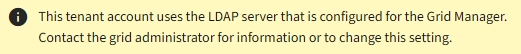

= Configurando uma fonte de identidade federada
:allow-uri-read: 
:icons: font
:imagesdir: ../media/

[role="lead"]
Você pode configurar a federação de identidade se quiser que grupos de locatários e usuários sejam gerenciados em outro sistema, como ative Directory, OpenLDAP ou Oracle Directory Server.

.O que você vai precisar
* Você deve estar conetado ao Gerenciador do Locatário usando um navegador compatível.
* Você deve ter permissões de acesso específicas.
* Você deve estar usando o ative Directory, OpenLDAP ou Oracle Directory Server como o provedor de identidade. Se pretender utilizar um serviço LDAP v3 que não esteja listado, tem de contactar o suporte técnico.
* Se você pretende usar TLS (Transport Layer Security) para comunicações com o servidor LDAP, o provedor de identidade deve estar usando TLS 1,2 ou 1,3.

.Sobre esta tarefa
Se você pode configurar um serviço de federação de identidade para seu locatário depende de como sua conta de locatário foi configurada. Seu locatário pode compartilhar o serviço de federação de identidade configurado para o Gerenciador de Grade. Se você vir essa mensagem ao acessar a página Federação de identidade, não será possível configurar uma origem de identidade federada separada para esse locatário.

.Passos
. Selecione *GERENCIAMENTO DE ACESSO* *federação de identidade*.
. Selecione *Ativar federação de identidade*.
. Na seção tipo de serviço LDAP, selecione *ative Directory*, *OpenLDAP* ou *Other*.
+
Se selecionar *OpenLDAP*, configure o servidor OpenLDAP. Consulte as diretrizes para configurar um servidor OpenLDAP.

+
Selecione *Other* para configurar valores para um servidor LDAP que use o Oracle Directory Server.

. Se você selecionou *Other*, preencha os campos na seção atributos LDAP.
+
** *Nome exclusivo do usuário*: O nome do atributo que contém o identificador exclusivo de um usuário LDAP. Este atributo é equivalente `sAMAccountName` ao ative Directory e `uid` ao OpenLDAP. Se estiver configurando o Oracle Directory Server, digite `uid`.
** *UUID de usuário*: O nome do atributo que contém o identificador exclusivo permanente de um usuário LDAP. Este atributo é equivalente `objectGUID` ao ative Directory e `entryUUID` ao OpenLDAP. Se estiver configurando o Oracle Directory Server, digite `nsuniqueid`. O valor de cada usuário para o atributo especificado deve ser um número hexadecimal de 32 dígitos no formato de 16 bytes ou string, onde os hífens são ignorados.
** *Group unique name*: O nome do atributo que contém o identificador exclusivo de um grupo LDAP. Este atributo é equivalente `sAMAccountName` ao ative Directory e `cn` ao OpenLDAP. Se estiver configurando o Oracle Directory Server, digite `cn`.
** *Group UUID*: O nome do atributo que contém o identificador exclusivo permanente de um grupo LDAP. Este atributo é equivalente `objectGUID` ao ative Directory e `entryUUID` ao OpenLDAP. Se estiver configurando o Oracle Directory Server, digite `nsuniqueid`. O valor de cada grupo para o atributo especificado deve ser um número hexadecimal de 32 dígitos no formato de 16 bytes ou string, onde os hífens são ignorados.

. Na secção Configurar servidor LDAP, introduza as informações de ligação de rede e servidor LDAP necessárias.
+
** *Nome do host*: O nome do host do servidor ou endereço IP do servidor LDAP.
** *Port*: A porta usada para se conetar ao servidor LDAP. A porta padrão para STARTTLS é 389 e a porta padrão para LDAPS é 636. No entanto, você pode usar qualquer porta desde que seu firewall esteja configurado corretamente.
** *Nome de usuário*: O caminho completo do nome distinto (DN) para o usuário que se conetará ao servidor LDAP. No ative Directory, você também pode especificar o Nome de logon de nível inferior ou o Nome principal do usuário.
+
O usuário especificado deve ter permissão para listar grupos e usuários e para acessar os seguintes atributos:

+
*** `sAMAccountName` ou `uid`
*** `objectGUID`, `entryUUID`, ou `nsuniqueid`
*** `cn`
*** `memberOf` ou `isMemberOf`

** *Senha*: A senha associada ao nome de usuário.
** *Group base DN*: O caminho completo do nome distinto (DN) para uma subárvore LDAP que você deseja pesquisar grupos. No exemplo do ative Directory (abaixo), todos os grupos cujo Nome distinto é relativo ao DN base (DC-StorageGRID,DC-com) podem ser usados como grupos federados.
+
Os valores *Group unique name* devem ser exclusivos dentro do *Group base DN* a que pertencem.

** *DN da base do usuário*: O caminho completo do nome distinto (DN) de uma subárvore LDAP que você deseja pesquisar por usuários.
+
Os valores *Nome exclusivo do usuário* devem ser exclusivos dentro do *DN base do usuário* a que pertencem.

. Na seção *Transport Layer Security (TLS)*, selecione uma configuração de segurança.
+
** *Use STARTTLS (recomendado)*: Use STARTTLS para proteger as comunicações com o servidor LDAP. Esta é a opção recomendada.
** *Use LDAPS*: A opção LDAPS (LDAP sobre SSL) usa TLS para estabelecer uma conexão com o servidor LDAP. Esta opção é suportada por razões de compatibilidade.
** *Não use TLS*: O tráfego de rede entre o sistema StorageGRID e o servidor LDAP não será protegido.
+
Esta opção não é suportada se o servidor do ative Directory forçar a assinatura LDAP. Você deve usar STARTTLS ou LDAPS.

. Se você selecionou STARTTLS ou LDAPS, escolha o certificado usado para proteger a conexão.
+
** *Use o certificado CA do sistema operacional*: Use o certificado CA padrão instalado no sistema operacional para proteger conexões.
** *Use certificado CA personalizado*: Use um certificado de segurança personalizado.
+
Se você selecionar essa configuração, copie e cole o certificado de segurança personalizado na caixa de texto certificado da CA.

. Selecione *testar ligação* para validar as definições de ligação para o servidor LDAP.
+
Uma mensagem de confirmação aparece no canto superior direito da página se a conexão for válida.

. Se a conexão for válida, selecione *Salvar*.
+
A captura de tela a seguir mostra valores de configuração de exemplo para um servidor LDAP que usa o ative Directory.

+
image::../media/ldap_config_active_directory.png[Página de Federação de identidades que mostra o servidor LDAP que utiliza o ative Directory]

.Informações relacionadas
link:tenant-management-permissions.html["Permissões de gerenciamento do locatário"]

link:guidelines-for-configuring-openldap-server.html["Diretrizes para configurar um servidor OpenLDAP"]
