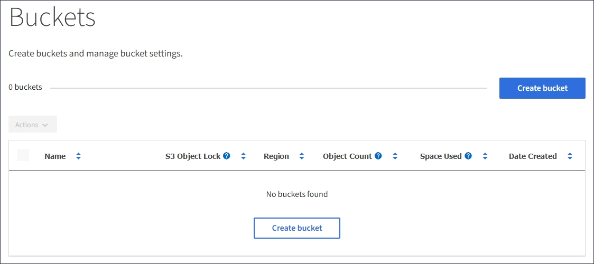
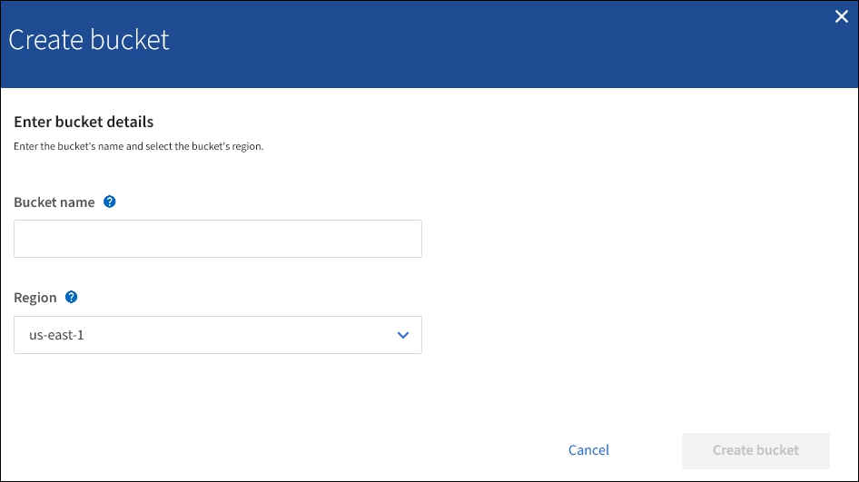

= Criando um bucket S3
:allow-uri-read: 
:icons: font
:imagesdir: ../media/

[role="lead"]
Você pode usar o Gerenciador do locatário para criar buckets do S3 para dados de objetos. Ao criar um intervalo, você deve especificar o nome e a região do intervalo. Se a configuração global de bloqueio de objetos S3D estiver ativada para o sistema StorageGRID, você poderá ativar opcionalmente o bloqueio de objetos S3D para o bucket.

.O que você vai precisar
* Você deve estar conetado ao Gerenciador do Locatário usando um navegador compatível.
* Você deve pertencer a um grupo de usuários que tenha a permissão Gerenciar todos os buckets ou acesso root. Essas permissões substituem as configurações de permissões em políticas de grupo ou bucket.
* Se você planeja criar um bucket com o bloqueio de objeto S3, a configuração global bloqueio de objeto S3 deve ter sido ativada para o sistema StorageGRID e você deve ter revisado os requisitos para buckets e objetos do bloqueio de objeto S3.
+
link:using-s3-object-lock.html["Usando S3 Object Lock"]

.Passos
. Selecione *STORAGE (S3)* > *Buckets*.
+
A página Buckets é exibida e lista todos os buckets que já foram criados.

+

. Selecione *criar bucket*.
+
O assistente criar bucket é exibido.

+

+

NOTE: Se a configuração global S3 Object Lock estiver ativada, Create bucket inclui uma segunda etapa para gerenciar o S3 Object Lock para o bucket.

. Introduza um nome exclusivo para o intervalo.
+

IMPORTANT: Não é possível alterar o nome do bucket depois de criar o bucket.

+
Os nomes dos buckets devem cumprir com estas regras:

+
** Deve ser exclusivo em cada sistema StorageGRID (não apenas exclusivo na conta do locatário).
** Deve ser compatível com DNS.
** Deve conter pelo menos 3 e não mais de 63 carateres.
** Pode ser uma série de uma ou mais etiquetas, com etiquetas adjacentes separadas por um período. Cada rótulo deve começar e terminar com uma letra minúscula ou um número e só pode usar letras minúsculas, números e hífens.
** Não deve se parecer com um endereço IP formatado em texto.
** Não deve usar períodos em solicitações de estilo hospedadas virtuais. Os períodos causarão problemas com a verificação do certificado curinga do servidor.

+

NOTE: Consulte a documentação do Amazon Web Services (AWS) para obter mais informações.

. Selecione a região para este intervalo.
+
O administrador do StorageGRID gerencia as regiões disponíveis. A região de um bucket pode afetar a política de proteção de dados aplicada a objetos. Por padrão, todos os buckets são criados na `us-east-1` região.

+

IMPORTANT: Não é possível alterar a região depois de criar o intervalo.

. Selecione *criar bucket* ou *continuar*.
+
** Se a configuração global S3 Object Lock não estiver ativada, selecione *Create bucket*. O bucket é criado e adicionado à tabela na página Buckets.
** Se a configuração global S3 Object Lock estiver ativada, selecione *Continue*. O passo 2, Gerenciar bloqueio de objetos S3, aparece.
+
image::../media/bucket_create_s3_object_lock_enabled.png[Bucket Create S3 Object Lock ativado]

. Opcionalmente, marque a caixa de seleção para ativar o bloqueio de objetos S3D para este bucket.
+
O bloqueio de objetos S3 deve ser ativado para o bucket antes que um aplicativo cliente S3 possa especificar as configurações de retenção legal e de retenção para os objetos adicionados ao bucket.

+

IMPORTANT: Não é possível ativar ou desativar o bloqueio de objetos S3 depois de criar o bucket.

+

NOTE: Se você ativar o bloqueio de objeto S3 para um bucket, o controle de versão do bucket será ativado automaticamente.

. Selecione *criar bucket*.
+
O bucket é criado e adicionado à tabela na página Buckets.

.Informações relacionadas
link:../ilm/index.html["Gerenciar objetos com ILM"]

link:understanding-tenant-management-api.html["Entendendo a API de gerenciamento do locatário"]

link:../s3/index.html["Use S3"]
