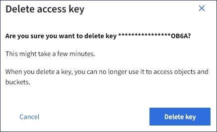

= Excluindo as chaves de acesso S3 de outro usuário
:allow-uri-read: 
:icons: font
:imagesdir: ../media/

[role="lead"]
Se você estiver usando um locatário S3 e tiver permissões apropriadas, você poderá excluir as chaves de acesso S3 de outro usuário. Depois que uma chave de acesso for excluída, ela não poderá mais ser usada para acessar os objetos e buckets na conta do locatário.

.O que você vai precisar
* Você deve estar conetado ao Gerenciador do Locatário usando um navegador compatível.
* Você deve ter a permissão de acesso root.

IMPORTANT: Os buckets e objetos do S3 pertencentes a um usuário podem ser acessados usando o ID da chave de acesso e a chave de acesso secreta exibidos para esse usuário no Gerenciador do locatário. Por esse motivo, proteja as chaves de acesso como faria com uma senha. Gire as chaves de acesso regularmente, remova quaisquer chaves não utilizadas da conta e nunca as compartilhe com outros usuários.

.Passos
. Selecione *GERENCIAMENTO DE ACESSO* *usuários*.
+
A página usuários é exibida e lista os usuários existentes.

. Selecione o usuário cujas chaves de acesso S3 você deseja gerenciar.
+
É apresentada a página Detalhes do utilizador.

. Selecione *teclas de acesso* e, em seguida, marque a caixa de seleção para cada chave de acesso que deseja excluir.
. Selecione *ações* *Excluir tecla selecionada*.
+
É apresentada uma caixa de diálogo de confirmação.

+

. Selecione *Delete key*.
+
Uma mensagem de confirmação aparece no canto superior direito da página. As alterações podem levar até 15 minutos para entrar em vigor devido ao armazenamento em cache.

.Informações relacionadas
link:tenant-management-permissions.html["Permissões de gerenciamento do locatário"]
