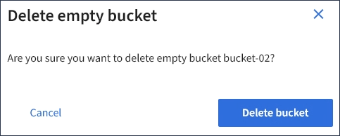

= Eliminar um bucket do S3
:allow-uri-read: 
:icons: font
:imagesdir: ../media/

[role="lead"]
Você pode usar o Gerenciador do Locatário para excluir um bucket do S3 vazio.

.O que você vai precisar
* Você deve estar conetado ao Gerenciador do Locatário usando um navegador compatível.
* Você deve pertencer a um grupo de usuários que tenha a permissão Gerenciar todos os buckets ou acesso root. Essas permissões substituem as configurações de permissões em políticas de grupo ou bucket.

.Sobre esta tarefa
Estas instruções descrevem como excluir um bucket do S3 usando o Gerenciador do locatário. Você também pode excluir buckets do S3 usando a API de gerenciamento do locatário ou a API REST do S3.

Não é possível excluir um bucket do S3 se ele contiver objetos ou versões de objetos não atuais. Para obter informações sobre como objetos com versão S3 são excluídos, consulte as instruções para gerenciar objetos com gerenciamento do ciclo de vida das informações.

.Passos
. Selecione *STORAGE (S3)* > *Buckets*.
+
A página baldes é exibida e mostra todos os baldes S3 existentes.

+
image::../media/buckets_table.png[Tabela de baldes]

. Marque a caixa de seleção do intervalo vazio que deseja excluir.
+
O menu ações está ativado.

. No menu ações, selecione *Excluir bucket vazio*.
+
image::../media/delete_bucket_button.png[Botão Delete Buckets (Eliminar baldes)]

+
É apresentada uma mensagem de confirmação.

+

. Se tiver certeza de que deseja excluir o intervalo, selecione *Excluir intervalo*.
+
O StorageGRID confirma que o balde está vazio e, em seguida, elimina o balde. Esta operação pode demorar alguns minutos.

+
Se o balde não estiver vazio, é apresentada uma mensagem de erro. Você deve excluir todos os objetos antes de excluir o bucket.

+
image::../media/delete_bucket_not_empty_message.png[Eliminar a mensagem balde não vazia]

.Informações relacionadas
link:../ilm/index.html["Gerenciar objetos com ILM"]
