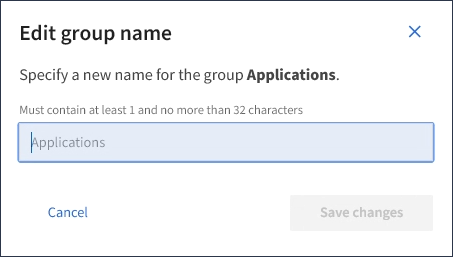

= Editar um nome de grupo
:allow-uri-read: 
:icons: font
:imagesdir: ../media/

[role="lead"]
Pode editar o nome de apresentação de um grupo. Não é possível editar o nome exclusivo de um grupo.

.O que você vai precisar
* Você deve estar conetado ao Gerenciador do Locatário usando um navegador compatível.
* Você deve pertencer a um grupo de usuários que tenha a permissão de acesso root.

.Passos
. Selecione *GERENCIAMENTO DE ACESSO* *grupos*.
. Marque a caixa de seleção do grupo cujo nome de exibição deseja editar.
. Selecione *ações* *Editar nome do grupo*.
+
A caixa de diálogo Editar nome do grupo é exibida.

+

. Se estiver editando um grupo local, atualize o nome de exibição conforme necessário.
+
Não é possível alterar o nome exclusivo de um grupo. Não é possível editar o nome de exibição de um grupo federado.

. Selecione *Salvar alterações*.
+
Uma mensagem de confirmação aparece no canto superior direito da página. As alterações podem levar até 15 minutos para entrar em vigor devido ao armazenamento em cache.

.Informações relacionadas
link:tenant-management-permissions.html["Permissões de gerenciamento do locatário"]
