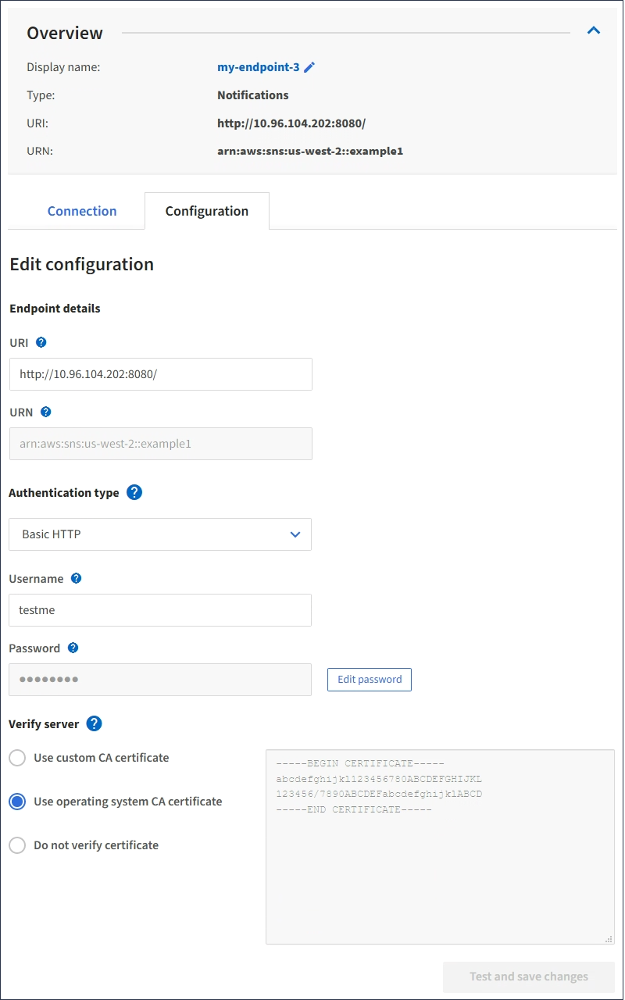

= Edição de um endpoint de serviços de plataforma
:allow-uri-read: 
:icons: font
:imagesdir: ../media/

[role="lead"]
Você pode editar a configuração de um endpoint de serviços de plataforma para alterar seu nome, URI ou outros detalhes. Por exemplo, talvez seja necessário atualizar credenciais expiradas ou alterar o URI para apontar para um índice de backup do Elasticsearch para failover. Você não pode alterar a URN para um endpoint de serviços de plataforma.

.O que você vai precisar
* Você deve estar conetado ao Gerenciador do Locatário usando um navegador compatível.
* Você deve pertencer a um grupo de usuários que tenha a permissão Gerenciar Endpoints.

.Passos
. Selecione *STORAGE (S3)* *endpoints de serviços de plataforma*.
+
A página de endpoints de serviços da plataforma é exibida e mostra a lista de endpoints de serviços da plataforma que já foram configurados.

+
image::../media/endpoints_list.png[Lista de endpoints]

. Selecione o ponto de extremidade que pretende editar.
+
A página de detalhes do ponto final é exibida.

. Selecione *Configuração*.
+

. Conforme necessário, altere a configuração do endpoint.
+

NOTE: Você não pode alterar a URNA DE um endpoint depois que o endpoint foi criado.

+
.. Para alterar o nome de exibição do endpoint, selecione o ícone de edição image:../media/icon_edit_tm.png["Ícone de edição"].
.. Conforme necessário, altere o URI.
.. Conforme necessário, altere o tipo de autenticação.
+
*** Para autenticação HTTP básica, altere o nome de usuário conforme necessário. Altere a senha conforme necessário selecionando *Editar senha* e inserindo a nova senha. Se você precisar cancelar suas alterações, selecione *Revert password edit*.
*** Para autenticação da chave de acesso, altere a chave conforme necessário selecionando *Editar chave S3* e colando uma nova ID de chave de acesso e chave de acesso secreta. Se você precisar cancelar suas alterações, selecione *Reverter S3 key edit*.

.. Conforme necessário, altere o método para verificar o servidor.

. Selecione *Teste e salve as alterações*.
+
** Uma mensagem de sucesso será exibida se o endpoint puder ser alcançado usando as credenciais especificadas. A conexão com o endpoint é verificada a partir de um nó em cada local.
** Uma mensagem de erro será exibida se a validação do endpoint falhar. Modifique o ponto final para corrigir o erro e selecione *testar e salvar alterações*.

.Informações relacionadas
link:creating-platform-services-endpoint.html["Criando um endpoint de serviços de plataforma"]
