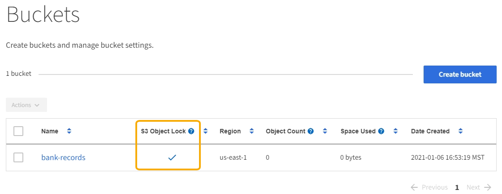

= Requisitos para o bloqueio de objetos S3
:allow-uri-read: 
:icons: font
:imagesdir: ../media/

[role="lead"]
Antes de ativar o bloqueio de objeto S3 para um bucket, revise os requisitos para buckets e objetos do bloqueio de objeto S3 e o ciclo de vida dos objetos em buckets com o bloqueio de objeto S3 ativado.

== Requisitos para buckets com bloqueio de objeto S3 ativado

* Se a configuração global de bloqueio de objeto S3 estiver ativada para o sistema StorageGRID, você poderá usar o Gerenciador de locatário, a API de gerenciamento de locatário ou a API REST S3 para criar buckets com o bloqueio de objeto S3 ativado.
+
Este exemplo do Gerenciador do Locatário mostra um bucket com o bloqueio de objeto S3 ativado.

+

* Se você planeja usar o bloqueio de objetos S3D, você deve ativar o bloqueio de objetos S3D ao criar o bucket. Não é possível ativar o bloqueio de objetos S3D para um bucket existente.
* O controle de versão do bucket é necessário com o S3 Object Lock. Quando o bloqueio de objeto S3 está ativado para um bucket, o StorageGRID ativa automaticamente o controle de versão desse bucket.
* Depois de criar um bucket com o bloqueio de objetos S3 ativado, não é possível desativar o bloqueio de objetos S3 ou suspender o controle de versão desse bucket.
* Um bucket do StorageGRID que tenha o bloqueio de objetos S3 ativado não tem um período de retenção padrão. Em vez disso, o aplicativo cliente S3 pode, opcionalmente, especificar uma data de retenção e uma configuração de retenção legal para cada versão de objeto adicionada a esse bucket.
* A configuração do ciclo de vida do bucket é compatível com buckets do ciclo de vida do objeto do S3.
* A replicação do CloudMirror não é compatível com buckets com o S3 Object Lock ativado.

== Requisitos para objetos em buckets com o bloqueio de objetos S3 ativado

* O aplicativo cliente S3 deve especificar configurações de retenção para cada objeto que precisa ser protegido pelo bloqueio de objetos S3.
* Você pode aumentar a data de retenção até uma versão de objeto, mas nunca pode diminuir esse valor.
* Se você for notificado de uma ação legal pendente ou investigação regulatória, poderá preservar informações relevantes colocando uma retenção legal em uma versão de objeto. Quando uma versão de objeto está sob uma retenção legal, esse objeto não pode ser excluído do StorageGRID, mesmo que tenha atingido sua data de retenção até. Assim que a retenção legal for levantada, a versão do objeto pode ser excluída se a data de retenção for atingida.
* S3 Object Lock requer o uso de buckets versionados. As configurações de retenção se aplicam a versões de objetos individuais. Uma versão de objeto pode ter uma configuração de retenção de data e de retenção legal, uma mas não a outra, ou nenhuma. Especificar uma configuração reter-até-data ou retenção legal para um objeto protege apenas a versão especificada na solicitação. Você pode criar novas versões do objeto, enquanto a versão anterior do objeto permanece bloqueada.

== Ciclo de vida dos objetos em buckets com o bloqueio de objetos S3 ativado

Cada objeto que é salvo em um bucket com o S3 Object Lock ativado passa por três estágios:

. * Ingestão de objetos*
+
** Ao adicionar uma versão de objeto a um bucket com o bloqueio de objeto S3 ativado, o aplicativo cliente S3 pode, opcionalmente, especificar configurações de retenção para o objeto (reter até a data, retenção legal ou ambos). Em seguida, o StorageGRID gera metadados para esse objeto, que inclui um identificador de objeto exclusivo (UUID) e a data e hora de ingestão.
** Depois que uma versão de objeto com configurações de retenção é ingerida, seus dados e metadados S3 definidos pelo usuário não podem ser modificados.
** O StorageGRID armazena os metadados do objeto independentemente dos dados do objeto. Ele mantém três cópias de todos os metadados de objetos em cada local.

. *Retenção de objetos*
+
** Várias cópias do objeto são armazenadas pelo StorageGRID. O número exato e o tipo de cópias e os locais de storage são determinados pelas regras em conformidade na política de ILM ativa.

. *Exclusão de objeto*
+
** Um objeto pode ser excluído quando sua data de retenção é alcançada.
** Não é possível eliminar um objeto que esteja sob uma guarda legal.

