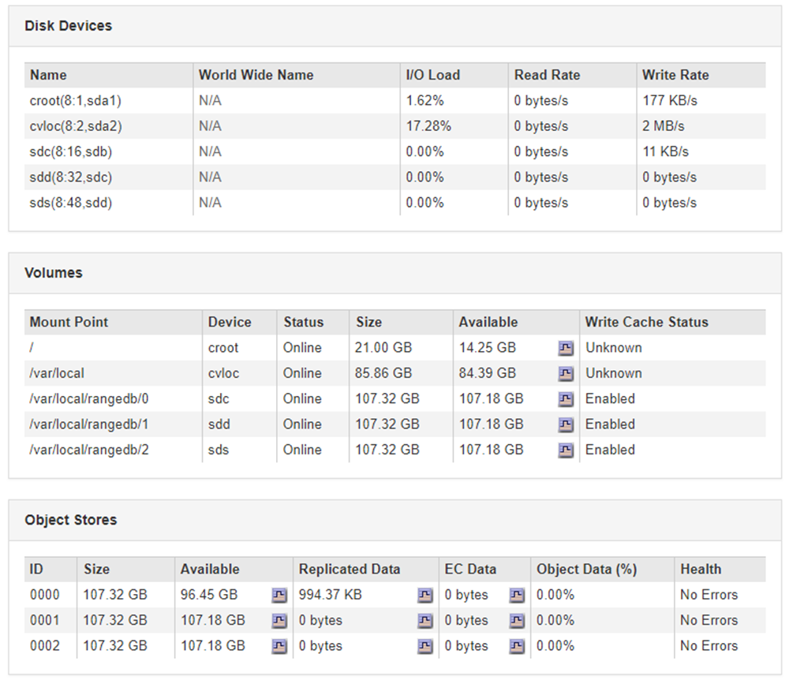

= Solução de problemas de objetos e storage
:allow-uri-read: 
:icons: font
:imagesdir: ../media/

[role="lead"]
Há várias tarefas que você pode executar para ajudar a determinar a origem dos problemas de armazenamento e objeto.

== Confirmar localizações de dados do objeto

Dependendo do problema, você pode querer confirmar onde os dados do objeto estão sendo armazenados. Por exemplo, você pode querer verificar se a política ILM está funcionando como esperado e os dados do objeto estão sendo armazenados onde se pretende.

.O que você vai precisar
* Você deve ter um identificador de objeto, que pode ser um dos seguintes:
+
** *UUID*: O Identificador universalmente exclusivo do objeto. Introduza o UUID em todas as maiúsculas.
** *CBID*: O identificador exclusivo do objeto dentro do StorageGRID . Você pode obter o CBID de um objeto a partir do log de auditoria. Introduza o CBID em todas as maiúsculas.
** *S3 bucket e chave de objeto*: Quando um objeto é ingerido através da interface S3, o aplicativo cliente usa uma combinação de bucket e chave de objeto para armazenar e identificar o objeto.
** * Nome do contentor e objeto Swift*: Quando um objeto é ingerido através da interface Swift, o aplicativo cliente usa uma combinação de nome de contentor e objeto para armazenar e identificar o objeto.

.Passos
. Selecione *ILM* > *Object Metadata Lookup*.
. Digite o identificador do objeto no campo *Identificador*.
+
Você pode inserir um UUID, CBID, S3 bucket/object-key ou Swift container/object-name.

+
image::../media/object_lookup.png[Página de pesquisa de objetos]

. Clique em *Procurar*.
+
Os resultados da pesquisa de metadados de objeto aparecem. Esta página lista os seguintes tipos de informações:

+
** Metadados do sistema, incluindo o ID do objeto (UUID), o nome do objeto, o nome do contentor, o nome ou ID da conta do locatário, o tamanho lógico do objeto, a data e hora em que o objeto foi criado pela primeira vez e a data e hora em que o objeto foi modificado pela última vez.
** Quaisquer pares de valor-chave de metadados de usuário personalizados associados ao objeto.
** Para objetos S3D, qualquer par de chave-valor de marca de objeto associado ao objeto.
** Para cópias de objetos replicadas, o local de storage atual de cada cópia.
** Para cópias de objetos com codificação de apagamento, o local de storage atual de cada fragmento.
** Para cópias de objetos em um Cloud Storage Pool, o local do objeto, incluindo o nome do bucket externo e o identificador exclusivo do objeto.
** Para objetos segmentados e objetos de várias partes, uma lista de segmentos, incluindo identificadores de segmento e tamanhos de dados. Para objetos com mais de 100 segmentos, apenas os primeiros 100 segmentos são mostrados.
** Todos os metadados de objetos no formato de armazenamento interno não processado. Esses metadados brutos incluem metadados internos do sistema que não são garantidos para persistir de liberação para liberação.
+
O exemplo a seguir mostra os resultados da pesquisa de metadados de objeto para um objeto de teste S3 que é armazenado como duas cópias replicadas.

+
image::../media/object_lookup_results.png[Resultados da Pesquisa de objetos]

.Informações relacionadas
link:../ilm/index.html["Gerenciar objetos com ILM"]

link:../s3/index.html["Use S3"]

link:../swift/index.html["Use Swift"]

== Falhas no armazenamento de objetos (volume de storage)

O storage subjacente em um nó de storage é dividido em armazenamentos de objetos. Esses armazenamentos de objetos são partições físicas que atuam como pontos de montagem para o armazenamento do sistema StorageGRID. Os armazenamentos de objetos também são conhecidos como volumes de armazenamento.

Você pode exibir informações de armazenamento de objetos para cada nó de armazenamento. Os armazenamentos de objetos são mostrados na parte inferior da página *nós* *_Storage Node_* *Storage*.

Para ver mais detalhes sobre cada nó de storage, siga estas etapas:

. Selecione *Support* > *Tools* > *Grid Topology*.
. Selecione *_site_* *_Storage Node_* *LDR* *Storage* *Overview* *Main*.

image::../media/storage_node_object_stores.png[Armazenamento de objetos nó de storage]

Dependendo da natureza da falha, as falhas com um volume de armazenamento podem ser refletidas em um alarme sobre o status de armazenamento ou sobre a integridade de um armazenamento de objetos. Se um volume de armazenamento falhar, você deve reparar o volume de armazenamento com falha para restaurar o nó de armazenamento para a funcionalidade completa o mais rápido possível. Se necessário, você pode ir para a guia *Configuração* e colocar o nó de armazenamento em um estado somente leitura para que o sistema StorageGRID possa usá-lo para recuperação de dados enquanto se prepara para uma recuperação completa do servidor.

.Informações relacionadas
link:../maintain/index.html["Manter  recuperar"]
