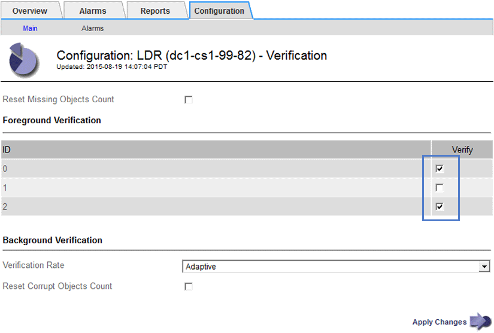

= Verificando a integridade do objeto
:allow-uri-read: 
:icons: font
:imagesdir: ../media/

[role="lead"]
O sistema StorageGRID verifica a integridade dos dados de objetos nos nós de storage, verificando se há objetos corrompidos ou ausentes.

Existem dois processos de verificação: Verificação em segundo plano e verificação em primeiro plano. Eles trabalham juntos para garantir a integridade dos dados. A verificação em segundo plano é executada automaticamente e verifica continuamente a correção dos dados do objeto. A verificação de primeiro plano pode ser acionada por um usuário, para verificar mais rapidamente a existência (embora não a correção) de objetos.

== O que é a verificação de antecedentes

O processo de verificação em segundo plano verifica automaticamente e continuamente os nós de storage em busca de cópias corrompidas de dados de objetos e tenta reparar automaticamente quaisquer problemas encontrados.

A verificação em segundo plano verifica a integridade dos objetos replicados e dos objetos codificados por apagamento, da seguinte forma:

* *Objetos replicados*: Se o processo de verificação em segundo plano encontrar um objeto replicado que está corrompido, a cópia corrompida será removida de seu local e colocada em quarentena em outro lugar no nó de armazenamento. Em seguida, uma nova cópia não corrompida é gerada e colocada para satisfazer a política ILM ativa. A nova cópia pode não ser colocada no nó de armazenamento que foi usado para a cópia original.

NOTE: Os dados de objetos corrompidos são colocados em quarentena em vez de excluídos do sistema, para que ainda possam ser acessados. Para obter mais informações sobre como acessar dados de objetos em quarentena, entre em Contato com o suporte técnico.

* *Objetos codificados por apagamento*: Se o processo de verificação em segundo plano detetar que um fragmento de um objeto codificado por apagamento está corrompido, o StorageGRID tentará automaticamente reconstruir o fragmento ausente no mesmo nó de storage, usando os dados restantes e fragmentos de paridade. Se o fragmento corrompido não puder ser reconstruído, o atributo cópias corrompidas detetadas (ECOR) é incrementado por um, e uma tentativa é feita para recuperar outra cópia do objeto. Se a recuperação for bem-sucedida, uma avaliação ILM será executada para criar uma cópia de substituição do objeto codificado de apagamento.
+
O processo de verificação em segundo plano verifica objetos apenas nos nós de storage. Ele não verifica objetos em nós de arquivamento ou em um pool de storage de nuvem. Os objetos devem ter mais de quatro dias para serem qualificados para verificação em segundo plano.

A verificação em segundo plano é executada a uma taxa contínua que é projetada para não interferir nas atividades comuns do sistema. A verificação em segundo plano não pode ser interrompida. No entanto, você pode aumentar a taxa de verificação em segundo plano para verificar mais rapidamente o conteúdo de um nó de armazenamento se suspeitar de um problema.

=== Alertas e alarmes (legacy) relacionados à verificação em segundo plano

Se o sistema detetar um objeto corrompido que não possa corrigir automaticamente (porque a corrupção impede que o objeto seja identificado), o alerta *Objeto corrompido não identificado detetado* é acionado.

Se a verificação em segundo plano não puder substituir um objeto corrompido porque ele não consegue localizar outra cópia, o alerta *objetos perdidos* e o alarme legado PERDIDO (objetos perdidos) são acionados.

== Alterar a taxa de verificação em segundo plano

Você pode alterar a taxa na qual a verificação em segundo plano verifica os dados de objetos replicados em um nó de storage se tiver preocupações com a integridade dos dados.

.O que você vai precisar
* Você deve estar conetado ao Gerenciador de Grade usando um navegador compatível.
* Você deve ter permissões de acesso específicas.

.Sobre esta tarefa
Você pode alterar a taxa de verificação para verificação em segundo plano em um nó de storage:

* Adaptive (adaptável): Predefinição. A tarefa foi projetada para verificar no máximo 4 MB/s ou 10 objetos/s (o que for excedido primeiro).
* Alta: A verificação do armazenamento prossegue rapidamente, a uma taxa que pode retardar as atividades normais do sistema.

Use a taxa de verificação alta somente quando suspeitar que uma falha de hardware ou software pode ter dados de objeto corrompidos. Após a conclusão da verificação de fundo de alta prioridade, a taxa de verificação é automaticamente redefinida para Adaptive (adaptável).

.Passos
. Selecione *Support* > *Tools* > *Grid Topology*.
. Selecione *_Storage Node_ LDR Verification*.
. Selecione *Configuração* > *Principal*.
. Vá para *LDR* *Verificação* *Configuração* *Principal*.
. Em Verificação em segundo plano, selecione *taxa de verificação* *alta* ou *taxa de verificação* *adaptável*.
+
image::../media/background_verification_rate.png[Definição da taxa de verificação]

NOTE: Definir a taxa de verificação como alta aciona o alarme legado VPRI (taxa de verificação) no nível de aviso.

. Clique em *aplicar alterações*.
. Monitore os resultados da verificação em segundo plano para objetos replicados.
+
.. Vá para *nodes* *_Storage Node_* *Objects*.
.. Na seção Verificação, monitore os valores para *objetos corrompidos* e *objetos corrompidos não identificados*.
+
Se a verificação em segundo plano encontrar dados de objeto replicados corrompidos, a métrica *objetos corrompidos* será incrementada e o StorageGRID tentará extrair o identificador de objeto dos dados, da seguinte forma:

+
*** Se o identificador do objeto puder ser extraído, o StorageGRID criará automaticamente uma nova cópia dos dados do objeto. A nova cópia pode ser feita em qualquer lugar do sistema StorageGRID que satisfaça a política ILM ativa.
*** Se o identificador de objeto não puder ser extraído (porque foi corrompido), a métrica *objetos corrompidos não identificados* é incrementada e o alerta *Objeto corrompido não identificado detetado* é acionado.

.. Se forem encontrados dados de objeto replicados corrompidos, entre em Contato com o suporte técnico para determinar a causa raiz da corrupção.

. Monitore os resultados da verificação em segundo plano para objetos codificados por apagamento.
+
Se a verificação em segundo plano encontrar fragmentos corrompidos de dados de objetos codificados por apagamento, o atributo fragmentos corrompidos detetados é incrementado. O StorageGRID se recupera reconstruindo o fragmento corrompido no mesmo nó de storage.

+
.. Selecione *Support* > *Tools* > *Grid Topology*.
.. Selecione *_Storage Node_ LDR Erasure Coding*.
.. Na tabela resultados da verificação, monitore o atributo fragmentos corrompidos detetados (ECCD).

. Depois que os objetos corrompidos forem restaurados automaticamente pelo sistema StorageGRID, redefina a contagem de objetos corrompidos.
+
.. Selecione *Support* > *Tools* > *Grid Topology*.
.. Selecione *_Storage Node_ LDR Verification Configuration*.
.. Selecione *Redefinir contagem de objetos corrompidos*.
.. Clique em *aplicar alterações*.

. Se você estiver confiante de que objetos em quarentena não são necessários, você pode excluí-los.

NOTE: Se o alerta *objetos perdidos* ou o alarme legado PERDIDO (objetos perdidos) foi acionado, o suporte técnico pode querer acessar objetos em quarentena para ajudar a depurar o problema subjacente ou tentar a recuperação de dados.

. Selecione *Support* > *Tools* > *Grid Topology*.
. Selecione *_Storage Node_* *LDR* *Verificação* *Configuração*.
. Selecione *Excluir objetos em quarentena*.
. Clique em *aplicar alterações*.

== O que é a verificação de primeiro plano

A verificação em primeiro plano é um processo iniciado pelo usuário que verifica se todos os dados de objeto esperados existem em um nó de armazenamento. A verificação de primeiro plano é usada para verificar a integridade de um dispositivo de armazenamento.

A verificação em primeiro plano é uma alternativa mais rápida à verificação em segundo plano que verifica a existência, mas não a integridade, de dados de objetos em um nó de armazenamento. Se a verificação de primeiro plano descobrir que muitos itens estão faltando, pode haver um problema com a totalidade ou parte de um dispositivo de armazenamento associado ao nó de armazenamento.

A verificação em primeiro plano verifica os dados de objetos replicados e os dados de objetos codificados por apagamento, da seguinte forma:

* *Objetos replicados*: Se uma cópia dos dados de objetos replicados estiver ausente, o StorageGRID tentará substituir automaticamente a cópia de cópias armazenadas em outro lugar do sistema. O nó de armazenamento executa uma cópia existente através de uma avaliação ILM, que determinará que a política ILM atual não está mais sendo atendida para este objeto porque a cópia ausente não existe mais no local esperado. Uma nova cópia é gerada e colocada para satisfazer a política ILM ativa do sistema. Esta nova cópia pode não ser colocada no mesmo local em que a cópia em falta foi armazenada.
* *Objetos codificados por apagamento*: Se um fragmento de um objeto codificado por apagamento estiver ausente, o StorageGRID tentará reconstruir automaticamente o fragmento ausente no mesmo nó de armazenamento usando os fragmentos restantes. Se o fragmento ausente não puder ser reconstruído (porque muitos fragmentos foram perdidos), o atributo cópias corrompidas detetadas (ECOR) é incrementado por um. O ILM então tenta encontrar outra cópia do objeto, que ele pode usar para gerar uma nova cópia codificada por apagamento.
+
Se a verificação em primeiro plano identificar um problema com a codificação de apagamento em um volume de armazenamento, a tarefa de verificação em primeiro plano será interrompida com uma mensagem de erro que identifique o volume afetado. Você deve executar um procedimento de recuperação para todos os volumes de armazenamento afetados.

Se nenhuma outra cópia de um objeto replicado em falta ou de um objeto codificado de apagamento corrompido puder ser encontrada na grade, o alerta *objetos perdidos* e o alarme legado PERDIDO (objetos perdidos) serão acionados.

== A executar a verificação de primeiro plano

A verificação em primeiro plano permite verificar a existência de dados em um nó de armazenamento. Dados de objeto ausentes podem indicar que existe um problema com o dispositivo de armazenamento subjacente.

.O que você vai precisar
* Você garantiu que as seguintes tarefas de grade não estão sendo executadas:
+
** Expansão da grade: Adicione servidor (GEXP), ao adicionar um nó de armazenamento
** Desativação do nó de armazenamento (LDCM) no mesmo nó de armazenamento se estas tarefas de grade estiverem em execução, aguarde que elas sejam concluídas ou liberem seu bloqueio.

* Você garantiu que o armazenamento está online. (Selecione *Support* *Tools* *Grid Topology*. Em seguida, selecione *_Storage Node_* *LDR* *Storage* *Overview* *Main*. Certifique-se de que *Estado de armazenamento - atual* está online.)
* Você garantiu que os seguintes procedimentos de recuperação não estão sendo executados no mesmo nó de storage:
+
** Recuperação de um volume de armazenamento com falha
** A recuperação de um nó de armazenamento com uma falha na verificação de primeiro plano da unidade do sistema não fornece informações úteis enquanto os procedimentos de recuperação estão em andamento.

.Sobre esta tarefa
Verificações de primeiro plano para dados de objetos replicados em falta e dados de objetos codificados por apagamento em falta:

* Se a verificação em primeiro plano encontrar grandes quantidades de dados de objetos em falta, provavelmente há um problema com o armazenamento do nó de armazenamento que precisa ser investigado e resolvido.
* Se a verificação em primeiro plano encontrar um erro de armazenamento grave associado a dados codificados por apagamento, ela o notificará. Você deve executar a recuperação do volume de armazenamento para reparar o erro.

Você pode configurar a verificação de primeiro plano para verificar todos os armazenamentos de objetos de um nó de armazenamento ou apenas armazenamentos de objetos específicos.

Se a verificação de primeiro plano encontrar dados de objeto em falta, o sistema StorageGRID tentará substituí-los. Se não for possível efetuar uma cópia de substituição, o alarme PERDIDO (objetos perdidos) poderá ser acionado.

A verificação em primeiro plano gera uma tarefa de grade de verificação em primeiro plano LDR que, dependendo do número de objetos armazenados em um nó de armazenamento, pode levar dias ou semanas para ser concluída. É possível selecionar vários nós de storage ao mesmo tempo; no entanto, essas tarefas de grade não são executadas simultaneamente. Em vez disso, eles são enfileirados e executados um após o outro até a conclusão. Quando a verificação em primeiro plano está em andamento em um nó de armazenamento, você não pode iniciar outra tarefa de verificação em primeiro plano nesse mesmo nó de armazenamento, mesmo que a opção para verificar volumes adicionais possa parecer estar disponível para o nó de armazenamento.

Se um nó de armazenamento diferente daquele em que a verificação de primeiro plano está sendo executada ficar off-line, a tarefa de grade continuará sendo executada até que o atributo *% completo* atinja 99,99%. O atributo *% complete* então volta para 50 por cento e espera que o nó de armazenamento retorne ao status online. Quando o estado do nó de armazenamento regressa à linha, a tarefa da grelha de verificação de primeiro plano do LDR continua até ser concluída.

.Passos
. Selecione *_Storage Node_* *LDR* *Verification*.
. Selecione *Configuração* > *Principal*.
. Em *Verificação de primeiro plano*, marque a caixa de seleção para cada ID de volume de armazenamento que deseja verificar.
+

. Clique em *aplicar alterações*.
+
Aguarde até que a página seja atualizada automaticamente e recarregada antes de sair da página. Uma vez atualizados, os armazenamentos de objetos ficam indisponíveis para seleção nesse nó de armazenamento.

+
Uma tarefa de grade de verificação de primeiro plano do LDR é gerada e executada até que ela seja concluída, pausa ou abortada.

. Monitorar objetos em falta ou fragmentos em falta:
+
.. Selecione *_Storage Node_* *LDR* *Verification*.
.. Na guia Visão geral em *resultados da verificação*, observe o valor de *objetos ausentes detetados*.
+
*Nota*: O mesmo valor é relatado como *objetos perdidos* na página de nós. Vá para *nodes* *_Storage Node_* e selecione a guia *Objects*.

+
Se o número de *objetos ausentes detetados* for grande (se houver centenas de objetos ausentes), provavelmente há um problema com o armazenamento do nó de armazenamento. Entre em Contato com o suporte técnico.

.. Selecione *_Storage Node_* *LDR* *Erasure Coding*.
.. Na guia Visão geral em *resultados da verificação*, observe o valor de *fragmentos ausentes detetados*.
+
Se o número de *fragmentos ausentes detetados* for grande (se houver centenas de fragmentos ausentes), provavelmente há um problema com o armazenamento do nó de armazenamento. Entre em Contato com o suporte técnico.

+
Se a verificação em primeiro plano não detetar um número significativo de cópias de objetos replicados em falta ou um número significativo de fragmentos ausentes, o storage estará operando normalmente.

. Monitorize a conclusão da tarefa de grelha de verificação em primeiro plano:
+
.. Selecione *Support* *Tools* *Grid Topology*. Em seguida, selecione *site* *_Admin Node_* *CMN* *Grid Task* *Overview* *Main*.
.. Verifique se a tarefa da grade de verificação de primeiro plano está progredindo sem erros.
+
*Nota*: Um alarme de nível de aviso é acionado no status da tarefa de grade (SCAs) se a tarefa de grade de verificação de primeiro plano for interrompida.

.. Se a tarefa de grade parar com um `critical storage error`, recupere o volume afetado e execute a verificação de primeiro plano nos volumes restantes para verificar se há erros adicionais.
+
*Atenção*: Se a tarefa da grade de verificação de primeiro plano for interrompida com a mensagem `Encountered a critical storage error in volume _volID_`, você deverá executar o procedimento para recuperar um volume de armazenamento com falha. Consulte as instruções de recuperação e manutenção.

.Depois de terminar
Se você ainda tiver dúvidas sobre a integridade dos dados, vá para *LDR* *Verificação* *Configuração* *Principal* e aumente a taxa de Verificação em segundo plano. A verificação em segundo plano verifica a exatidão de todos os dados de objetos armazenados e repara quaisquer problemas que encontrar. Encontrar e reparar possíveis problemas o mais rápido possível reduz o risco de perda de dados.

.Informações relacionadas
link:../maintain/index.html["Manter  recuperar"]
